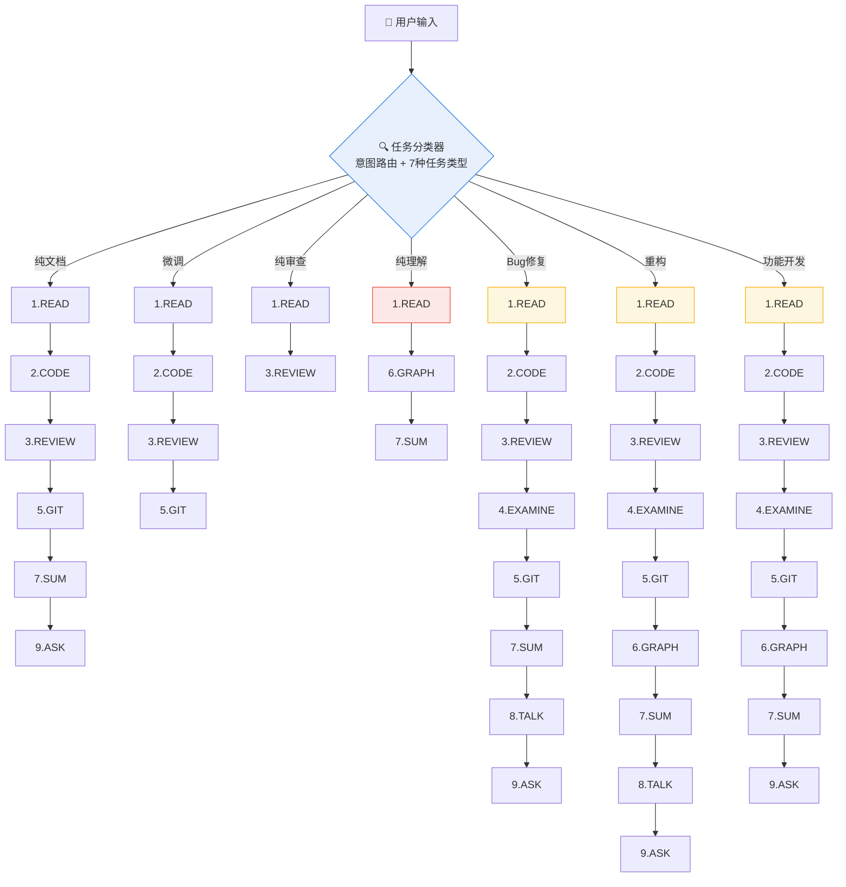

# EasyWork — AI 全链路开发工作流技能包

## 这是什么？

EasyWork 是一套为 AI 编码助手（Claude Code、Cursor、GitHub Copilot）设计的标准化开发工作流。
它解决的核心问题是：**AI 写代码太快、太不可控**——它们跳过理解直接改代码、顺手重构无关模块、
不跑测试直接交付。EasyWork 通过**按需裁剪的 9 步工作流 + 全局异常 SOP + 人工确认闸门**，
让 AI 从"散漫的代码生成器"变成"严格按流程走的虚拟结对程序员"。

### v2.3 核心改进：生产级 Skill 工程实践

- **Gotchas 知识库**：Agent 踩坑后自动追加项目特定陷阱，后续执行前主动扫描预警
- **并行审查**：高风险任务启用 3 个并行子 Agent（安全/性能/兼容性）+ 主审查同步
- **反合理化防御**：9 条 Agent 自我欺骗话术及反驳表，每次审查前先过目
- **团队策略覆盖**：团队在 `team-policy.md` 中声明规则，无需修改核心文件。支持注释语言配置
- **自定义步骤注入**：自动发现 `.claude/skills/easywork/custom/` 的技能并注入流程
- **逐步骤预览**：每步执行前可选微型预览（预计操作/耗时/Token）
- **交互式新手引导**：5 阶段对话脚本——需求了解→级别推荐→最小演示→首任务→学习总结
- **可访问性审查**：第 7 维度（语义化HTML/ARIA/键盘导航/色彩对比/屏幕阅读器）
- **供应链安全检查**：新增依赖自动检查许可证/CVE/维护状态
- **Conventional Commits**：提交消息强制规范化（feat/fix/refactor/test/docs/style/chore/perf/ci）
- **JSON Schema 数据契约**：`data-contract.schema.json` 提供机器可读验证
- **故障 Runbook**：5 种重复故障的预置诊断与修复方案
- **条件分支扩展**：17 条条件分支（步骤间 + 上下文自适应），覆盖更多实战场景
- **Skill 自测提示词集**：16 个测试场景，修改 Skill 后验证未退化
- **增强技能模板**：`skill-template/` 新增 Gotchas/反合理化/测试提示词/Before-After 对比
- **日志分析脚本**：`analyze-logs.sh` 一键分析（总览/步骤/瓶颈/趋势）

v1.0 强制所有任务走完 9 步，这很安全但也很烦——改一个文案不需要画架构图。
**v2.0 内置了任务分类器**：启动时先判断任务类型（纯理解/微调/Bug修复/功能开发等），
然后自动建议要执行和跳过的步骤。**v2.2 新增干跑预览**：执行前先展示每步会做什么，用户确认后再开始。
**v2.3 对准业界标准**：补齐并行审查、反合理化防御、Gotchas、供应链检查等生产级能力。修复 17 项真实 Skill 层差距。

## 工作流：9 步 → 按需裁剪



| 步骤 | 技能 | 核心职责 | Bug修复 | 功能开发 | 重构 | 微调 | 纯审查 | 纯文档 | 纯理解 |
|------|------|---------|--------|---------|------|------|--------|--------|--------|
| 1 | READ | 理解需求（文档/图片/日志/代码） | ✅ | ✅ | ✅ | ✅ | ✅ | ✅ | ✅ |
| 2 | CODE | 克制编码（中文注释/复用模式） | ✅ | ✅ | ✅ | ✅ | ⏭️ | ✅ | ⏭️ |
| 3 | REVIEW | 七维度自审查 | ✅ | ✅ | ✅ | ✅ | ✅ | ✅ | ⏭️ |
| 4 | EXAMINE | 跑测试/补测试 | ✅ | ✅ | ✅ | ⏭️ | ⏭️ | ⏭️ | ⏭️ |
| 5 | GIT | 拆分提交（按维度） | ✅ | ✅ | ✅ | ✅ | ⏭️ | ✅ | ⏭️ |
| 6 | GRAPH | Mermaid 图表 | ⏭️ | ✅ | ✅ | ⏭️ | ⏭️ | ⏭️ | ✅ |
| 7 | SUM | 六要素总结 | ✅ | ✅ | ✅ | ⏭️ | ⏭️ | ✅ | ✅ |
| 8 | TALK | 5-Whys 复盘 | ✅ | ⏭️ | ✅ | ⏭️ | ⏭️ | ⏭️ | ⏭️ |
| 9 | ASK | 人工确认 | ✅ | ✅ | ✅ | ⏭️ | ⏭️ | ✅ | ⏭️ |

> 上表是**默认建议**。用户可以随时追加或跳过步骤，Agent 不会强制执行不必要的流程。

## 核心设计原则

### 1. 任务分类前置（v2.0）
启动时先判断"这到底是个什么任务"（纯理解/纯审查/微调/Bug修复/重构/功能开发），再决定走哪些步骤。
改文案不需要架构图，看代码不需要写测试。**流程服务于任务，而非任务迁就流程。**
新增了回退循环限制（最多 3 轮）和步骤间数据传递契约，防止 Agent 在某个环节无限循环。

### 2. HITL（Human In The Loop）
三个强制人类确认点：READ（需求不确定时）、GIT（拆分方案确认）、ASK（最终上线确认）。
其他步骤遇到异常时挂起询问。Agent 的决策权和技术能力被尊重，但**否决权和最终判断权始终在人类手中**。

### 3. 异常处理 SOP
每个步骤都有标准异常处理流程：停止 → 描述问题 → 提供选项 → 等待人类指示 → 继续。
**严格禁止 Agent 在不确定时自行猜测。**

### 4. Checklist 打卡
每个步骤都有结构化 Checklist，Agent 逐项确认后打钩。长流程任务中有效防止遗漏。

### 5. 反模式显式化
每个技能不仅有"应该做什么"，更有"禁止做什么"。研究表明，AI 对"不要做 X"的遵循度高于"要做 Y"。

## 安装方式

### 方式 A：一键安装脚本（推荐）

**Windows**：
```cmd
.\install.bat  [目标项目路径]
:: 不传参数则安装到当前目录
```

**macOS / Linux**：
```bash
chmod +x ./install.sh
./install.sh  [目标项目路径]
# 不传参数则安装到当前目录
```

脚本会自动完成：复制技能文件 → 创建 `.claude/skills/easywork/` → 追加配置到 `CLAUDE.md`。

**卸载**：
```bash
./install.sh --uninstall /path/to/project   # Unix
install.bat 然后手动删除                      # Windows
```

### 方式 B：手动安装

#### 1. 复制技能文件

将 `skills/` 目录复制到目标项目的 `.claude/skills/easywork/` 下：

```
目标项目/
├── .claude/
│   └── skills/
│       └── easywork/
│           ├── SKILL.md                           # 索引入口
│           ├── README.md
│           ├── QUICKREF.md
│           ├── fullchain-dev-workflow/   # 编排中枢
│           ├── read-requirements/        # 步骤1
│           ├── code-implement/           # 步骤2
│           ├── code-review/              # 步骤3
│           ├── examine-quality/          # 步骤4
│           ├── git-split-commit/         # 步骤5
│           ├── graph-fullchain/          # 步骤6
│           ├── sum-session/              # 步骤7
│           ├── talk-retro/               # 步骤8
│           └── ask-change-questions/     # 步骤9
├── CLAUDE.md   ← 下面要编辑这个文件
└── ...
```

#### 2. 配置到各平台的入口文件

**平台一：Claude Code（VS Code / JetBrains / CLI）**

编辑目标项目的 `CLAUDE.md`（如不存在则新建），添加：

```markdown
# EasyWork 全链路工作流
当用户需要进行代码开发、Bug 修复、代码审查或需求分析时，
加载 .claude/skills/easywork/fullchain-dev-workflow/SKILL.md
并严格遵循其任务分类与流程编排规则。

## 可单独调用的子技能
- 需求理解: .claude/skills/easywork/read-requirements/SKILL.md
- 代码实现: .claude/skills/easywork/code-implement/SKILL.md
- 代码审查: .claude/skills/easywork/code-review/SKILL.md
- 质量验证: .claude/skills/easywork/examine-quality/SKILL.md
- 提交拆分: .claude/skills/easywork/git-split-commit/SKILL.md
- 图表绘制: .claude/skills/easywork/graph-fullchain/SKILL.md
- 总结报告: .claude/skills/easywork/sum-session/SKILL.md
- 深度复盘: .claude/skills/easywork/talk-retro/SKILL.md
- 人工确认: .claude/skills/easywork/ask-change-questions/SKILL.md
```

✅ Claude Code 支持所有 EasyWork 特性：子 Agent 隔离、多技能加载、Bash 测试执行。

---

**平台二：GitHub Copilot（VS Code / CLI）**

在项目根目录新建 `.github/copilot-instructions.md`：

```markdown
# EasyWork 全链路工作流规则

你需要在每次代码任务中遵守以下 EasyWork 工作流规则：

## 任务分类
在动手之前先判断任务类型：
- 纯理解（只看不改）→ 需求分析 + 总结
- 纯审查 → 需求分析 + 七维度审查
- 微调 → 需求分析 + 实现 + 审查 + 提交拆分
- Bug修复 → 需求分析 + 实现 + 审查 + 测试 + 提交拆分 + 总结 + 复盘 + 人工确认
- 重构 → READ + CODE + REVIEW + EXAMINE + GIT + GRAPH + SUM + TALK + ASK（9步）
- 功能开发 → READ + CODE + REVIEW + EXAMINE + GIT + GRAPH + SUM + ASK（8步，跳过TALK）

## 全局铁律
1. 注释必须用中文
2. 复用项目现有代码模式，不引入新的设计模式
3. 不确定时必须询问用户，禁止猜测
4. 修改必须严格限定在需求范围内，不顺手重构无关代码
5. CODE→REVIEW 回退循环最多3轮

## 七维度审查
每次写代码后自审查：正确性、安全性、兼容性、可维护性、性能、可观测性、可访问性

## 提交拆分
改动 ≥3 个文件时按维度拆分：配置/核心逻辑/UI/测试，每个单元附风险分析和验证方式

## 异常处理
遇到不确定的决策 → 停止 → 描述问题 → 提供选项 → 等用户指示

## 默认 HTML 输出
用户未指定输出格式时，生成 .claude/easywork/EasyWork_Report_{时间}.html
```

⚠️ Copilot 的功能限制：
- 不支持子 Agent 隔离（上下文管理策略中的"子Agent隔离"不可用）
- 不支持文件名 `SKILL.md` 的技能发现机制（需要手动在 `copilot-instructions.md` 中内嵌规则）
- 建议将 EasyWork 的核心约束（如上）直接嵌入 `.github/copilot-instructions.md`

---

**平台三：Cursor / Windsurf**

在项目根目录的 `.cursorrules` 或 `.windsurfrules` 中添加：

```
# EasyWork AI 工作流规则

在每次代码任务中遵守以下流程：

1. 先分类任务：纯理解/纯审查/微调/Bug修复/重构/功能开发
2. 根据任务类型执行对应步骤（见 QUICKREF.md 速查表）
3. 写代码时：中文注释、复用模式、不过度设计、不碰范围外代码
4. 写完后：七维度自审查（正确性/安全性/兼容性/可维护性/性能/可观测性/可访问性）
5. 不确定时：停止 → 描述问题 → 给选项 → 等用户指示
6. 改动 ≥3 文件：输出按维度拆分的提交方案
7. 默认 HTML 输出

完整规则文件位于：.claude/skills/easywork/
```

⚠️ Cursor 的能力与 Claude Code 接近，支持自定义规则文件。建议将 `SKILL.md` 的核心约束精简后嵌入 `.cursorrules`。

---

#### 3. 验证安装

在项目目录中发起新对话，输入：
```
"帮我 review 下这段代码"
```

如果 Agent 加载了 code-review 技能（输出七维度审查结果），则安装成功。

**自检命令**（在新对话中输入）：
```
"你现在加载了哪些 EasyWork 技能？"
```

Agent 应列出 `fullchain-dev-workflow` 及其子技能。

---

## 各平台功能对比

| 功能 | Claude Code | Copilot | Cursor |
|------|------------|---------|--------|
| 全 9 步工作流 | ✅ 完整支持 | ⚠️ 需内嵌规则 | ✅ 部分支持 |
| 子 Agent 隔离 | ✅ | ❌ 不支持 | ⚠️ 取决于版本 |
| Bash 测试执行 | ✅ | ✅ | ✅ |
| Skill 自动发现 | ✅ | ❌ | ❌ |
| 单步触发 | ✅ | ⚠️ | ⚠️ |
| HTML 报告生成 | ✅ | ✅ | ✅ |
| 状态快照恢复 | ✅ | ⚠️ 手动 | ⚠️ 手动 |

**总结建议**：
- **Claude Code** — 最佳体验，所有特性可用
- **Copilot / Cursor** — 核心规则可移植，但部分高级特性（子Agent、Skill自动发现）不可用。建议将核心约束内嵌到对应配置文件中

## 使用方式

**全链路**：触发 fullchain-dev-workflow → Agent 输出任务分类和裁剪方案 → 你确认 → Agent 按裁剪后的流程执行。

**单步**：直接说"帮我 review 下这段代码" → Agent 加载 code-review 技能。

**半链路**："代码已写好，从 REVIEW 开始走后续" → Agent 从步骤 3 开始。

## 项目结构

```
EasyWork/
├── README.md                          # 项目说明（你正在读的）
├── SKILL.md                           # 技能索引入口（Agent 读的）
├── QUICKREF.md                        # 30秒速查卡片
├── CHANGELOG.md                       # 版本更新记录
├── TROUBLESHOOTING.md                 # 故障排查与自救指南
├── CONTRIBUTING.md                    # 贡献指南
├── LICENSE                            # MIT
├── install.bat                        # Windows 一键安装
├── install.sh                         # Unix 一键安装
├── skill-template/                    # 🆕 自定义技能模板
│   ├── SKILL.md                       #   技能骨架
│   ├── assets/template.md             #   输出模板骨架
│   └── references/guide.md            #   参考指南骨架
└── skills/
    ├── fullchain-dev-workflow/        # 🔗 编排中枢（任务分类 + 步骤裁剪 + 流程编排）
    │   ├── SKILL.md                   #   核心行为指令
    │   ├── assets/
    │   │   ├── output-template.md     #   全链路输出模板
    │   │   ├── html-output-template.md#   HTML 报告规范
    │   │   ├── html-skeleton.html     #   🆕 HTML 报告骨架（直接复制填充）
    │   │   └── walkthrough-example.md #   🆕 3个端到端完整示例
    │   └── references/
    │       ├── acceptance-gates.md    #   每步验收关卡
    │       ├── data-contract.md       #   步骤间数据传递契约（含版本迁移）
    │       ├── data-contract.schema.json  #   🆕 JSON Schema 机器可读验证
    │       ├── orchestration-engine.md    #   编排引擎（DAG/并行/条件分支/自定义步骤）
    │       ├── language-matrix.md     #   🆕 语言/技术栈适配速查
    │       ├── maturity-levels.md     #   🆕 渐进式成熟度 L1/L2/L3
    │       ├── gotchas.md             #   🆕 项目踩坑知识库
    │       ├── team-policy.md         #   🆕 团队策略覆盖
    │       ├── failure-runbooks.md    #   🆕 故障模式诊断
    │       ├── self-test-prompts.md   #   🆕 Skill 自测提示词集
    │       └── log-analysis-guide.md  #   🆕 JSONL 日志分析指南
    ├── read-requirements/             # 📖 步骤1：多态输入 → 结构化需求
    ├── code-implement/                # ⌨️ 步骤2：克制编码（中文注释/复用/反炫技）
    ├── code-review/                   # 🔍 步骤3：七维度自审查 + 反合理化防御
    ├── examine-quality/               # 🧪 步骤4：测试执行与质量验证
    ├── git-split-commit/              # 📦 步骤5：多维提交拆分（HITL 关键环节）
    ├── graph-fullchain/               # 📊 步骤6：Mermaid/飞书 可视化图表
    ├── sum-session/                   # 📝 步骤7：六要素结构化总结
    ├── talk-retro/                    # 🔬 步骤8：5-Whys 根因分析 + Trade-offs
    └── ask-change-questions/          # ✅ 步骤9：人工确认问询（HITL 终极闸门）
```

每个 skill 目录包含：
- `SKILL.md` — 核心行为指令（前置条件 + 执行流程 + 反模式 + 异常SOP）
- `assets/` — 标准化输出模板
- `references/` — 深度参考指南（Agent 按需查阅，不占常驻上下文）

## 常见问题

**Q: 必须走 9 步吗？**
A: 不。v2.0 的任务分类器会根据任务类型自动建议裁剪方案。改一个文案可能只需要 READ + CODE + REVIEW。
但涉及核心逻辑的 Bug 修复和功能开发，强烈建议走完整流程。

**Q: 我的团队刚起步，不想一下用全部——有渐进式方案吗？**
A: 🆕 v2.2 提供 L1/L2/L3 三级成熟度配置：
- **L1（入门）**：4 个核心技能（READ + CODE + REVIEW + ASK），适合个人和原型阶段
- **L2（标准）**：7 个技能（+EXAMINE + GIT + SUM），适合有 CI/CD 的正式团队
- **L3（完整）**：全部 10 个技能，适合企业级/合规场景
详见 `skills/fullchain-dev-workflow/references/maturity-levels.md`，升级时只需复制新技能目录即可。

**Q: AI 不遵守规则怎么办？**
A: 每个技能都有反模式清单（Never Do This），这些"禁止"指令对 AI 的约束力比"应该"更强。
如果 AI 偏离，可以直接说"遵守当前 skill 的反模式清单"来纠正。

**Q: 第一次使用，从哪里开始？**
A: 先看 `skills/fullchain-dev-workflow/assets/walkthrough-example.md`，里面有"修 Bug"、"纯理解代码"和"功能开发"三个完整的端到端示例，展示了从任务分类到最终确认的全过程。看完就能上手。

**Q: 上下文满了怎么办？**
A: EasyWork 内置了四级上下文管理策略（🟢正常→🟡预警→🟠警戒→🔴危急）。
默认采用**单技能加载模式**——只加载当前步骤的 SKILL.md，而非一次性加载全部 10 个。
每一步完成后自动保存 JSON 状态快照，你可以随时 `/clear` 再粘贴快照从中断处继续。
如果某步骤特别重（大量测试、大量文件搜索），Agent 会主动建议拆分到子 Agent 执行。

**Q: 可以和现有项目规则共存吗？**
A: 可以。EasyWork 是叠加在现有规则（CLAUDE.md、ESLint 等）之上的工作流层，不会冲突。
相反，EasyWork 会在 READ 阶段主动读取这些规则作为约束条件。

**Q: 如何自定义某个步骤？**
A: 直接编辑对应 skill 的 SKILL.md。每个 skill 是独立文件，修改一个不影响其他。
