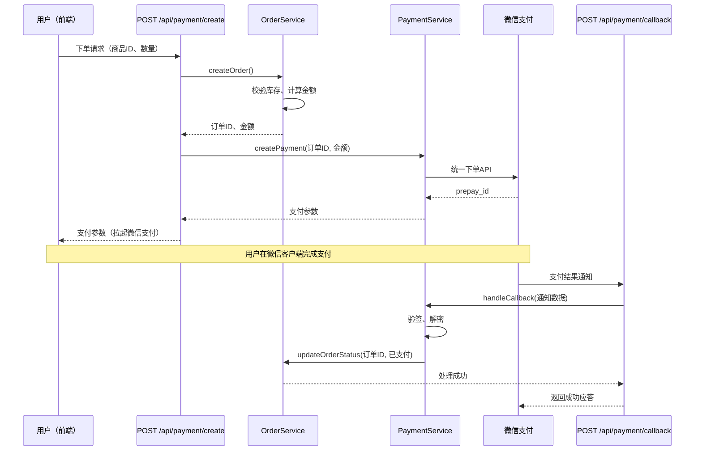

# 端到端示例

本文档演示 EasyWork 全链路工作流在两个真实场景中的完整执行过程。
如果你是第一次使用，从这两个示例开始最快上手。

---

## 示例 1：修 Bug — "登录接口偶发 500"

### 用户输入
> 用户反馈登录有时候会弹"网络错误"，看日志是 `POST /api/login` 返回了 500，
> 报错信息：`Cannot read property 'password' of undefined`。帮我看下怎么回事。

### 阶段 0：任务分类

| 维度 | 判断 |
|------|------|
| 改动性质 | 🐛 Bug修复 |
| 影响范围 | 🟡 中风险（登录是核心流程，影响所有用户） |
| 预估文件数 | 未知（需先排查） |

**裁剪方案**：READ → CODE → REVIEW → EXAMINE → GIT → SUM → TALK → ASK（跳过 GRAPH）

### 步骤 1：READ（需求理解）

Agent 读日志报错 → 定位到 `src/services/auth.service.ts:88`：
```typescript
const hashedPassword = user.password;  // ← user 可能为 null（数据库中无此用户时）
```

Agent 输出五要素：
- **目标**：修复"用户不存在时登录接口返回 500"的 bug，应返回 401 + 明确错误信息
- **范围**：`auth.service.ts` 的 `login()` 方法、对应的测试文件
- **约束**：不改变 API 的请求/响应签名，不修改密码加密逻辑
- **验收**：(1) 不存在的用户登录 → HTTP 401 + "用户名或密码错误" (2) 现有 8 个测试保持通过 (3) 新增 1 个"用户不存在"的测试通过
- **不做**：不修改注册/注销/Token刷新逻辑

### 步骤 2：CODE（代码实现）

Agent 修改 `auth.service.ts`：
```typescript
// 在访问 user.password 之前增加空值判断
const user = await UserModel.findByUsername(username);
if (!user) {
  // 用户不存在时返回统一错误信息，避免泄露"用户是否存在"的信息
  throw new UnauthorizedError('用户名或密码错误');
}
const hashedPassword = user.password;
```

变更记录：
| 文件 | 改动 | 原因 |
|------|------|------|
| `src/services/auth.service.ts` | `login()` 方法加 user 空值判断 | 防止空指针 |
| `tests/auth.service.test.ts` | 新增"用户不存在返回401"测试 | 回归验证 |

### 步骤 3：REVIEW（六维度自审查）

- ✅ 正确性：null/undefined/空对象全部处理，if-else 覆盖完整
- ✅ 安全性：返回统一错误信息，不泄露"用户是否存在"；无硬编码凭证
- ✅ 兼容性：API 签名不变，所有调用方不受影响
- ✅ 可维护性：中文注释解释了为什么用通用错误信息
- ✅ 性能：无新增查询，无循环内查询
- ✅ 可观测性：UnauthorizedError 已包含在现有日志中间件中

→ 审查通过，放行到 EXAMINE。

### 步骤 4：EXAMINE（测试执行）

```bash
$ npm test -- --testPathPattern="auth.service"
 PASS  tests/auth.service.test.ts (12 个测试)
  ✓ 正确凭证登录成功
  ✓ 错误密码返回401
  ✓ 用户不存在返回401（新增）
  ✓ ... 其余 9 个测试全部通过
Tests: 12 passed, 0 failed
```

→ 全绿通过。

### 步骤 5：GIT（提交拆分）

改动仅 2 个文件且在同一模块，拆无可拆。单提交：

```
提交：修复登录接口在用户不存在时返回500的bug

文件：
- src/services/auth.service.ts — 增加 user 空值判断
- tests/auth.service.test.ts — 新增"用户不存在"回归测试

风险：低（逻辑简单，测试覆盖充分）
验证：12 个测试全部通过，含新增回归测试
```

### 步骤 6：GRAPH — [skip] 改动逻辑简单，不需要图表

### 步骤 7：SUM（总结报告）

**背景**：用户反馈登录偶发 500 错误，日志显示 `Cannot read property 'password' of undefined`。

**发现过程**：日志定位 `auth.service.ts:88` → 发现 `UserModel.findByUsername()` 在用户不存在时返回 `null`，代码未做空值判断直接访问 `.password`。

**问题说明**：`login()` 方法缺少对 `findByUsername()` 返回值的空值判断，导致用户登录时输入不存在的用户名会触发空指针异常，接口返回 500 而非 401。

**解决方案**：在访问 `user.password` 之前增加 `if (!user)` 判断，抛出 `UnauthorizedError`，返回与"密码错误"相同的错误信息（防止用户枚举攻击）。

**最终效果**：12 个测试全绿。修复前：不存在的用户 → 500。修复后：不存在的用户 → 401 + "用户名或密码错误"。

**未来展望**：建议全局搜索其他 Service 中类似的 `findByXxx()` 直接访问属性的模式，统一做空值防御。

### 步骤 8：TALK（5-Whys 复盘）

| 层级 | 追问与回答 |
|------|-----------|
| Why1 | 为什么返回500？→ `user` 为 `null` 时访问了 `.password` |
| Why2 | 为什么没做空值判断？→ 开发者假设 `findByUsername` 在查不到时抛异常，而非返回 null |
| Why3 | 为什么会有这个错误假设？→ `findByUsername` 的返回值类型是 `User | null`，但函数没有 JSDoc 注释说明 null 的情况 |
| Why4 | 为什么没有 JSDoc 注释？→ 团队没有要求所有 Model 方法必须有返回值类型注释 |
| Why5 | 为什么 CI 没有检查？→ ESLint 没有开启 `@typescript-eslint/no-unsafe-member-access` 规则 |
| → 根因 | TypeScript 严格模式和 ESLint 规则未充分配置 |
| → 行动 | 建议开启 `strictNullChecks` + `no-unsafe-member-access` 规则 |

**Trade-offs**：本次选择了最简单的 if-null-return 方案，没有引入 Result/Option 类型抽象（保持项目一致性优先于引入新模式）。

**工程规范建议**：所有 Model 的查询方法（findByXxx）必须用 JSDoc 标注返回值包含 null 的情况。

### 步骤 9：ASK（人工确认）

- **需求验收**：修复了用户不存在的场景，返回 401 → ✅ 确认
- **行为变化**：不存在的用户从 500 → 401。这是后端行为，前端已有 401 拦截器无需修改 → ✅ 确认
- **数据与回滚**：无数据库变更。回滚：`git revert <hash>` → ✅ 确认
- **安全与权限**：错误信息与"密码错误"一致，防止用户枚举 → ✅ 确认
- **测试覆盖**：12/12 通过，含新增回归测试 → ✅ 确认
- **上线监控**：建议上线后关注登录接口 401 比例（正常波动 < 5%）→ ✅ 确认

→ 全部确认完毕。工作流完结。

---

## 示例 2：纯理解 — "帮我看下支付模块的流程"

### 用户输入
> 我刚接手这个项目，帮我理一下支付模块的整体流程，从用户下单到支付回调。

### 阶段 0：任务分类

| 维度 | 判断 |
|------|------|
| 改动性质 | 🔍 纯理解 |
| 影响范围 | 🟢 低风险（不产生代码改动） |
| 预估文件数 | 0（只读不写） |

**裁剪方案**：READ → GRAPH → SUM（跳过 CODE/REVIEW/EXAMINE/GIT/TALK/ASK，只走 3 步）

### 步骤 1：READ（需求理解）

Agent 搜索支付相关文件：
```
$ grep -r "payment\|支付\|order" --include="*.ts" src/
找到 8 个相关文件。
```

Agent 阅读关键文件：
- `src/routes/payment.ts` — 支付路由：`POST /api/payment/create`、`POST /api/payment/callback`
- `src/services/payment.service.ts` — 支付核心逻辑
- `src/services/order.service.ts` — 订单服务
- `src/models/order.model.ts` — 订单数据模型

输出五要素：
- **目标**：理清支付模块的完整调用链路和数据流转
- **范围**：payment 路由、service、order service、order model，共 4 个核心文件
- **约束**：只读不写，不改动任何代码
- **验收**：能清晰描述"用户下单→支付→回调→订单状态更新"的完整流程
- **不做**：不分析退款/对账/其他非支付流程

### 步骤 2~5：CODE/REVIEW/EXAMINE/GIT — [skip] 纯理解任务

### 步骤 6：GRAPH（图表绘制）

Agent 画出时序图：



| 图中节点 | 代码实体 | 文件位置 |
|---------|---------|---------|
| POST /api/payment/create | `paymentRouter.post('/create', ...)` | `src/routes/payment.ts:15` |
| OrderService | `class OrderService` | `src/services/order.service.ts` |
| PaymentService | `class PaymentService` | `src/services/payment.service.ts` |
| 微信支付 统一下单API | `PaymentService.createPayment()` 内部调用 | `src/services/payment.service.ts:88` |
| POST /api/payment/callback | `paymentRouter.post('/callback', ...)` | `src/routes/payment.ts:42` |

### 步骤 7：SUM（总结报告）

**背景**：团队有新成员接手项目，需要理解支付模块的架构和流程。

**发现过程**：通过搜索 `payment` 关键词定位到 4 个核心文件 → 逐文件阅读 → 梳理调用关系。

**核心流程**（5 个阶段）：
1. **下单阶段**：用户请求 → `OrderService.createOrder()` 校验库存、计算金额 → 返回订单ID
2. **发起支付**：`PaymentService.createPayment()` → 调用微信统一下单 API → 返回 prepay_id → 前端拉起微信支付
3. **用户支付**：用户在微信客户端完成支付（此阶段系统不参与）
4. **支付回调**：微信异步通知 `POST /api/payment/callback` → `PaymentService.handleCallback()` 验签解密
5. **状态更新**：验签通过后 → `OrderService.updateOrderStatus(订单ID, '已支付')`

**关键设计点**：
- 支付回调必须验签（`PaymentService` 中有专门的验签逻辑，防止伪造回调）
- 订单状态更新是幂等的（重复回调不会导致重复更新）
- 前端轮询订单状态作为回调的补充（防止微信回调延迟或丢失）

**后续建议**：建议补充支付超时处理（15 分钟未支付的订单自动取消），当前代码中未实现。

### 步骤 8~9：TALK/ASK — [skip] 纯理解任务
