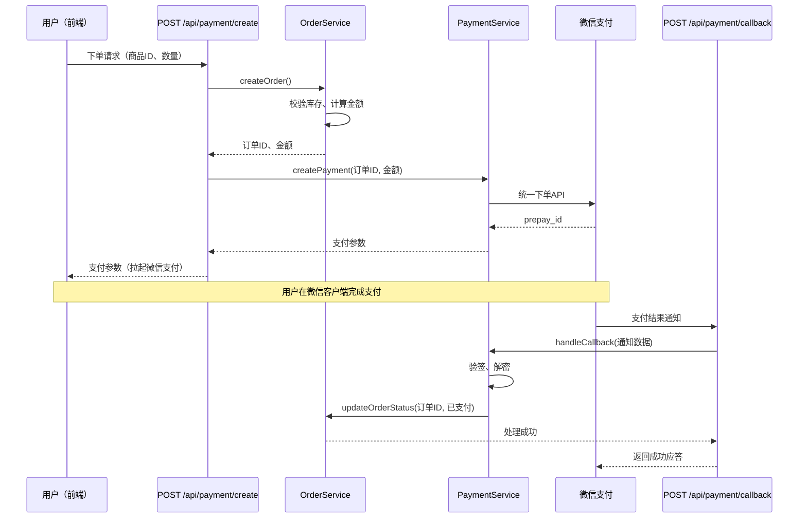
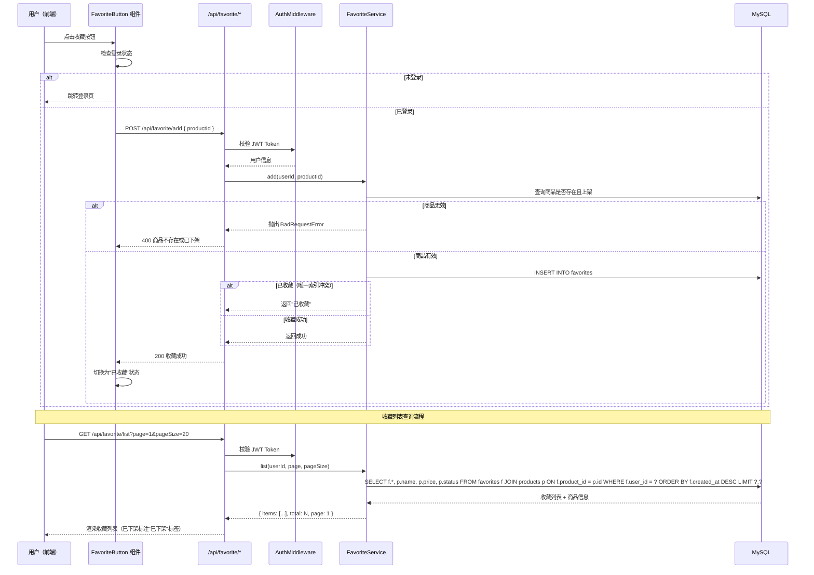

# 端到端示例

> **⚠️ 重要提示**：本文档中的所有代码、文件路径、函数名、错误信息和项目结构均为**虚构示例**，
> 不代表任何真实产品或服务。`auth.service.ts`、`UserModel.findByUsername()`、`payment.service.ts`、
> 微信支付回调等均为教学示例，不包含任何真实代码或凭据。

本文档演示 EasyWork 全链路工作流在三个真实场景中的完整执行过程。
如果你是第一次使用，从这三个示例开始最快上手。

---

## 示例 1：修 Bug — "登录接口偶发 500"

### 用户输入
> 用户反馈登录有时候会弹"网络错误"，看日志是 `POST /api/login` 返回了 500，
> 报错信息：`Cannot read property 'password' of undefined`。帮我看下怎么回事。

### 阶段 0：任务分类

| 维度 | 判断 |
|------|------|
| 改动性质 | 🐛 Bug修复 |
| 影响范围 | 🟡 中风险（登录是核心流程，影响所有用户） |
| 预估文件数 | 未知（需先排查） |

**裁剪方案**：READ → CODE → REVIEW → EXAMINE → GIT → SUM → TALK → ASK（跳过 GRAPH）

### 步骤 1：READ（需求理解）

Agent 读日志报错 → 定位到 `src/services/auth.service.ts:88`：
```typescript
const hashedPassword = user.password;  // ← user 可能为 null（数据库中无此用户时）
```

Agent 输出五要素：
- **目标**：修复"用户不存在时登录接口返回 500"的 bug，应返回 401 + 明确错误信息
- **范围**：`auth.service.ts` 的 `login()` 方法、对应的测试文件
- **约束**：不改变 API 的请求/响应签名，不修改密码加密逻辑
- **验收**：(1) 不存在的用户登录 → HTTP 401 + "用户名或密码错误" (2) 现有 8 个测试保持通过 (3) 新增 1 个"用户不存在"的测试通过
- **不做**：不修改注册/注销/Token刷新逻辑

### 步骤 2：CODE（代码实现）

Agent 修改 `auth.service.ts`：
```typescript
// 在访问 user.password 之前增加空值判断
const user = await UserModel.findByUsername(username);
if (!user) {
  // 用户不存在时返回统一错误信息，避免泄露"用户是否存在"的信息
  throw new UnauthorizedError('用户名或密码错误');
}
const hashedPassword = user.password;
```

变更记录：
| 文件 | 改动 | 原因 |
|------|------|------|
| `src/services/auth.service.ts` | `login()` 方法加 user 空值判断 | 防止空指针 |
| `tests/auth.service.test.ts` | 新增"用户不存在返回401"测试 | 回归验证 |

### 步骤 3：REVIEW（七维度自审查）

- ✅ 正确性：null/undefined/空对象全部处理，if-else 覆盖完整
- ✅ 安全性：返回统一错误信息，不泄露"用户是否存在"；无硬编码凭证
- ✅ 兼容性：API 签名不变，所有调用方不受影响
- ✅ 可维护性：中文注释解释了为什么用通用错误信息
- ✅ 性能：无新增查询，无循环内查询
- ✅ 可观测性：UnauthorizedError 已包含在现有日志中间件中
- N/A 可访问性：本次为纯后端变更，不涉及 UI 交互

→ 审查通过，放行到 EXAMINE。

### 步骤 4：EXAMINE（测试执行）

```bash
$ npm test -- --testPathPattern="auth.service"
 PASS  tests/auth.service.test.ts (12 个测试)
  ✓ 正确凭证登录成功
  ✓ 错误密码返回401
  ✓ 用户不存在返回401（新增）
  ✓ ... 其余 9 个测试全部通过
Tests: 12 passed, 0 failed
```

→ 全绿通过。

### 步骤 5：GIT（提交拆分）

改动仅 2 个文件且在同一模块，拆无可拆。单提交：

```
提交：修复登录接口在用户不存在时返回500的bug

文件：
- src/services/auth.service.ts — 增加 user 空值判断
- tests/auth.service.test.ts — 新增"用户不存在"回归测试

风险：低（逻辑简单，测试覆盖充分）
验证：12 个测试全部通过，含新增回归测试
```

### 步骤 6：GRAPH — [skip] 改动逻辑简单，不需要图表

### 步骤 7：SUM（总结报告）

**背景**：用户反馈登录偶发 500 错误，日志显示 `Cannot read property 'password' of undefined`。

**发现过程**：日志定位 `auth.service.ts:88` → 发现 `UserModel.findByUsername()` 在用户不存在时返回 `null`，代码未做空值判断直接访问 `.password`。

**问题说明**：`login()` 方法缺少对 `findByUsername()` 返回值的空值判断，导致用户登录时输入不存在的用户名会触发空指针异常，接口返回 500 而非 401。

**解决方案**：在访问 `user.password` 之前增加 `if (!user)` 判断，抛出 `UnauthorizedError`，返回与"密码错误"相同的错误信息（防止用户枚举攻击）。

**最终效果**：12 个测试全绿。修复前：不存在的用户 → 500。修复后：不存在的用户 → 401 + "用户名或密码错误"。

**未来展望**：建议全局搜索其他 Service 中类似的 `findByXxx()` 直接访问属性的模式，统一做空值防御。

### 步骤 8：TALK（5-Whys 复盘）

| 层级 | 追问与回答 |
|------|-----------|
| Why1 | 为什么返回500？→ `user` 为 `null` 时访问了 `.password` |
| Why2 | 为什么没做空值判断？→ 开发者假设 `findByUsername` 在查不到时抛异常，而非返回 null |
| Why3 | 为什么会有这个错误假设？→ `findByUsername` 的返回值类型是 `User | null`，但函数没有 JSDoc 注释说明 null 的情况 |
| Why4 | 为什么没有 JSDoc 注释？→ 团队没有要求所有 Model 方法必须有返回值类型注释 |
| Why5 | 为什么 CI 没有检查？→ ESLint 没有开启 `@typescript-eslint/no-unsafe-member-access` 规则 |
| → 根因 | TypeScript 严格模式和 ESLint 规则未充分配置 |
| → 行动 | 建议开启 `strictNullChecks` + `no-unsafe-member-access` 规则 |

**Trade-offs**：本次选择了最简单的 if-null-return 方案，没有引入 Result/Option 类型抽象（保持项目一致性优先于引入新模式）。

**工程规范建议**：所有 Model 的查询方法（findByXxx）必须用 JSDoc 标注返回值包含 null 的情况。

### 步骤 9：SELFCHECK（CTO 拷打 — 完整模式）

**业务背景拷打**：这个 Bug 是怎么发现的？有数据支撑吗？——用户在客服渠道反馈。排查后发现所有不存在的用户查询都触发 500。影响面评估：API 错误率上升了约 5%。

**解决方案拷打**：改动在哪条链路的哪个位置？——在 auth.service.ts 的 login() 中，第 88 行。为什么在这里改不在 controller 层改？——因为 controller 层不应该感知 Model 层返回值细节。

**实现过程拷打**：之前为什么没做空值判断？——两个原因：一是 TypeScript 类型标注没有反映 null 可能性；二是 findByEmail 的 JSDoc 没有标注 @returns {User|null}。属于知识和流程问题。

**汇报就绪**：认知缺口——TypeScript strict null checks 未开启，已记录到 gaps。

### 步骤 10：ASK（人工确认）

- **需求验收**：修复了用户不存在的场景，返回 401 → ✅ 确认
- **行为变化**：不存在的用户从 500 → 401。这是后端行为，前端已有 401 拦截器无需修改 → ✅ 确认
- **数据与回滚**：无数据库变更。回滚：`git revert <hash>` → ✅ 确认
- **安全与权限**：错误信息与"密码错误"一致，防止用户枚举 → ✅ 确认
- **测试覆盖**：12/12 通过，含新增回归测试 → ✅ 确认
- **上线监控**：建议上线后关注登录接口 401 比例（正常波动 < 5%）→ ✅ 确认

→ 全部确认完毕。工作流完结。

---

## 示例 2：纯理解 — "帮我看下支付模块的流程"

### 用户输入
> 我刚接手这个项目，帮我理一下支付模块的整体流程，从用户下单到支付回调。

### 阶段 0：任务分类

| 维度 | 判断 |
|------|------|
| 改动性质 | 🔍 纯理解 |
| 影响范围 | 🟢 低风险（不产生代码改动） |
| 预估文件数 | 0（只读不写） |

**裁剪方案**：READ → GRAPH → SUM → SELFCHECK(轻量)（跳过 CODE/REVIEW/EXAMINE/GIT/TALK/ASK，4 步）

### 步骤 1：READ（需求理解）

Agent 搜索支付相关文件：
```
$ grep -r "payment\|支付\|order" --include="*.ts" src/
找到 8 个相关文件。
```

Agent 阅读关键文件：
- `src/routes/payment.ts` — 支付路由：`POST /api/payment/create`、`POST /api/payment/callback`
- `src/services/payment.service.ts` — 支付核心逻辑
- `src/services/order.service.ts` — 订单服务
- `src/models/order.model.ts` — 订单数据模型

输出五要素：
- **目标**：理清支付模块的完整调用链路和数据流转
- **范围**：payment 路由、service、order service、order model，共 4 个核心文件
- **约束**：只读不写，不改动任何代码
- **验收**：能清晰描述"用户下单→支付→回调→订单状态更新"的完整流程
- **不做**：不分析退款/对账/其他非支付流程

### 步骤 2~5：CODE/REVIEW/EXAMINE/GIT — [skip] 纯理解任务

### 步骤 6：GRAPH（图表绘制）

Agent 画出时序图：



| 图中节点 | 代码实体 | 文件位置 |
|---------|---------|---------|
| POST /api/payment/create | `paymentRouter.post('/create', ...)` | `src/routes/payment.ts:15` |
| OrderService | `class OrderService` | `src/services/order.service.ts` |
| PaymentService | `class PaymentService` | `src/services/payment.service.ts` |
| 微信支付 统一下单API | `PaymentService.createPayment()` 内部调用 | `src/services/payment.service.ts:88` |
| POST /api/payment/callback | `paymentRouter.post('/callback', ...)` | `src/routes/payment.ts:42` |

### 步骤 7：SUM（总结报告）

**背景**：团队有新成员接手项目，需要理解支付模块的架构和流程。

**发现过程**：通过搜索 `payment` 关键词定位到 4 个核心文件 → 逐文件阅读 → 梳理调用关系。

**核心流程**（5 个阶段）：
1. **下单阶段**：用户请求 → `OrderService.createOrder()` 校验库存、计算金额 → 返回订单ID
2. **发起支付**：`PaymentService.createPayment()` → 调用微信统一下单 API → 返回 prepay_id → 前端拉起微信支付
3. **用户支付**：用户在微信客户端完成支付（此阶段系统不参与）
4. **支付回调**：微信异步通知 `POST /api/payment/callback` → `PaymentService.handleCallback()` 验签解密
5. **状态更新**：验签通过后 → `OrderService.updateOrderStatus(订单ID, '已支付')`

**关键设计点**：
- 支付回调必须验签（`PaymentService` 中有专门的验签逻辑，防止伪造回调）
- 订单状态更新是幂等的（重复回调不会导致重复更新）
- 前端轮询订单状态作为回调的补充（防止微信回调延迟或丢失）

**后续建议**：建议补充支付超时处理（15 分钟未支付的订单自动取消），当前代码中未实现。

### 步骤 8：TALK — [skip] 纯理解任务

### 步骤 9：SELFCHECK（CTO 拷打 — 轻量模式）

纯理解任务使用轻量模式（2 阶段：理解了什么 + 还不清楚什么）。

**理解了什么**：支付链路涉及 5 个阶段——前端创建订单→后端调用微信统一下单→用户微信支付→微信异步回调→系统验签并更新订单状态。关键设计点：回调验签防伪造、订单状态更新幂等。

**还不清楚什么**：支付超时处理（15 分钟未支付自动取消）当前未实现——这是后续需要补充的。

### 步骤 10：ASK — [skip] 纯理解任务

---

## 示例 3：功能开发 — "给商品模块加一个收藏功能"

### 用户输入
> 用户反馈希望可以收藏商品，方便以后购买。需要在商品详情页加一个收藏按钮，用户可以在"我的收藏"页面看到所有已收藏的商品。收藏不需要登录——未登录用户点收藏时跳转到登录页。

### 阶段 0：任务分类

| 维度 | 判断 |
|------|------|
| 改动性质 | 🚀 功能开发 |
| 影响范围 | 🟡 中风险（涉及新接口+新页面+数据库新表） |
| 预估文件数 | 8-10 个 |

**裁剪方案**：9 步 — READ→CODE→REVIEW→EXAMINE→GIT→GRAPH→SUM→SELFCHECK→ASK（跳过 TALK，功能开发无可追溯的"问题根因"；SELFCHECK 为完整模式）

### 步骤 1：READ（需求理解）

Agent 搜索现有商品模块结构：
```
$ grep -r "product\|商品" --include="*.ts" src/
找到商品路由(product.ts)、Service、Model，共 6 个核心文件。
```

Agent 搜索现有收藏/点赞功能的实现模式：
```
$ grep -r "favorite\|like\|收藏\|点赞" --include="*.ts" src/
未找到现有实现 → 这是一个全新的功能。
```

Agent 输出五要素：
- **目标**：实现商品收藏功能——用户可收藏/取消收藏商品，在"我的收藏"页面查看已收藏列表
- **范围**：
  - 新增：`favorite` 表（migration）、`FavoriteModel`、`FavoriteService`、收藏路由、收藏按钮组件、"我的收藏"页面
  - 遵循项目现有的 MVC 模式
- **约束**：
  - 未登录用户点收藏跳转登录页（不弹窗）
  - 收藏列表需分页（每页 20 条），按收藏时间倒序
  - 商品已下架时在收藏列表中标注"已下架"而非直接隐藏
  - 不要改动商品 Service 和 Model 的现有接口
- **验收**：
  - (1) 已登录用户点收藏 → 收藏成功，按钮状态变为"已收藏"
  - (2) 已登录用户点取消收藏 → 取消成功，按钮状态变为"收藏"
  - (3) 未登录用户点收藏 → 跳转登录页
  - (4) "我的收藏"页面——分页、倒序、已下架标注
  - (5) 同一用户对同一商品不能重复收藏
  - (6) 所有新增代码有测试覆盖
- **不做**：不做收藏夹分组、不做收藏商品降价提醒、不做"猜你喜欢"推荐

### 步骤 2：CODE（代码实现）

Agent 按项目现有 MVC 模式实现：

**变更清单**：

| 文件 | 改动类型 | 改动量 | 原因 |
|------|---------|--------|------|
| `migrations/20260619_create_favorites.sql` | 新增 | ~15行 | 创建 favorites 表(user_id, product_id, created_at)，联合唯一索引(user_id, product_id) |
| `src/models/favorite.model.ts` | 新增 | ~30行 | FavoriteModel，参考项目现有 UserModel 风格 |
| `src/services/favorite.service.ts` | 新增 | ~80行 | FavoriteService：add/remove/list/check 四个方法 |
| `src/routes/favorite.ts` | 新增 | ~40行 | 收藏路由：POST /add, POST /remove, GET /list, GET /check |
| `src/middleware/auth.ts` | 修改 | ~5行 | 新增可选鉴权中间件 `optionalAuth`（未登录不报错，用于 check 接口） |
| `src/components/FavoriteButton.vue` | 新增 | ~60行 | 收藏按钮组件，根据登录状态和收藏状态切换样式和行为 |
| `src/pages/MyFavorites.vue` | 新增 | ~90行 | "我的收藏"页面：分页列表、已下架标注、取消收藏操作 |
| `src/app.ts` | 修改 | ~3行 | 注册 favorite 路由 |
| `tests/favorite.service.test.ts` | 新增 | ~120行 | FavoriteService 单元测试（8个用例） |
| `tests/favorite.api.test.ts` | 新增 | ~80行 | 收藏 API 集成测试（6个用例） |

**关键实现决策**：
```typescript
// FavoriteService.add() — 用 INSERT IGNORE 或 try-catch 防止重复收藏
// 之所以用数据库唯一索引而非应用层查重：
// (1) 数据库约束是最后防线，防止并发场景下重复插入
// (2) 应用层 catch 到唯一约束冲突时返回"已收藏"而非抛异常
const result = await db.query(
  'INSERT INTO favorites (user_id, product_id) VALUES (?, ?)',
  [userId, productId]
);
```

**实现原则遵守**：
- ✓ 中文注释说明"为什么用 INSERT IGNORE 而非 SELECT + INSERT"
- ✓ 复用项目现有的 `db.query()` 封装（而非引入 ORM）
- ✓ 收藏按钮组件风格参照项目现有的 `AddToCartButton.vue`
- ✓ 未碰商品模块的任何现有代码

### 步骤 3：REVIEW（七维度自审查）

| 维度 | 结论 | 发现 |
|------|------|------|
| 正确性 | ✅ 通过 | 所有入口做了登录状态判断；favorites 表联合唯一索引防重复；分页参数做了边界校验(page≥1, pageSize≤100) |
| 安全性 | ⚠️ 有轻微问题 | POST /add 接收 productId 但未校验该商品是否存在——可能收藏已下架或已删除的商品。**建议**：add 时先查 product 表确认商品存在且上架 |
| 兼容性 | ✅ 通过 | 新表、新路由、新组件，不影响现有功能；auth middleware 新增可选鉴权，不改变现有必选鉴权行为 |
| 可维护性 | ✅ 通过 | 中文注释充分；FavoriteService 四个方法职责单一；组件命名与项目一致(PascalCase) |
| 性能 | ✅ 通过 | 收藏列表有分页(20条/页)；联合索引覆盖查询；收藏按钮用防抖(300ms)防止连点 |
| 可观测性 | ✅ 通过 | 收藏/取消收藏 catch 分支有日志；关键操作(收藏成功/失败)有 info 日志 |
| 可访问性 | ✅ 通过 | FavoriteButton 使用 `<button>` 语义标签、支持 Tab 聚焦、防抖期间有 `aria-busy` 状态；收藏列表图标按钮有 `aria-label` |

→ **发现 1 个问题**：add 时未校验商品是否存在。回退 CODE 修复。

**修复**：在 `FavoriteService.add()` 开头增加：
```typescript
// 先校验商品是否存在且上架——防止收藏已下架商品
const product = await ProductModel.findById(productId);
if (!product || product.status !== 'online') {
  throw new BadRequestError('商品不存在或已下架');
}
```

修复后重新审查 → 七维度全部通过 ✅。

### 步骤 4：EXAMINE（测试执行）

```bash
$ npm test -- --testPathPattern="favorite"

 PASS  tests/favorite.service.test.ts
  ✓ add() — 正常收藏商品
  ✓ add() — 重复收藏返回"已收藏"
  ✓ add() — 收藏不存在的商品返回错误
  ✓ add() — 收藏已下架商品返回错误（新增——覆盖 REVIEW 发现的问题）
  ✓ remove() — 正常取消收藏
  ✓ remove() — 取消不存在的收藏返回"未收藏"
  ✓ list() — 分页返回收藏列表
  ✓ list() — 已下架商品标注 status='offline'
  ✓ check() — 未收藏返回 false
  ✓ check() — 已收藏返回 true

 PASS  tests/favorite.api.test.ts
  ✓ POST /api/favorite/add — 200 收藏成功
  ✓ POST /api/favorite/add — 401 未登录
  ✓ POST /api/favorite/add — 400 重复收藏
  ✓ POST /api/favorite/remove — 200 取消成功
  ✓ GET /api/favorite/list — 200 分页列表
  ✓ GET /api/favorite/check — 200 收藏状态

Tests: 16 passed, 0 failed
```

→ 全绿通过 ✅。测试覆盖了 Happy Path + 边界条件 + 安全校验场景。

### 步骤 5：GIT（提交拆分）

共 10 个文件，跨 4 个维度。拆为 4 个提交单元：

| # | 维度 | 文件数 | 风险 | 描述 |
|---|------|--------|------|------|
| 1 | 数据层 | 2 | 低 | favorites 表 migration + Model |
| 2 | 核心逻辑 | 4 | 高 ⚠️ | FavoriteService + 路由 + auth 中间件 + 路由注册 |
| 3 | UI 层 | 2 | 中 | FavoriteButton 组件 + MyFavorites 页面 |
| 4 | 测试 | 2 | 低 | Service 测试 + API 测试 |

**提交 2（核心逻辑）标记为高风险**——涉及新增 API 接口和可选鉴权中间件。审查时重点看：
- `optionalAuth` 中间件是否真的"可选"（不登录不报错）
- `FavoriteService` 的事务边界是否正确
- 路由是否正确注册且没有与现有路由冲突

### 步骤 6：GRAPH（架构可视化）



| 图中节点 | 代码实体 | 文件位置 |
|---------|---------|---------|
| FavoriteButton 组件 | `<FavoriteButton>` | `src/components/FavoriteButton.vue` |
| POST /api/favorite/add | `router.post('/add', ...)` | `src/routes/favorite.ts:8` |
| AuthMiddleware | `authenticate()` | `src/middleware/auth.ts:15` |
| FavoriteService | `class FavoriteService` | `src/services/favorite.service.ts` |
| INSERT INTO favorites | `FavoriteService.add()` | `src/services/favorite.service.ts:22` |
| GET /api/favorite/list | `router.get('/list', ...)` | `src/routes/favorite.ts:28` |

### 步骤 7：SUM（总结报告）

**背景**：用户反馈希望收藏商品以便后续购买。这是电商基础功能，竞品均有此功能，缺失会影响用户留存和复购率。

**发现过程**：需求描述清晰（收藏→列表→未登录跳转）→ 搜索项目现有模式（MVC + 组件化）→ 按现有模式设计实现方案。

**问题说明**：项目缺少商品收藏功能，用户无法标记感兴趣的商品，无法形成"浏览→收藏→购买"的用户行为闭环。

**解决方案**：按项目 MVC 模式新增完整收藏功能——favorites 表（联合唯一索引防重复）、FavoriteService（CRUD）、RESTful API（add/remove/list/check）、FavoriteButton 组件（防抖+登录检查）和 MyFavorites 收藏列表页（分页+已下架标注）。选择 RESTful API + 服务端渲染列表而非 localStorage 前端方案——因为用户跨设备访问时需要收藏同步。

**最终效果**：16 个测试全绿。REVIEW 发现的商品存在性校验问题已修复。

| 功能点 | 验收标准 | 状态 |
|--------|---------|------|
| 收藏商品 | 已登录用户点击→收藏成功，按钮变"已收藏" | ✅ |
| 取消收藏 | 再次点击→取消成功，按钮变回"收藏" | ✅ |
| 未登录拦截 | 未登录用户点击→跳转登录页 | ✅ |
| 收藏列表 | 分页20条、倒序、已下架标注 | ✅ |
| 防重复收藏 | 同一用户同一商品重复收藏→返回"已收藏"不报错 | ✅ |

**未来展望**：(1) 上线后观察 favorites 表增长速率，如日增 > 1 万条考虑加 Redis 缓存；(2) 下个迭代评估收藏夹分组和批量管理功能；(3) 收藏数据可接入推荐算法作为召回信号。

### 步骤 8：TALK — [skip] 功能开发无可追溯的"问题根因"，跳过

### 步骤 9：SELFCHECK（CTO 拷打 — 完整模式）

**业务背景拷打**：收藏功能解决什么业务问题？——提升用户复购率。用户在浏览时看到感兴趣的商品，收藏后可以跨设备、跨会话随时找回。不做的话用户需要截图或记链接，体验差且容易流失。

**解决方案拷打**：为什么选 RESTful API + 服务端存储而不是 localStorage？——用户在手机端收藏后需要在 PC 端能看到，localStorage 无法跨设备同步。为什么不做成"购物车+收藏"合并功能？——收藏和购物车是不同的意图：收藏是"以后再看"，购物车是"准备买"。

**实现过程拷打**：最大难点？——防重复收藏（联合唯一索引）和未登录时的 UX 处理（跳转登录页保留收藏意图，登录后自动完成收藏）。

**汇报就绪**：3 句话说清楚——(1) 用户可以在商品详情页收藏商品 (2) 收藏数据服务端存储，跨设备同步 (3) 在"我的收藏"页面查看和取消收藏。准备上线。

### 步骤 10：ASK（人工确认）

- **需求与验收**：收藏+列表+未登录跳转均实现。收藏夹分组、降价提醒等高级功能未在本次范围 → ✅ 确认
- **行为变化**：auth 中间件新增 `optionalAuth`（不改变现有行为）。新路由 `/api/favorite/*` 不影响现有路由 → ✅ 确认
- **数据与回滚**：新增 favorites 表。回滚需 DROP TABLE + 删除路由注册和组件。favorites 数据丢失是否可接受？→ ⏳ 确认中
- **安全与权限**：add 接口校验了商品存在性。用户只能查看/取消自己的收藏（通过 userId 隔离）。未登录用户拦截在组件层+API层双重保障 → ✅ 确认
- **测试覆盖**：16 测试全绿。未覆盖场景：大量并发收藏的数据库压力测试 → ⏳ 确认中
- **上线与监控**：建议灰度 10% 观察 2h（关注 favorites 表写入 QPS 和 API P99 延迟）。回滚：git revert + 删除 favorites 表 → ✅ 确认

→ 全部确认完毕。工作流完结。
