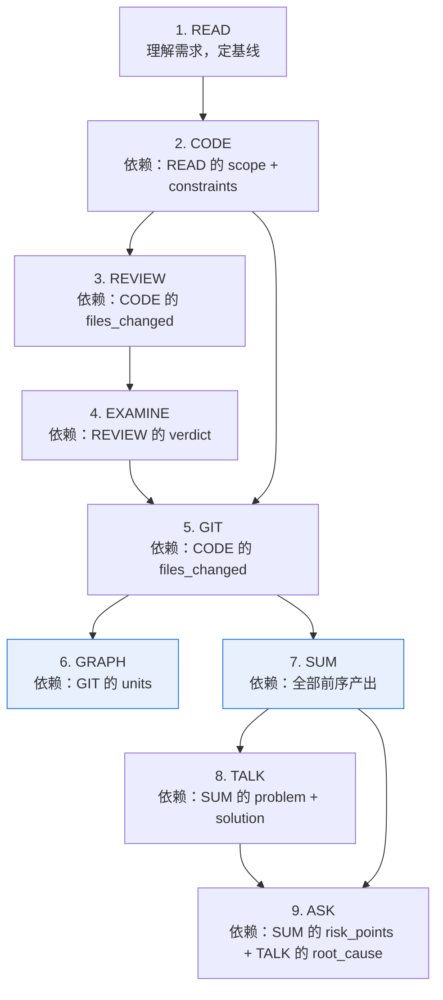

# 编排引擎详细机制

本文档为编排中枢 §6（九步流程）的补充深度参考。Agent 不需要读完这里才能执行——先看 §6 的概要表，深入细节时按需查阅此处。

---

## 步骤间依赖 DAG



> GRAPH 和 SUM 高亮表示它们可以**并行执行**——都只依赖 GIT，互相无依赖。其余步骤严格串行。

### 并行规则

| 步骤对 | 可否并行 | 条件 |
|--------|---------|------|
| GRAPH ∥ SUM | ✅ 可以 | 上下文 🟢 正常级别 |
| GRAPH ∥ TALK | ❌ 不可以 | TALK 依赖 SUM 产出，必须先 SUM 后 TALK |
| GRAPH ∥ EXAMINE | ❌ 不可以 | 无共同前置依赖 |
| SUM ∥ TALK | ❌ 不可以 | SUM 是 TALK 的输入 |

**并行执行约束**：
- 上下文 🟡 预警及以上 → 禁止并行，回归串行
- 平台不支持并发 → 按默认顺序先 GRAPH 后 SUM

---

## 并行审查（🆕 v2.3）

REVIEW 步骤（步骤 3）默认是单线程六维度自审查 + 串行二次独立抽查。对于高风险任务（重构 / 功能开发），编排中枢可启用**并行多视角审查**以提升审查深度。

### 触发条件

以下条件**同时满足**时启用并行审查：
1. 风险等级为 🔴 高（重构或功能开发）
2. 上下文 🟢 正常（< 60%）
3. 平台支持子 Agent（Agent 工具可用）

### 并行审查架构

```
主审查（Agent 自身 — 六维度扫描）
    +
并行交叉审查者（3 个子 Agent，同步运行）：
  ├── 安全审查者    → 专注 OWASP Top 10 / CWE
  ├── 性能审查者    → 专注 N+1 查询 / 内存泄漏 / 算法复杂度
  └── 兼容性审查者  → 专注 API 签名变更 / 依赖冲突 / 数据库迁移兼容
```

每个并行审查者独立产出审查结论。主审查（六维度自审查）的结果作为 base，并行审查者的发现作为追加补充。

### 并行审查合并规则

```
合并逻辑：
1. 主审查 verdict = "pass" 且所有并行审查者均无阻断发现 → 放行
2. 任一并行审查者发现阻断问题 → 汇总到 blocking_issues → 回退 CODE
3. 并行审查者发现非阻断问题 → 追加到对应维度的 issues 列表
4. 二次独立抽查（交叉审查）仍然执行——聚焦于并行审查者未覆盖的维度
```

### 并行审查输出

并行审查者的发现合并到 `review_output` 的扩展字段：

```
review_output:
  parallel_reviews:          # [可选] 仅并行审查启用时存在
    security_reviewer:
      verdict: string        #   "pass" | "issues_found"
      blocking_count: int
      findings: string[]
    performance_reviewer:
      verdict: string
      blocking_count: int
      findings: string[]
    compatibility_reviewer:
      verdict: string
      blocking_count: int
      findings: string[]
```

### 不启用并行审查时

回退到默认行为：单线程六维度自审查 + 二次独立抽查（与 v2.2 相同）。

---

## 自定义步骤注入（🆕 v2.3）

团队可在内置 9 步之外注入自定义步骤，无需修改编排中枢核心文件。

### 发现机制

Agent 在任务分类完成后、执行前，扫描以下目录：

```
.claude/skills/easywork/custom/
├── security-scan/SKILL.md
├── i18n-check/SKILL.md
├── accessibility-audit/SKILL.md
└── ...
```

每发现一个自定义技能，读取其 YAML frontmatter 中的 `insert_after` 和 `insert_condition` 字段。

### 自定义技能规范

自定义技能的 SKILL.md 必须声明以下 frontmatter 字段：

```yaml
---
name: security-scan
description: SAST 安全扫描 — 对变更代码运行 Semgrep/CodeQL
insert_after: REVIEW         # 插入到哪个内置步骤之后
insert_condition: review_output.dimensions.security.status == "issues_found"  # 触发条件
model: sonnet
version: 1.0
---
```

### 注入规则

1. **只能插在已有步骤之间**，不能替换或删除内置步骤
2. **最多注入 5 个自定义步骤**（防止流程膨胀）
3. **自定义步骤失败不阻塞主流程**——标注为 `[custom: fail]`，在 SUM 中记录
4. **自定义步骤的产出**追加到 `step_outputs.custom_steps` 中
5. **注入位置**：`insert_after` 指定的步骤完成后，检查 `insert_condition`，满足则执行

### 工作流展示

注入自定义步骤后，进度卡展示为：

```
EasyWork 工作流启动 — 任务：重构 — 风险：高

[ ] 1. READ     — 理解需求
[ ] 2. CODE     — 代码实现
[ ] 3. REVIEW   — 六维度审查 + 并行审查
[+] 🔒 SECURITY_SCAN — SAST 安全扫描（团队自定义）
[ ] 4. EXAMINE  — 测试执行
[ ] 5. GIT      — 提交拆分
...
```

`[+]` 前缀表示自定义步骤，区别于内置的 9 步。

---

## 条件分支规则（🆕 v2.3 扩展）

当特定条件触发时，自动调整后续步骤的行为：

### 步骤间分支

| 触发条件 | 触发点 | 自动动作 |
|---------|--------|---------|
| REVIEW 发现 `security.status = "issues_found"` | 步骤 3→4 | EXAMINE 自动追加安全相关测试用例（注入、越权、敏感数据） |
| REVIEW 发现 `correctness.status = "blocked"` | 步骤 3 | 不回退 CODE，挂起用户确认 |
| REVIEW 发现 `compatibility.status = "issues_found"` 且涉及 API 签名变更 | 步骤 3 | 追加兼容性测试到 EXAMINE（旧版本 API 调用测试） |
| REVIEW 发现 `maintainability.status = "issues_found"` 且涉及重复代码 | 步骤 3 | 警告但不阻断——在 SUM 中记录技术债务 |
| EXAMINE 发现已有测试失败（非本次导致） | 步骤 4 | 标注 `[已有失败]`，不阻塞流程，不修复无关测试 |
| EXAMINE 运行超 5 分钟无输出 | 步骤 4 | 终止测试进程，挂起用户确认是否跳过 |
| EXAMINE 全部绿色但覆盖率 < 50%（项目有覆盖率工具） | 步骤 4 | 警告——在 SUM 中标注测试覆盖不足 |
| GIT 发现混合变更文件 ≥ 3 个 | 步骤 5 | 提示用户"需要仔细拆分"，每个混合文件标注警示 |
| GRAPH 节点数超过 20 个 | 步骤 6 | 自动拆分为主图 + 子图（而非硬截断） |
| TALK 5-Whys 触及第三方黑盒 | 步骤 8 | 降级为"标注黑盒边界 + 防御建议"，不强行追问 |
| TALK 发现根因与上一次同类型任务相同 | 步骤 8 | 标注 `[重复根因]`，建议升级为 team-policy 规则 |
| CODE↔REVIEW 回退达 3 轮 | 步骤 2↔3 | 挂起用户，输出已发现的所有问题和修复历程 |
| ASK 用户跳过必问维度 | 步骤 9 | 记录 `user_skip_note`，不等于问题消失 |

### 上下文自适应分支

| 触发条件 | 自动动作 |
|---------|---------|
| 上下文 🟠 警戒（80-95%）且还剩 ≥ 4 步 | 跳过 GRAPH（如果执行），跳过 ASK 详细模式 → 快速模式 |
| 上下文 🔴 危急（> 95%） | 立即保存状态快照，停止所有操作 |
| 步骤耗时超过预估 2 倍 | 询问用户：继续等待 / 跳过 / 简化执行 |
| 单步搜索文件超过 15 个（铁律#6） | 挂起确认，除非用户已预授权 |

---

## 自定义步骤与条件分支的交互

自定义步骤也可以注册条件分支：

```yaml
# 在自定义 SKILL.md 的 frontmatter 中声明
triggers_branch:
  - condition: "finding_count >= 3"
    action: "追加专项修复步骤，回退到 CODE"
  - condition: "timeout"
    action: "挂起用户，提供跳过选项"
```

编排中枢在执行自定义步骤后，检查其产出的 `triggers` 字段，按声明处理后续流程。

---

## 步骤产出强制自检

每步结束时（含被跳过的步骤），Agent 必须执行自检：

```
【步骤自检 — {步骤名}】
对照 data-contract.md 中 {步骤名}_output 的 [必填] 字段：

- [ ] {field_1} — 值：{实际值} — ✅ 非空 / ⚠️ 需补全
- [ ] {field_2} — 值：{实际值} — ✅ 非空 / ⚠️ 需补全

自检结论：✅ 全部必填字段已产出 / ⚠️ {N} 个字段需补全
```

### 自检规则

1. **必填字段不可为空**：`null`、`""`、`[]`、`"无"`、`"N/A"` 均视为未产出
2. **缺失时立即补全**：不得以"后续步骤会补充"为由跳过
3. **跳过步骤也需自检**：标记为 `[skip]` 且不产出对应字段，但在自检中显式标注 `[skip]`
4. **自检不可跳过**：即使是低风险任务或重复执行

### 自检增强（🆕 v2.3）

自检现在可选引用 `data-contract.schema.json` 做机器可读验证（平台支持时）：

- 如果 `.claude/skills/easywork/fullchain-dev-workflow/references/data-contract.schema.json` 存在
- 且平台支持 JSON Schema 验证
- 将产出与 schema 中的 `required` 字段对照
- 人工自检（Markdown 表格）+ 机器验证（Schema）双重保障

### data-contract 必填字段速查

| 步骤 | 至少需产出的字段 |
|------|----------------|
| READ | `goal`（非空字符串）, `scope.files`（非空数组）, `constraints`（非空数组）, `acceptance_criteria`（非空数组）, `non_goals`（非空数组） |
| CODE | `files_changed`（非空数组，每项含 path+change_type+reason）, `impact_assessment`（非空字符串）, `implementation_notes`（非空字符串） |
| REVIEW | `verdict`（pass/pass_with_fixes/blocked）, `dimensions`（6+1 个维度各有 status）, `blocking_issues`（数字） |
| EXAMINE | `verdict`（pass/conditional_pass/fail）, `test_command`（非空字符串）, `test_results`（total+passed+failed+skipped）, `test_output_snippet`（非空字符串） |
| GIT | `total_files`, `total_units`, `units`（非空数组，每项含 dimension+files+summary+risk_level） |
| GRAPH | `diagram_type`, `mermaid_code`, `node_mapping`（非空数组）, `text_explanation` |
| SUM | `background`, `discovery`, `problem`, `solution`, `outcome`（含 acceptance_check）, `future`（非空数组） |
| TALK | `five_whys`（非空数组）, `root_cause`, `root_cause_type`, `trade_offs`（非空数组）, `engineering_rules`（非空数组） |
| ASK | `questions`（非空数组，每项含 dimension+question+why_asked+if_no_action）, `confirmed_dimensions` |

---

## 结构化日志

每步完成后，Agent 向 `.claude/easywork/workflow.log.jsonl` 追加一行：

```jsonl
{"session":"{session_id}","step":"READ","status":"pass","skipped":false,"tokens_est":4200,"duration_s":18,"ts":"2026-06-19T15:30:00Z"}
```

### 字段说明

| 字段 | 类型 | 说明 | 可选值 |
|------|------|------|--------|
| `session` | string | 工作流会话 ID | `{YYYYMMDD}-{task_summary_slug}` |
| `step` | string | 步骤名 | READ/CODE/REVIEW/EXAMINE/GIT/GRAPH/SUM/TALK/ASK |
| `status` | string | 执行结果 | pass / pass_with_fixes / skip / blocked / fail |
| `skipped` | bool | 是否跳过 | true / false |
| `tokens_est` | int | 估算消耗 token | — |
| `duration_s` | int | 耗时（秒） | — |
| `ts` | string | ISO 8601 时间戳 | — |

### 日志分析提示

- 找出最耗时步骤：`grep '"step"' workflow.log.jsonl | sort` 按 duration_s 排序
- 统计步骤通过率：按 step 分组统计 status=pass 的比例
- 发现流程瓶颈：哪个步骤的 duration_s 最高且 status!=skip
- 详见 `references/log-analysis-guide.md`
