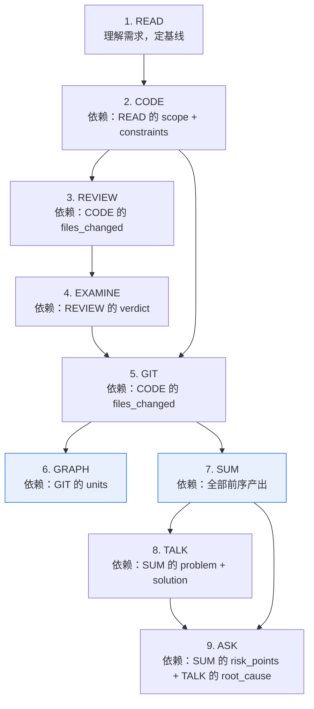

# 编排引擎详细机制

本文档为编排中枢 §6（九步流程）的补充深度参考。Agent 不需要读完这里才能执行——先看 §6 的概要表，深入细节时按需查阅此处。

---

## 步骤间依赖 DAG



> GRAPH 和 SUM 高亮表示它们可以**并行执行**——都只依赖 GIT，互相无依赖。其余步骤严格串行。

### 并行规则

| 步骤对 | 可否并行 | 条件 |
|--------|---------|------|
| GRAPH ∥ SUM | ✅ 可以 | 上下文 🟢 正常级别 |
| GRAPH ∥ TALK | ❌ 不可以 | TALK 依赖 SUM 产出，必须先 SUM 后 TALK |
| GRAPH ∥ EXAMINE | ❌ 不可以 | 无共同前置依赖 |
| SUM ∥ TALK | ❌ 不可以 | SUM 是 TALK 的输入 |

**并行执行约束**：
- 上下文 🟡 预警及以上 → 禁止并行，回归串行
- 平台不支持并发 → 按默认顺序先 GRAPH 后 SUM

---

## 条件分支规则

当特定条件触发时，自动调整后续步骤的行为：

| 触发条件 | 触发点 | 自动动作 |
|---------|--------|---------|
| REVIEW 发现 `security.status = "issues_found"` | 步骤 3→4 | EXAMINE 自动追加安全相关测试用例（注入、越权、敏感数据） |
| REVIEW 发现 `correctness.status = "blocked"` | 步骤 3 | 不回退 CODE，挂起用户确认 |
| EXAMINE 发现已有测试失败（非本次导致） | 步骤 4 | 标注 `[已有失败]`，不阻塞流程，不修复无关测试 |
| EXAMINE 运行超 5 分钟无输出 | 步骤 4 | 终止测试进程，挂起用户确认是否跳过 |
| TALK 5-Whys 触及第三方黑盒 | 步骤 8 | 降级为"标注黑盒边界 + 防御建议"，不强行追问 |
| CODE↔REVIEW 回退达 3 轮 | 步骤 2↔3 | 挂起用户，输出已发现的所有问题和修复历程 |

---

## 步骤产出强制自检

每步结束时（含被跳过的步骤），Agent 必须执行自检：

```
【步骤自检 — {步骤名}】
对照 data-contract.md 中 {步骤名}_output 的 [必填] 字段：

- [ ] {field_1} — 值：{实际值} — ✅ 非空 / ⚠️ 需补全
- [ ] {field_2} — 值：{实际值} — ✅ 非空 / ⚠️ 需补全

自检结论：✅ 全部必填字段已产出 / ⚠️ {N} 个字段需补全
```

### 自检规则

1. **必填字段不可为空**：`null`、`""`、`[]`、`"无"`、`"N/A"` 均视为未产出
2. **缺失时立即补全**：不得以"后续步骤会补充"为由跳过
3. **跳过步骤也需自检**：标记为 `[skip]` 且不产出对应字段，但在自检中显式标注 `[skip]`
4. **自检不可跳过**：即使是低风险任务或重复执行

### data-contract 必填字段速查

| 步骤 | 至少需产出的字段 |
|------|----------------|
| READ | `goal`（非空字符串）, `scope.files`（非空数组）, `constraints`（非空数组）, `acceptance_criteria`（非空数组）, `non_goals`（非空数组） |
| CODE | `files_changed`（非空数组，每项含 path+change_type+reason）, `impact_assessment`（非空字符串）, `implementation_notes`（非空字符串） |
| REVIEW | `verdict`（pass/pass_with_fixes/blocked）, `dimensions`（6 个维度各有 status）, `blocking_issues`（数字） |
| EXAMINE | `verdict`（pass/conditional_pass/fail）, `test_command`（非空字符串）, `test_results`（total+passed+failed+skipped）, `test_output_snippet`（非空字符串） |
| GIT | `total_files`, `total_units`, `units`（非空数组，每项含 dimension+files+summary+risk_level） |
| GRAPH | `diagram_type`, `mermaid_code`, `node_mapping`（非空数组）, `text_explanation` |
| SUM | `background`, `discovery`, `problem`, `solution`, `outcome`（含 acceptance_check）, `future`（非空数组） |
| TALK | `five_whys`（非空数组）, `root_cause`, `root_cause_type`, `trade_offs`（非空数组）, `engineering_rules`（非空数组） |
| ASK | `questions`（非空数组，每项含 dimension+question+why_asked+if_no_action）, `confirmed_dimensions` |

---

## 结构化日志

每步完成后，Agent 向 `.claude/easywork/workflow.log.jsonl` 追加一行：

```jsonl
{"session":"{session_id}","step":"READ","status":"pass","skipped":false,"tokens_est":4200,"duration_s":18,"ts":"2026-06-19T15:30:00Z"}
```

### 字段说明

| 字段 | 类型 | 说明 | 可选值 |
|------|------|------|--------|
| `session` | string | 工作流会话 ID | `{YYYYMMDD}-{task_summary_slug}` |
| `step` | string | 步骤名 | READ/CODE/REVIEW/EXAMINE/GIT/GRAPH/SUM/TALK/ASK |
| `status` | string | 执行结果 | pass / pass_with_fixes / skip / blocked / fail |
| `skipped` | bool | 是否跳过 | true / false |
| `tokens_est` | int | 估算消耗 token | — |
| `duration_s` | int | 耗时（秒） | — |
| `ts` | string | ISO 8601 时间戳 | — |

### 日志分析提示

- 找出最耗时步骤：`grep '"step"' workflow.log.jsonl | sort` 按 duration_s 排序
- 统计步骤通过率：按 step 分组统计 status=pass 的比例
- 发现流程瓶颈：哪个步骤的 duration_s 最高且 status!=skip
- 详见 `references/log-analysis-guide.md`
