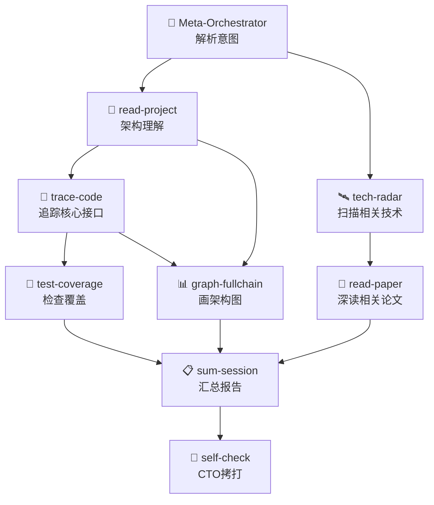

# EasyWork 技能图谱：点 · 线 · 网 三级编排架构

> 版本：v1.0 | 日期：2026-06-25 | 依赖：EasyWork v2.12+

## 0. 为什么需要点线网

EasyWork 目前有 18 个技能节点，但它们是**孤岛**——每个只能单独调用，彼此不知道对方的存在。

```
现状（孤岛模式）：
  📖 read-paper    📐 read-project   🔬 trace-code
  🛰️ tech-radar    🧪 test-coverage  ...
  
  每个都是独立节点，用户必须手动选择调用哪个。
  技能A不知道技能B能做什么，也不知道自己完成后应该建议用户调用谁。
```

**点线网要解决的问题**：

| 层级 | 能力 | 解决的问题 |
|------|------|-----------|
| 🎯 **点** | 单技能精准调用 | "我就需要这一个功能" |
| 🔗 **线** | 技能流水线自动串联 | "我知道要做什么，但不想手动分步调用" |
| 🌐 **网** | 技能自治发现 + 自动扩散 | "我不确定需要哪些技能，让系统自己判断" |

---

## 1. 核心概念

### 1.1 技能原子（Skill Atom）

每个技能是一个**可组合的原子单元**，除了原有的 SKILL.md 外，新增一份**能力卡片（Capability Card）**声明：

```yaml
# 能力卡片 —— 每个技能在 SKILL.md frontmatter 中增加以下字段
capability:
  # 这个技能消费什么
  inputs:
    - name: paper_url
      type: url
      description: ArXiv 论文链接
      required: false
    - name: paper_text
      type: text
      description: 用户粘贴的论文全文/部分
      required: false

  # 这个技能产出什么
  outputs:
    - name: paper_reading_report
      type: markdown
      description: 10 段论文阅读报告
      structure: [速览, 总结, 背景, 问题, 方法, 图解析, 实验, 局限, 概念速查, 分享大纲, 预判问题]

  # 用户说什么会触发这个技能
  triggers:
    - "读论文"
    - "看论文"
    - "paper"
    - "论文阅读"

  # 这个技能跟哪些技能是"好朋友"（高频组合）
  related_skills:
    - skill: tech-radar
      relationship: "tech-radar 扫描到论文后，用户可以挑一篇深读 → 进入 read-paper"
      direction: inbound   # inbound=别人调用我 / outbound=我完成后建议调用别人
    - skill: sum-session
      relationship: "读完论文后可以让 SUM 把多篇的结论汇总"
      direction: outbound

  # 什么场景下应该建议用户调用这个技能（供 Meta-Orchestrator 判断）
  suggested_when:
    - "用户提供了论文链接或论文内容"
    - "用户要准备技术分享且提到了论文"
    - "tech-radar 扫描结果中用户选择了深读某篇论文"

  # 这个技能在被其他技能调用时的行为约束
  callable_by_other: true
  requires_user_confirmation: false   # 被其他技能调用时是否需要用户确认
  max_autonomous_depth: 1             # 最多被自动调用几层（防止无限扩散）
```

### 1.2 三级执行模式

```
🎯 点模式 (Point Mode)
  └── 用户说 "读论文" → 加载 read-paper → 执行 → 产出报告
      触发词精准命中，单技能直调。零开销，最快。

🔗 线模式 (Line Mode / Pipeline)
  └── 用户说 "帮我扫描 AI 动态，有好的论文深读"
      → tech-radar 扫描 → 用户选 #3 → read-paper 深读 #3
      或用户说："先理解项目架构，再追踪支付模块的调用链"
      → read-project → trace-code
      有向无环图 (DAG) 编排，前一个技能的输出是后一个的输入。

🌐 网模式 (Net Mode / Mesh)
  └── 用户说 "帮我搞清楚这个项目的支付模块能不能扛住双11"
      → Meta-Orchestrator 分析意图 →
        1. read-project（理解项目）
        2. trace-code（追踪支付调用链）
        3. test-coverage（检查支付模块测试覆盖）
        4. self-check（CTO拷打：真的能扛住吗？）
        5. talk-retro（分析潜在风险点）
      技能在执行过程中也可以自行发现需要其他技能——
      trace-code 发现有个函数完全没测试覆盖，主动建议/调用 test-coverage。
      自我扩散，自我收敛。最智能，但需要用户审批关键节点。
```

### 1.3 元编排器（Meta-Orchestrator）

位于所有技能之上的调度中枢。不是替换现有的 `fullchain-dev-workflow`（那是开发流程编排），而是新增一个**跨技能调度层**：

```
用户意图
  │
  ▼
┌──────────────────────────────────────┐
│         Meta-Orchestrator             │
│                                        │
│  1. 意图解析：用户到底想要什么？       │
│  2. 模式选择：点/线/网？              │
│  3. 技能匹配：需要哪些技能？          │
│  4. 依赖分析：技能的输入输出对接？    │
│  5. 执行调度：串行/并行/DAG？        │
│  6. 网扩散控制：自治调用的深度/审批？ │
│                                        │
│  ┌──────────┐  ┌──────────┐          │
│  │ Skill    │  │ Pipeline │          │
│  │ Registry │  │ Composer │          │
│  └──────────┘  └──────────┘          │
└──────────────────────────────────────┘
  │
  ▼
技能图谱（Skill Graph）
```

---

## 2. 点模式（Point）：当前已实现

```
触发：用户说的关键词精确命中某个技能的 triggers
行为：只加载该技能的 SKILL.md，执行，产出
规则：跳过全部闸门，风险 L0，无状态文件
```

**当前 18 个技能点全部支持点模式**。无需额外实现。

---

## 3. 线模式（Line）：流水线编排

### 3.1 内置流水线（预定义高频组合）

这些是社区验证过的高频技能串联模式，开箱即用：

| 流水线名称 | 触发词 | 技能序列 | 说明 |
|-----------|--------|---------|------|
| 🔭 **扫描→深读** | "扫技术动态并深读 / scan and deep read" | 🛰️ tech-radar → 📖 read-paper | 先扫再挑重点深读 |
| 🏗️ **理解→追踪** | "理解项目并追踪 / understand and trace" | 📐 read-project → 🔬 trace-code | 先宏观架构再微观调用链 |
| 🧪 **覆盖→补测** | "分析覆盖率并补测试 / coverage and fix" | 🧪 test-coverage → 👁️ read-requirements → ✏️ code-implement | 找到盲区→理解需求→补代码 |
| 📖 **论文→分享** | "读论文并准备分享 / paper to share" | 📖 read-paper → 📊 graph-fullchain → 📋 sum-session | 读懂→画图→汇总 |
| 🔍 **审查→复盘** | "审查并复盘 / review and retro" | 🔍 code-review → 🧠 talk-retro | 发现问题→追根因 |
| 🧠 **复盘→拷打** | "复盘并拷打 / retro and CTO" | 🧠 talk-retro → 🥊 self-check | 分析根因→CTO 验证 |
| 🏗️🔬 **全理解** | "全面理解这个项目 / full understand" | 📐 read-project → 🔬 trace-code → 🧪 test-coverage | 架构+调用链+测试覆盖三连 |

### 3.2 动态流水线（用户即兴组合）

用户可以直接描述想要的技能序列：

```
用户："先帮我理解项目架构，然后追踪支付接口的调用链，最后检查一下支付模块的测试覆盖"

Meta-Orchestrator 解析：
1. "理解项目架构" → 📐 read-project
2. "追踪支付接口调用链" → 🔬 trace-code (入口=支付接口)
3. "检查测试覆盖" → 🧪 test-coverage (聚焦=支付模块)

DAG 执行：
  read-project ──→ trace-code ──→ test-coverage
  (提供架构上下文)  (提供调用路径)  (评估覆盖盲区)
```

**动态流水线的解析逻辑**：

```
输入：用户的自然语言描述
  ↓
Step 1: 提取动作序列
  "先...然后...最后..." / "第一步...第二步..." / 分号或换行分隔
  ↓
Step 2: 每个动作匹配技能
  动作关键词 → Skill Registry 匹配 → 找到目标技能
  ↓
Step 3: 构建依赖图
  技能A 产出 X → 技能B 需要 X → 建立有向边 A→B
  ↓
Step 4: 检查输入输出对接
  如果 B 需要的输入 A 不能产出 → 标注缺口，提示用户补充
  ↓
Step 5: 展示流水线 → 用户确认 → 执行
```

### 3.3 流水线中的闸门策略

流水线模式不是"全部跳过闸门"。根据任务性质决定：

| 流水线类型 | 闸门策略 |
|-----------|---------|
| **纯理解型**（如 理解→追踪） | 跳过全部闸门，风险 L0 |
| **含代码改动**（如 覆盖→补测） | 启用 CODE/REVIEW/EXAMINE 相关闸门 |
| **含安全风险**（如涉及数据库/权限） | 启用完整闸门，按 L2-L4 执行 |

---

## 4. 网模式（Net）：技能自治网络

### 4.1 核心机制：技能自我扩散

网模式的关键创新：**技能在执行过程中，可以发现自己需要其他技能的帮助，主动建议调用。**

```
场景：用户说 "帮我搞清楚这个项目的支付模块能不能扛住双11"

Meta-Orchestrator 初步分析：
  🔬 trace-code (追踪支付调用链) → 输出调用链报告

trace-code 执行过程中发现：
  "这个函数 ProcessRefund 有 18 个分支但只测了 2 个——覆盖率严重不足"
  → 建议调用 🧪 test-coverage 分析支付模块覆盖盲区

test-coverage 执行过程中发现：
  "ProcessRefund 风险分 86 🔴——涉及资金+高复杂度+低覆盖"
  → 建议调用 🥊 self-check 对支付模块进行 CTO 拷打

self-check 拷打发现：
  "并发退款场景下存在竞态条件，可能导致重复退款"
  → 建议调用 🧠 talk-retro 进行根因分析

最终执行图（自适应扩散）：
  trace-code
    ├── test-coverage (自动触发)
    │   └── self-check (自动触发)
    │       └── talk-retro (自动触发)
    └── read-project (可选——如果架构信息还不够)
```

### 4.2 扩散控制（防止无限扩散）

| 控制机制 | 规则 |
|---------|------|
| **深度限制** | 最多自动扩散 3 层（可配置）。第 4 层起必须用户确认。 |
| **用户审批** | 涉及代码改动/数据库/外部调用的技能扩散必须用户确认。纯分析技能（read/trace/test-coverage）可以自动扩散。 |
| **循环检测** | 如果技能 A 建议调用 B，B 又建议调用 A → 标记为循环，停止扩散，报告给用户。 |
| **预算限制** | 网模式单次总 token 预算上限（默认 100K）。超过则停止扩散，汇总已有发现。 |
| **相关性衰减** | 每次扩散时，新技能与原始意图的相关性必须 ≥ 阈值（默认 0.5）。低于阈值不扩散。 |

### 4.3 网模式的触发方式

| 触发方式 | 示例 | 行为 |
|---------|------|------|
| **用户显式** | "全面分析 / 帮我搞清楚 / 深度排查" | 直接进入网模式 |
| **Meta-Orchestrator 判断** | 用户意图复杂，涉及 3+ 技能 | 建议切换到网模式："这个任务可能需要多个步骤，要用网模式吗？" |
| **技能执行中自触发** | trace-code 发现严重问题 | 技能在报告中标注 `[建议调用 test-coverage]`，询问用户是否扩散 |

### 4.4 技能间通信协议（Skill Intercom）

技能在执行中如何建议调用其他技能？通过标准化的**技能间建议（Skill Suggestion）**格式：

```json
{
  "from_skill": "trace-code",
  "suggestion_type": "coverage_gap_detected",
  "severity": "high",
  "target_skill": "test-coverage",
  "reason": "ProcessRefund 覆盖率 12%，18 个分支仅覆盖 2 个，建议分析盲区",
  "context_pass": {
    "focus_file": "order.go",
    "focus_function": "ProcessRefund",
    "risk_score": 86
  },
  "requires_confirmation": false
}
```

**Suggestion Type 枚举**：

| 类型 | 含义 | 触发条件 |
|------|------|---------|
| `coverage_gap_detected` | 发现覆盖盲区 | 某函数覆盖<30% + 复杂度>10 |
| `architecture_unknown` | 需要架构上下文 | 当前技能需要了解项目结构 |
| `deep_read_needed` | 需要深读某篇文献 | 扫描到高价值论文 |
| `root_cause_analysis` | 需要根因分析 | 发现重复出现的问题模式 |
| `cto_review_needed` | 需要 CTO 拷打 | 发现高风险的决策/代码 |
| `visualization_needed` | 需要可视化 | 调用链/架构需要图 |
| `knowledge_gap` | 需要外部知识 | 遇到不熟悉的领域/技术 |
| `long_output_needs_writing` | 长输出需写入文件 | 产出超过 20 行/结构性报告，建议调用 article-write 写入 .md 文件 |
| `needs_quick_answer` | 需要快速精简回答 | 用户问题明确但不想看长篇大论，建议用 quick-answer 模式回答 |
| `needs_tech_compare` | 需要技术方案选型对比 | 面临多方案选择/技术决策/架构选型，建议调用 tech-compare 做六阶段战略分析 |
| `needs_api_test` | 需要接口联调测试 | 新接口开发完成/联调阶段/需要构造测试参数，建议调用 api-test 做全覆盖测试 |

---

## 5. 技能注册表（Skill Registry）

### 5.1 完整能力卡片模板

```yaml
# 每个 SKILL.md frontmatter 中新增 capability 块
capability:
  id: "read-paper"
  display_name: "论文阅读助手"
  emoji: "📖"
  category: "learning"           # learning / development / quality
  tier: 1                        # 1=基础节点 / 2=流程节点 / 3=编排节点

  inputs:
    - { name: "paper_url", type: "url", required: false }
    - { name: "paper_text", type: "text", required: false }

  outputs:
    - { name: "reading_report", type: "markdown", description: "10 段论文阅读报告" }

  triggers: ["读论文", "看论文", "paper", "论文阅读"]

  related_skills:
    - { skill: "tech-radar", relationship: "inbound", desc: "tech-radar 扫描后深读论文" }
    - { skill: "sum-session", relationship: "outbound", desc: "多篇论文汇总到 SUM" }

  suggested_when:
    - "用户提供了论文链接/内容"
    - "技术分享准备中涉及论文"
    - "tech-radar 深读请求"

  pipeline_placement:
    good_after: ["tech-radar"]    # 适合跟在哪些技能后面
    good_before: ["sum-session", "graph-fullchain"]  # 适合在哪些技能前面

  autonomous:
    callable_by_other: true
    requires_confirmation: false
    max_depth: 1

  risk_level: "L0"                # 纯理解任务，无副作用
```

### 5.2 18 个技能的能力卡片速览

| 技能 | 类别 | 消费 | 产出 | 好朋友 |
|------|------|------|------|--------|
| 📖 read-paper | learning | paper_url/text | reading_report | tech-radar→, →sum-session |
| 📐 read-project | learning | project_path | project_report | →trace-code, →test-coverage |
| 🔬 trace-code | learning | entry_function | trace_report | read-project→, →test-coverage |
| 🛰️ tech-radar | learning | domains, time_range | radar_report | →read-paper |
| 🧪 test-coverage | learning | project_path | coverage_report | trace-code→, →code-implement |
| 👁️ read-requirements | development | requirement_text | requirement_doc | →code-implement, →checklist |
| ✏️ code-implement | development | requirement_doc | code_changes | read-requirements→, test-coverage→ |
| 🔍 code-review | development | code_changes | review_report | →talk-retro |
| 🧠 talk-retro | development | review_report | retro_report | code-review→, →self-check |
| 🥊 self-check | development | any_report | cto_review | talk-retro→, checklist→ |
| 📊 graph-fullchain | development | project_report | mermaid_diagrams | read-project→ |
| 📋 sum-session | development | multi_reports | summary_report | read-paper→, →checklist |
| ✅ checklist | quality | delivery_definition, task_type | checklist_report, gaps | read-requirements→, sum-session→, →self-check, →ask-change-questions |
| 📝 article-write | content | raw_content, doc_type, source_skill | written_file_path, doc_preview | all skills→ (底座能力——任何长输出技能均可调用写入 .md 文件) |
| 💻 slash-cmd | orchestration | action, skill_name | command_status | all skills→ (命令入口层——为所有技能生成 /easywork:<name> 子命令) |
| ⚡ quick-answer | content | user_question | quick_answer | all skills→ (底座能力——TL;DR 优先的结构化精简回答，答案先行要点为辅) |
| ⚖️ tech-compare | development | problem_context, candidate_solutions | tech_compare_report, decision_matrix, adr_draft | tech-radar→, read-paper→, →article-write, →self-check (六阶段战略决策框架——问题考古→解空间映射→深度对比→差异化论证→效果量化→演进路线) |
| 🔌 api-test | quality | api_spec, test_scope | test_case_matrix, error_code_map, db_verify_sql, middleware_verify, test_script | code-implement→, code-review→, →article-write, →self-check (五阶段接口联调——规格解析→用例生成→预期计算→错误码映射→DB/MQ/Redis验证) |

---

## 6. 流水线编排器（Pipeline Composer）

### 6.1 DAG 执行模型

```
流水线 = 有向无环图 (DAG)
  - 节点 = 技能
  - 边 = 数据依赖（上游产出 → 下游消费）
  - 无依赖的节点可以并行执行
```

**示例：全理解流水线**



### 6.2 三种编排策略

借鉴 AgentSkillOS 的三策略设计：

| 策略 | 行为 | 适用场景 |
|------|------|---------|
| **质量优先** Quality-First | 串行执行，每步产出经过验证后才进入下一步。前置步骤充分准备，后续步骤可以引用丰富上下文。 | 重要决策、安全审计、技术方案评审 |
| **效率优先** Efficiency-First | 最大化并行度。无依赖的技能同时执行，最后汇总。 | 时间敏感、多维度独立分析 |
| **简洁优先** Simplicity-First | 只执行最小必需技能集。每个技能都是不可去掉的。 | 快速验证、简单问题 |

**用户指定策略**：
- "帮我全面深度分析这个项目" → 质量优先
- "快速帮我扫一下，半小时内出结果" → 效率优先
- "就帮我搞清楚支付模块能不能用" → 简洁优先

---

## 7. 用户交互界面

### 7.1 三种模式的用户触发方式

```
🎯 点模式 —— 跟现在一样
  "读论文" / "追踪代码" / "扫技术动态" / "测试覆盖率"
  → 单技能直调

🔗 线模式 —— 用户说串联词
  "先...再...然后..." / "帮我...之后..."
  "扫描技术动态，有好的论文帮我深读"
  "先理解项目架构，然后追踪支付接口的调用链"
  → Meta-Orchestrator 解析 → 构建流水线

🌐 网模式 —— 用户说复杂意图
  "全面分析 / 深度排查 / 帮我搞清楚 / 完整评估"
  "帮我搞清楚这个项目的支付模块能不能扛住双11"
  → Meta-Orchestrator 分析意图 → 初始技能图 → 执行中自扩散
```

### 7.2 流水线/网络的进度展示

```
【🔗 线模式 — 理解→追踪→覆盖】

📐 read-project ........... ✅ 完成 (3 个核心模块)
🔬 trace-code ............. 🔄 执行中 (追踪 ProcessRefund...)
🧪 test-coverage .......... ⏳ 等待上游完成

━━━━━━━━━━━━━━━━━━━━━━━━━━━━━━ 67%


【🌐 网模式 — 支付模块全面评估】

🔬 trace-code ............ ✅ 完成
  ├── 发现覆盖盲区 → 建议 🧪 test-coverage
🧪 test-coverage ......... ✅ 完成
  ├── 发现高危热点 → 建议 🥊 self-check
🥊 self-check ............ 🔄 执行中
  └── 发现了竞态风险 → 建议 🧠 talk-retro [等待确认]
🧠 talk-retro ............ ⏸️ 等待用户确认

扩散深度: 2/3 | 已用 token: 45K/100K
```

### 7.3 用户审批节点

网模式中，以下情况必须用户确认才能继续扩散：

| 触发条件 | 审批提示 |
|---------|---------|
| 技能的扩散建议包含代码改动 | "下一步将生成补测试代码，确认继续？" |
| 扩散深度达到限制 | "已达到最大扩散深度 (3 层)，要继续吗？" |
| Token 预算消耗 80% | "已用 80K/100K tokens，要继续扩散还是先看报告？" |
| 技能建议涉及安全/权限 | "下一步将分析认证模块的安全风险，确认继续？" |

---

## 8. 实现路线图

### Phase 1：能力卡片 + 注册表（1-2 天）

**文件变更**：
- 18 个 SKILL.md 各增加 `capability` frontmatter 块
- 新建 `skills/fullchain-dev-workflow/references/skill-registry.md`（自动从 capability 生成）

**效果**：
- 技能之间互相"知道"对方的存在
- 可以查询"哪些技能跟 read-paper 是好朋友"
- 点了技能后，Agent 可以在输出末尾建议相关技能

### Phase 2：线模式 — 内置流水线（2-3 天）

**文件变更**：
- `skills/fullchain-dev-workflow/SKILL.md` 增加 §线模式
- 新建 `skills/fullchain-dev-workflow/references/pipeline-composer.md`
- QUICKREF.md 增加流水线触发词

**效果**：
- 7 条内置流水线开箱即用
- 用户可以说"先...再..."触发动态流水线
- 流水线有进度条展示

### Phase 3：网模式 — 技能自治网络（3-5 天）

**文件变更**：
- `skills/fullchain-dev-workflow/SKILL.md` 增加 §网模式 + Meta-Orchestrator
- 新建 `skills/fullchain-dev-workflow/references/skill-intercom.md`
- 每个技能增加"执行中建议其他技能"的逻辑

**效果**：
- 技能在分析过程中可以发现盲区并建议其他技能
- Meta-Orchestrator 自动判断是否需要扩散
- 扩散深度/预算/审批三重控制

---

## 9. 与现有架构的关系

```
EasyWork 现有架构：

  fullchain-dev-workflow (编排中枢)
    ├── READ → CODE → REVIEW → EXAMINE → GIT → GRAPH → SUM → TALK → SELFCHECK → ASK
    └── 单步调用（18 个技能点）

点线网架构（在现有基础上增加）：

  fullchain-dev-workflow (编排中枢)
    ├── 🎯 点模式（现有，18 个技能）
    ├── 🔗 线模式（🆕 流水线编排器 + 7 条内置流水线）
    └── 🌐 网模式（🆕 Meta-Orchestrator + 技能自治扩散）

  不替换现有架构，而是增加两个新的执行模式。
  现有的单步调用和 10 步开发流程完全不受影响。
```

---

## 10. 反模式

- ❌ 网模式无限扩散不设深度限制——3 层深度是硬上限
- ❌ 技能之间循环调用（A→B→A）——循环检测必须到位
- ❌ 涉及代码改动的技能被自动调用不经用户确认——write 操作永远需要审批
- ❌ 流水线不考虑技能间的输入输出对接——不匹配就硬凑会产出垃圾
- ❌ 所有流水线都用质量优先策略——简单任务用简洁优先，别杀鸡用牛刀
- ❌ 把"建议调用"变成"强制调用"——技能只能建议，不能越权
- ❌ 网模式执行时间无上限——30 分钟超时自动收敛

---

## 参考文献

- AgentSkillOS (Shanghai AI Lab, 2025): Capability Tree + DAG Orchestration
- SkillGraph: Subagent Delegation Model
- Google A2A Protocol: Agent Cards for Cross-Framework Coordination
- Adaptive Cognitive Loop (ACL): Dynamic Agent Spawning Pattern
- Anthropic Skills Protocol: Progressive Disclosure (4-Level Context Loading)
