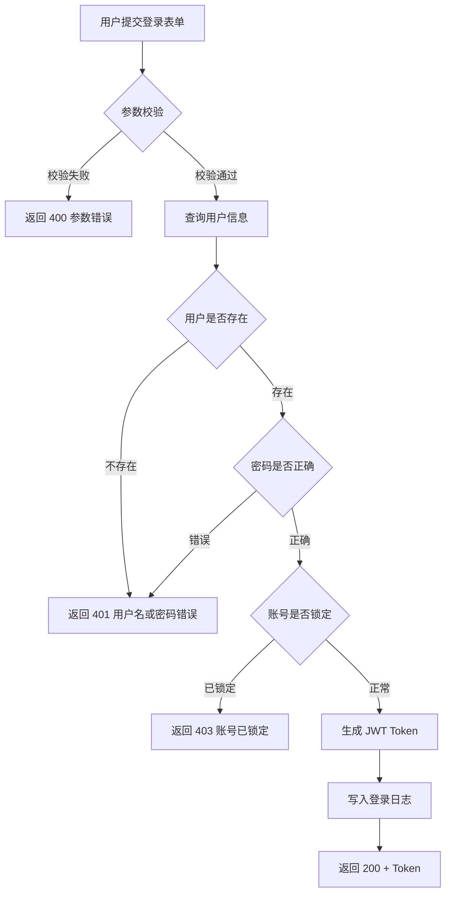
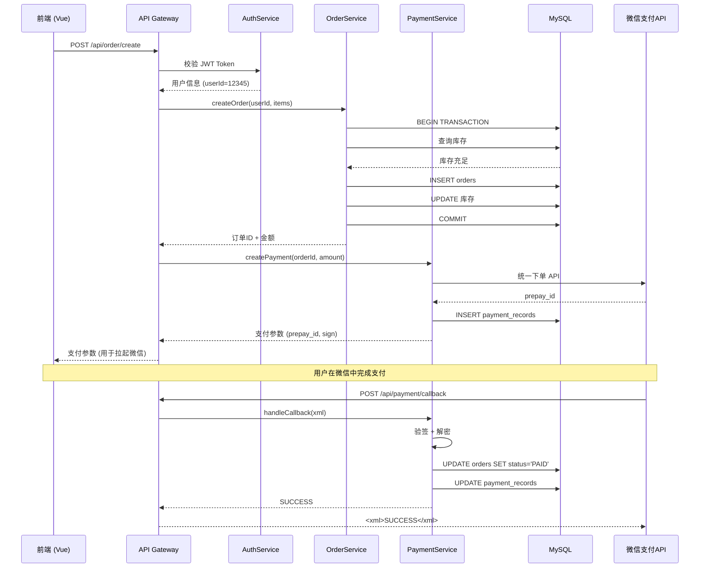

# 可视化图表输出模板

## 图表类型说明
- 所选图表类型：{流程图 / 时序图 / 架构图}
- 选择理由：{为什么选择这个图表类型，关联到本次改动的什么特点}

---

## 图表一：{图表名称}

### Mermaid 代码

```mermaid
{你的 Mermaid 代码}
```

### 图表说明

{用文字对图表进行补充解释，特别是图中不方便标注的业务背景和设计考量}

### 节点与代码对照表

| 图中节点 | 对应代码实体 | 文件位置 |
|---------|-------------|---------|
| {节点1} | {函数名/类名/API路径} | {文件:行号} |
| {节点2} | {函数名/类名/API路径} | {文件:行号} |

---

## 可复用 Mermaid 示例

以下三个完整示例可直接修改使用。

### 示例 1：流程图 — 用户登录校验流程



节点对照表：
| 图中节点 | 代码实体 | 文件位置 |
|---------|---------|---------|
| 参数校验 | `validateLoginInput()` | `src/middleware/validator.ts:42` |
| 查询用户信息 | `UserModel.findByUsername()` | `src/models/user.model.ts:108` |
| 密码是否正确 | `bcrypt.compare()` | `src/services/auth.service.ts:88` |
| 账号是否锁定 | `user.lockedUntil > now` | `src/services/auth.service.ts:95` |
| 生成 JWT Token | `jwt.sign()` | `src/utils/jwt.ts:25` |
| 写入登录日志 | `LoginLog.create()` | `src/models/login-log.model.ts:33` |

---

### 示例 2：时序图 — 前端→后端→数据库→微信支付 完整调用链



节点对照表：
| 图中节点 | 代码实体 | 文件位置 |
|---------|---------|---------|
| AuthService | `class AuthService` | `src/services/auth.service.ts` |
| OrderService | `class OrderService` | `src/services/order.service.ts` |
| PaymentService | `class PaymentService` | `src/services/payment.service.ts` |
| 统一下单API | `PaymentService._callWxUnifiedOrder()` | `src/services/payment.service.ts:142` |
| 验签 + 解密 | `PaymentService._verifyWxSign()` | `src/services/payment.service.ts:210` |

---

### 示例 3：架构图 — 微服务电商系统模块关系

```mermaid
graph TD
    subgraph 前端层
        Web[Web 前端 (Vue)]
        Admin[管理后台 (React)]
    end

    subgraph 网关层
        Gateway[API Gateway (Kong)]
    end

    subgraph 核心服务
        UserSvc[用户服务]
        OrderSvc[订单服务]
        PaySvc[支付服务]
        GoodsSvc[商品服务]
    end

    subgraph 基础设施
        MySQL[(MySQL)]
        Redis[(Redis 缓存)]
        MQ[消息队列 (Kafka)]
    end

    subgraph 外部服务
        WXPay[微信支付]
        SMS[短信服务]
    end

    Web --> Gateway
    Admin --> Gateway
    Gateway --> UserSvc
    Gateway --> OrderSvc
    Gateway --> PaySvc
    Gateway --> GoodsSvc

    UserSvc --> MySQL
    UserSvc --> Redis
    OrderSvc --> MySQL
    OrderSvc --> MQ
    PaySvc --> MySQL
    PaySvc --> WXPay
    PaySvc --> MQ
    GoodsSvc --> MySQL
    GoodsSvc --> Redis

    UserSvc --> SMS
```

> **提示**：架构图在实际使用时，应**高亮本次改动涉及的节点**。如上例中若本次只改了支付服务，可以用 `style PaySvc fill:#e8f0fe,stroke:#1a73e8` 高亮 `PaySvc` 节点。

---

## 关键流程文字解释

{用 3-5 段文字总结图表中最核心的流程和设计决策，方便不习惯看图的人}
