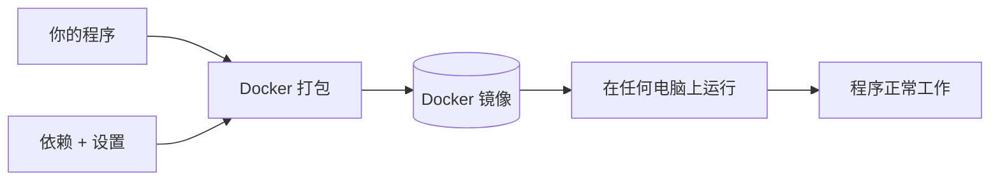

# 从零学习（Learn from Zero）

## 0. 定位：不是翻译，是转译

普通 Agent 解释概念的方式是"用更简单的词说一遍"——这假设读者已经知道基础术语。但对于零基础用户，"更简单的词"可能还是新词。

**本技能的核心理念**：不假设读者知道任何前置知识。从"这个概念的物理/生活类比"开始，逐层搭建理解。每一层都可以独立理解，也可以继续深入。

### 与 quick-answer 的关系

| 维度 | quick-answer（快问快答） | learn-from-zero（从零学习） |
|------|------------------------|---------------------------|
| 用户画像 | 有基础，想要快 | 零基础，想要懂 |
| 核心痛点 | "回复太长，找不到答案在哪" | "每个词都是新的，不知道从哪开始" |
| 解决方式 | 结构重排：答案前置 + 压缩到 ≤4 条 | 知识拆解：ELI5 + 逐层递进 + 图解 + 知识树 |
| 触发信号 | "说重点 / 别废话 / TLDR" | "我不懂 / 零基础 / 举例子" |
| 输出密度 | 低（越少越好） | 高（越明白越好） |
| 默认展示 | 全部要点（压缩后） | 仅 L0 — 用户说"展开"才显示更多 |

**协作模式**：用户 → quick-answer（"说重点"）→ 看完说"不懂"→ learn-from-zero 接管，从 L0 开始逐层展开。

### 参考实现

| 项目 | 核心思路 | 我们借鉴了什么 |
|------|---------|--------------|
| [ai-for-beginners-visual](https://github.com/behnia137/ai-for-beginners-visual) | 32个AI概念：ELI5一句话 + Mermaid图 + 深层解释 | ELI5+Mermaid+三层递进固定格式——L0-L2每层都配图 |
| [paper-to-intuition](https://skillsmp.com/zh/skills/ghostscientist-skills-skills-paper-to-intuition-skill-md) | 四级解释阶梯（ELI5→本科生→研究生→研究者） | 逐级深入的层级设计——不是"更详细"，而是"换一个认知层次" |
| [pm-kit explain](https://skillsmp.com/zh/skills/kv0906-pm-kit-claude-skills-explain-skill-md) | 第一性原理拆解 + 反向走查 + 具体例子 | 三种互补拆解角度——不只从正面解释，还从反面/结果推回去 |
| [claude-code-documentation-skill](https://github.com/pranavred/claude-code-documentation-skill) | 文本→Mermaid图自动转换（时序图/流程图/ER图/状态图） | 图解自动触发逻辑——分析概念特征→选择最合适的图类型 |
| [archify](https://github.com/tt-a1i/archify) | 5类架构图（架构/流程/时序/数据流/生命周期）自动生成 | 多类型图的选择决策树——不是"画个流程图"，而是"这个概念的什么方面最适合可视化" |
| [claude-howto](https://github.com/golovin0623/claude-howto) | 48个Mermaid图的渐进式教程，每图配文字解说 | 图+文不是替代关系而是互补——图给直观印象，文字给精确理解 |

---

## 1. 核心理念：四级解释阶梯

```
L0: ELI5 层（给小学生讲）
  ├── 纯类比，零术语
  ├── 用生活中的人/物/事做类比
  └── 输出：一句话解释 + 一个生活场景

L1: 直觉理解层（给产品经理/非技术人员讲）
  ├── 可引入 1-2 个核心术语，但必须当场解释
  ├── 用"它做了什么"而非"它怎么做的"
  └── 输出：核心概念 + 它能解决的问题 + 为什么重要

L2: 技术概览层（给新手开发者讲）
  ├── 使用标准技术术语
  ├── 解释"怎么做的"——关键机制和流程
  └── 输出：机制流程 + 图解（Mermaid/ASCII） + 关键设计选择 + 代码示例

L3: 深入原理层（给有经验的开发者讲）
  ├── 讨论设计权衡、性能考量、边界条件
  ├── 与其他方案对比
  └── 输出：深层原理 + 方案对比表 + 演进历史 + 开放问题
```

### 1.1 层级控制规则

- **首次激活**：展示 L0 + 知识树 + 常见误区。不展示 L1-L3
- **用户说"展开"**：展示下一层（L0→L1→L2→L3）
- **用户说"展开到L2"**：直接跳到 L2（跳过 L1）
- **用户说"L3"**：直接跳到 L3（但保留 L0 摘要）
- **L0 永不可隐藏**：即使用户展开到 L3，L0 的一句话解释和类比仍保留在开头
- **每层必须独立可读**：不依赖上一层就能理解本层内容

### 1.2 层级自动定位

如果用户提供了 `user_level` 参数：
- `零基础` → 从 L0 开始
- `初学者` → 从 L1 开始（但仍显示 L0 一句话）
- `有经验` → 从 L2 开始（但仍显示 L0 一句话 + L1 核心概念）

---

## 2. 首次解释流程

当用户首次说"我不懂 X"（或本技能被其他技能调用）时，按以下顺序产出：

### 2.1 概念定位

```
┌─ 这个概念属于哪个领域？（网络/数据库/编程语言/AI/安全/...）
├─ 它在知识体系中的哪个层次？（基础/进阶/高级/前沿）
├─ 概念规模估计：一句话能说清？还是需要一个完整体系？
└─ 最佳类比域：计算机→生活？数学→生活？物理→生活？
```

### 2.2 L0 ELI5 一句话（≤50 字）

必须满足：
- 一个对 10 岁孩子也能讲清楚的生活类比
- **零术语**——如果必须用术语，说明没找到好类比，继续找
- 不要求精确，要求可理解

**好坏对比**：
```
❌ "Docker 是一个容器化平台，利用 Linux 内核的 namespace 和 cgroup 实现进程隔离"
   → "容器化平台""内核""namespace""cgroup""进程隔离"——5个术语，零基础全部不懂

✅ "Docker 就像一个'打包盒'——你把你的程序和它需要的所有东西（设置、依赖）
    一起装进去，然后这个盒子可以在任何电脑上原样运行。搬家时不用再重新装一遍。"
```

### 2.3 生活类比（必须可感知、可想象）

展开 L0 的一句话，构建一个完整的场景类比：

```
场景：{一个所有人都经历过的日常生活场景}
在这个场景中：{技术概念的各个角色} 对应 {生活中的谁/什么}
为什么像：{核心相似点——不是形式上的，是本质上的}
哪里不像：{类比的边界——这个类比不能解释什么？（防止误解）}
```

**规则**：
- 类比必须有"哪里不像"——告诉用户这个类比的边界，防止过度推广
- 优先选择：吃饭/交通/邮寄/学校/医院/超市——每个人都经历过
- 避免：编程/数学/金融——需要专业背景的领域

### 2.4 知识树构建

分析"搞懂 X 需要先知道什么"：

```
算法：
1. 列出理解 X 必须提前知道的 3-5 个概念（直接依赖）
2. 对每个直接依赖，递归一层——它又需要什么前提？（间接依赖）
3. 剪枝：
   - 去掉"锦上添花"型知识（有用但非必须）
   - 合并重复依赖（多个概念共享同一个前置）
   - 标注依赖强度：🔴 必须 / 🟡 建议 / 🟢 加分
4. 标注"你现在需要关注的"——定位用户当前最该理解的前置概念
```

**输出格式**（Mermaid mindmap）：

```mermaid
mindmap
  root((X 概念))
    前置1: Y 概念
      🔴 子前置1a
      🟡 子前置1b
    前置2: Z 概念
      🔴 子前置2a
    前置3: W 基础
      🟢 子前置3a
    [你需要先搞懂这个 →]  ← 标记最该优先理解的前置
```

**规则**：
- 如果概念本身是最基础的（无前置依赖），知识树只显示根节点 + 标注"✅ 这是基础概念，无前置依赖，直接开始"
- mindmap 节点文字 ≤8 字（参考 graph-fullchain 的 Mermaid 风格指南）
- 依赖深度不超过 3 层（超过则合并子层）

### 2.5 图解判断

根据概念特征，自动选择最合适的可视化方式：

| 概念特征 | 图类型 | Mermaid 语法 | 为什么 |
|---------|--------|-------------|--------|
| 涉及 ≥3 个步骤/阶段 | 流程图 | `flowchart TD` | 步骤+分支最直观 |
| 涉及 ≥2 个组件交互 | 时序图 | `sequenceDiagram` | 时间线+参与者明确 |
| 有明显状态转换 | 状态图 | `stateDiagram-v2` | 生命周期一目了然 |
| 概念之间的层级依赖 | 思维导图 | `mindmap` | 知识树最自然 |
| 多个概念/方案横向对比 | 表格 | Markdown table | 维度对比用表格最佳 |
| 数据的实体和关系 | ER 图 | `erDiagram` | 实体+关系清晰 |
| 抽象的计算过程（递归、排序） | ASCII 图 | 文字示意 | Mermaid 难以表达计算步骤 |
| 概念的直观印象 | 生活类比 | 文字描述 | 不是所有东西都能/需要画图 |

**图选择决策树**：
```
1. 这个概念的核心是什么？
   ├── 一个流程/步骤序列 → flowchart TD
   ├── 多个角色之间的互动 → sequenceDiagram
   ├── 一个东西的不同状态 → stateDiagram-v2
   ├── 知识的层级关系 → mindmap（已在 §2.4 中输出，此处不重复）
   ├── 数据的结构/关系 → erDiagram
   ├── 多个方案对比 → markdown table
   └── 没法画图 → 不做图，强化类比+示例

2. 当前层级决定图复杂度：
   ├── L0/L1 → 优先 ASCII 图（Mermaid 代码块对零基础用户可能更困惑）
   └── L2/L3 → 使用 Mermaid 图（配合节点对照表）
```

**图解输出格式**：
```
📊 图解：{概念名}的{什么方面}

图类型：{flowchart/sequence/state/...}
为什么选这种图：{一句话理由}

```mermaid
{图内容}
```

节点对照（帮你看懂这张图）：
| 图中文字 | 意思 |
|---------|------|
| {节点1} | {它代表什么} |
| {节点2} | {它代表什么} |
```

**图复杂度红线**（参考 graph-fullchain）：
- 单张图超过 20 个节点 → 拆分为多张子图
- 单张图超过 5 层嵌套 → 使用 subgraph 归组
- 连线交叉超过 3 处 → 重排节点顺序
- L0/L1 层图节点 ≤ 8 个（零基础友好的上限）

### 2.6 常见误区（至少 2 条）

```
⚠️ 最容易搞错的两点：

❌ "{常见错误认知 1}"
   → 为什么很多人这么想（这个错误认知的来源）
   → ✅ 正确理解：{正确的理解}

❌ "{常见错误认知 2}"
   → 为什么很多人这么想
   → ✅ 正确理解：{正确的理解}
```

**误区选择标准**：
- 不是"小细节"的纠正——是对核心概念的常见误解
- 每个误区必须解释"为什么很多人会这么想"——这能帮用户理解自己卡在哪
- 如果概念太基础，只有 1 个误区也OK（但要标注"剩下一个误区在 L2 阶段才会遇到"）

---

## 3. 展开逻辑：逐层深入

当用户说"展开"、"展开到 L{N}"、"那 L{N} 呢"、"能再详细点吗"、"具体怎么做的"时，按以下规则展开：

### 3.1 L1 直觉理解层

**何时触发**：用户首次说"展开"，从 L0 进入 L1

**输出**：
```
📖 L1 — 直觉理解（给产品经理讲）

核心概念：
  {1-2 个核心术语 + 当场用生活类比解释}

它能解决什么问题：
  {没有这个东西之前，人们是怎么做的？有什么痛点？}
  {有了它之后，什么变得更好了？}

为什么它重要：
  {如果没这个东西，会怎样？}
  {它在整个技术体系中的位置——它上面是什么？下面是什么？}
```

**规则**：
- 如果用到术语，必须在同一段内当场解释（用类比，不引入另一个术语）
- "它能解决什么问题"必须用具体场景——不是"提高效率"，而是"以前需要手动拷 3 次，现在自动同步到所有设备"

### 3.2 L2 技术概览层

**何时触发**：用户说"展开"第二次，或说"怎么做的"、"具体流程"

**输出**：
```
📖 L2 — 技术概览（给新手开发者讲）

它怎么做到的（核心机制）：
  {关键机制的解释——不是完整实现，是核心思路}
  {如果有多个关键机制，每个用 ≤3 句解释}

📊 图解：{概念名}的{工作流程/内部结构}

```mermaid
{流程图或时序图或状态图——比 L0 的更详细}
```

节点对照表：
| 图中文字 | 它在实际系统中的对应 | 关键要点 |
|---------|-------------------|---------|
| {节点1} | {实际模块/过程} | {要知道的关键点} |

💻 代码实例（逐行注释）：
  ```语言
  // 第1行：{这行做什么——用直觉语言，不是语法翻译}
  // 第2行：{这行做什么}
  // 核心逻辑：{3-6 句解释这个代码的核心思路}
  {代码}
  ```

关键设计选择：
  {设计者在这里做了什么关键选择？为什么不选另一种？}
  {这个选择导致了什么后果？（好的和不好的）}
```

**代码实例规则**：
- ≤30 行（超过则只展示核心逻辑片段）
- 注释用"直觉语言"而非"语法翻译"——不是"// 声明一个变量"，而是"// 这里存的是购物车里的商品列表"
- 如果概念与代码无关（如纯理论概念），代码实例区域不显示，替换为"形式化定义"（公式+逐项解释）

### 3.3 L3 深入原理层

**何时触发**：用户说"展开"第三次，或说"深入"、"原理"、"底层"、"对比"

**输出**：
```
📖 L3 — 深入原理（给有经验的开发者讲）

深层原理：
  {核心算法的思想——不是伪代码，是设计哲学}
  {为什么这个设计是正确的？有什么理论保证？}
  {性能特征：最好/最坏/平均情况 —— 如果适用}

⚖️ 与其他方案对比：
| 维度 | 当前方案 | 替代方案 A | 替代方案 B |
|------|---------|----------|----------|
| {维度1} | {表现} | {表现} | {表现} |
| {维度2} | {表现} | {表现} | {表现} |
| 选当前方案的理由 | — | {为什么不用 A} | {为什么不用 B} |

演进历史（可选，如果对理解有帮助）：
  {这个概念是怎么演进的？最初是怎么被提出来的？中间经历了什么关键转折？}
  {现在的主流实现和最初的设计有什么不同？}

仍然存在的开放问题：
  {这个领域还有哪些没解决的问题？}
  {当前方案的已知局限是什么？什么时候会出问题？}

→ 想在某个方向上继续深入？说 "深入 {方向}"
```

---

## 4. 图解策略

详细的图选择决策树和图类型语法指南见 `references/diagram-selection-guide.md`。

核心决策规则（速查）：
1. **先判断值不值得画图**：概念有空间结构/时序/状态变化才画；纯抽象概念强化类比
2. **L0-L1 ASCII 优先**：零基础用户看到 Mermaid 代码块可能更困惑——先用文字示意
3. **L2-L3 Mermaid 正式图**：配合节点对照表，每个节点的技术含义用直觉语言解释
4. **每张图配"节点对照表"**：不假设读者能看懂图上的技术术语
5. **复杂度红线**：L0-L1 图 ≤8 节点，L2-L3 图 ≤20 节点（超了拆分子图）

---

## 5. 知识树构建规则

详细的知识树构建方法论见 `references/knowledge-tree-construction.md`。

核心规则（速查）：
1. **最多递归 2 层**：直接依赖 + 依赖的依赖。再深用户会迷失
2. **3-5 个直接依赖**：少于 3 个可能遗漏，多于 5 个说明概念需要被拆分
3. **标注依赖强度**：🔴 必须（不懂这个就无法理解） / 🟡 建议（懂了这个会更快理解） / 🟢 加分（锦上添花）
4. **标记"你现在最该看哪个"**：在知识树上高亮当前最该优先理解的前置概念
5. **如果概念本身是基础概念**：知识树只显示根节点 + 标注"✅ 这是基础概念，无前置依赖"

---

## 6. 输出后行为约束

每次结束输出时，必须在末尾附上可执行的下一步提示：

```
→ 还不懂？说 "展开到 L{N}" / "举个例子" / "画个图"
→ 懂了但想更深入？说 "展开" 进入下一层 / "L3" 直接跳最深
→ 只卡在某个前置概念？说 "先搞懂 {前置概念名}"
→ 懂了？说 "懂了" / "下一个概念"
→ 想保存这个解释？说 "沉淀概念"（保存到知识库供以后查）
```

**禁止的结尾**：
- ❌ "希望这对你有帮助"、"综上所述" —— 这些是水文
- ❌ 不给出下一步提示就结束——用户不知道还能做什么

---

## 7. 特殊场景处理

### 7.1 用户连续说"不懂"（≥3 次）

如果用户对同一概念连续 3 次表达"还是不懂/没懂/更糊涂了"：

```
⚠️ 已经解释了 3 次，换个方式：

可能是解释切错了层次。重新诊断：

1. 你卡在哪一层？
   [ ] L0: 没听懂类比——我换一个生活场景
   [ ] L1: 知道它是什么但不知道它解决什么问题
   [ ] L2: 知道它做什么但不知道怎么做

2. 或者我们换个角度：
   [ ] 从结果反推——"如果没有它，会怎样？"
   [ ] 从反面讲——"它不是什么？"
   [ ] 从历史讲——"为什么需要发明它？"

→ 你选哪个？
```

**规则**：
- 不要继续解释——用户已经证明当前的解释路径无效
- 切换到诊断模式——让用户自己选择解释角度
- 如果用户说"都选了但都不懂"——建议"这个概念需要前置知识，先搞懂 {最依赖的前置概念}"

### 7.2 概念本身是基础概念

如果概念没有前置依赖（如"变量"、"文件"、"网络请求"）：

- L0 的 ELI5 一句话必须更精炼（30 字以内）
- 知识树只显示根节点 + "✅ 这是基础概念"
- 图解更简单（优先 ASCII 图或纯文字示意）
- 常见误区只保留 1-2 条核心误解

### 7.3 被其他技能调用（callable_by_other: true）

当 learn-from-zero 被其他技能（如 read-paper、tech-compare）作为子步骤调用时：

**输入格式**：
```json
{
  "concept": "CAP 定理",
  "user_level": "初学者",
  "previous_explanation": "CAP 定理说明分布式系统最多只能同时满足一致性、可用性和分区容错性中的两个",
  "caller": "tech-compare"
}
```

**行为差异**：
- 默认只输出 L0 + L1 + 知识树（因为调用方只想要"快速理解"，不是"完全从零开始"）
- 不显示"展开入口"提示（调用方控制用户交互流程）
- 在解释开头标注来源：`> 📎 被 {caller} 调用 —— 解释 {concept}`
- 如果调用方在 `previous_explanation` 中给出了已有解释，分析它"哪里讲得不够好"，在解释中针对性修复

### 7.4 用户说"画个图"但不指定概念

如果用户只说"画个图/图解"但没说要画什么：
- 回溯上一轮对话，提取最近讨论的核心概念
- 如果上一轮没有明确概念 → 问"你想让我画什么？"
- 不要猜测——画错图比不画图更混淆

---

## 8. 示例对比

### 示例 1：用户说"我不懂 Docker"

**普通 Agent 回复**（~180 字，5 个术语，用户还是不懂）：
> Docker 是一个开源的容器化平台，它使用操作系统级别的虚拟化技术，通过 namespace 实现资源隔离，通过 cgroup 实现资源限制。Docker 容器共享宿主机的内核，因此比传统虚拟机更轻量。你可以用 Dockerfile 定义镜像，然后用 docker-compose 编排多容器应用。

**learn-from-zero 回复**（L0，零术语，类比+知识树+图解）：
```
🧠 Docker 就像一个"搬家打包盒"——你把程序和它需要的东西全装进去，然后这个盒子可以在任何电脑上原样运行。

📦 生活类比：
  场景：你搬家。以前搬家要一件件拆、搬到新家再一件件装。每台新电脑就像一个"新家"——
        你得重新装 Python、装数据库、改设置……折腾半天。
  Docker 盒子里：你的程序 + Python 3.11 + 数据库配置 + 所有依赖 = 一个完整单元。
  搬"盒子"到另一台电脑 → 打开 → 原样运行，不用重装任何东西。
  哪里不像：Docker 不是真正的"搬家"——盒子里的东西还是在原来的操作系统上运行，不是独立的小电脑。

🗺️ 搞懂这个需要先知道：
```mermaid
mindmap
  root((Docker))
    🟡 镜像 Image
    🟡 容器 Container
    🔴 进程隔离
      🔴 操作系统内核
    🟢 依赖管理
  [你需要先搞懂这个 →]
```

📊 图解：Docker 帮你解决了什么

图类型：流程图
为什么选这种图：Docker 的核心价值是一个"打包→搬运→运行"的流程



节点对照（帮你看懂这张图）：
| 图中文字 | 意思 |
|---------|------|
| Docker 打包 | 把你程序需要的所有东西装到一个"盒子"里 |
| Docker 镜像 | 这个"盒子"的模板——可以复制出很多份 |
| 在任何电脑上运行 | 不管电脑装的什么系统，只要装了 Docker 就能跑 |

⚠️ 最容易搞错的两点：

❌ "Docker 就是个小虚拟机"
   → 为什么很多人这么想：Docker 也能隔离环境，看起来很像虚拟机
   → ✅ Docker 容器共享你电脑的操作系统内核——它比虚拟机快很多也省资源，但也因此（此处 L1 继续展开）

❌ "Docker 只能跑 Linux 程序"
   → ✅ Docker 可以跑任何能在 Linux 上跑的程序，但 Windows/Mac 上装的 Docker 实际是在后台跑了一个小 Linux

→ 还不懂？说 "展开到 L1" / "举个例子" / "画个图"
→ 懂了？说 "懂了，下一个"
→ 只卡在"进程隔离"？说 "先搞懂进程隔离"
```

### 示例 2：用户说"说人话，解释什么是 API"

**learn-from-zero 回复**（L0）：
```
🧠 API 就像餐厅里的"服务员"——你想点菜，不用去厨房自己炒。你跟服务员说"我要一份宫保鸡丁"，
   服务员去厨房下单，然后把菜端给你。中间你怎么跟厨房沟通、厨房怎么炒菜——你完全不用管。

📦 生活类比：
  场景：去一家餐厅吃饭。
  你（用户程序）→ 服务员（API）→ 厨房（另一台电脑/另一个系统）
  - 你不需要知道厨房有几个灶台，火候多大——你只要看菜单（API文档），告诉服务员你要什么
  - 服务员给你端来菜（API 返回结果）——你不需要自己进去做
  - 哪里不像：API 不是"人"——它是机器之间的约定，比服务员更死板但更精确

🗺️ 搞懂 API 需要先知道：
```mermaid
mindmap
  root((API))
    🔴 请求和响应
    🔴 协议 —— 通信规则
      🟡 HTTP / HTTPS
    🟡 数据格式 —— JSON / XML
  [你需要先搞懂这个 →]
```

✅ 这是基础概念——不需要太多前置知识就能懂。

→ 还不懂？说 "展开" 看 L1 / "举个例子"
```

### 示例 3：用户连续 3 次说"还是不懂"（触发诊断模式）

```
⚠️ 已经解释了 3 次 CAP 定理，换个方式：

可能是解释切错了层次。重新诊断：

1. 你卡在哪一层？
   [ ] L0: 没听懂"银行分行"的类比——我换个场景
   [ ] L1: 知道三个字母代表什么但不知道为什么三者不能兼得
   [ ] L2: 知道为什么不能兼得但不知道实际怎么选

2. 或者换个角度讲：
   [ ] 从反面讲——"如果非要三者兼得，会发生什么灾难？"
   [ ] 从历史讲——"CAP 定理是怎么被发现的？Amazon 当年踩了什么坑？"
   [ ] 从例子讲——"淘宝双11是怎么选的？微信用了什么策略？"

→ 你选哪个？
```

---

## 9. 反模式

### 解释类反模式
- ❌ L0 用了任何专业术语——哪怕是"容器""协议""接口"都算——除非用户已经在 L1+
- ❌ 类比只说了"像什么"没说"哪里不像"——用户会过度推广，产生新的误解
- ❌ 解释全在同一层次——用户说"不懂"后还在原地打转，没切换到另一种认知层次
- ❌ 第一次解释就展示 L3 内容——零基础用户被吓退
- ❌ 把 quick-answer 的压缩规则用到 learn-from-zero——learn-from-zero 要"展开"而非"压缩"
- ❌ 代码示例注释写"声明变量 i"——这是语法翻译，不是直觉解释

### 图解类反模式
- ❌ 不用图可以不画——比画错的图好一万倍
- ❌ 图没有"节点对照表"——技术术语对零基础用户就是天书
- ❌ 图太复杂（L0-L1 超过 8 个节点）——零基础用户一看就关
- ❌ 强行画图——纯抽象概念用类比比用图好
- ❌ Mermaid 图有语法错误就输出——语法错的图渲染不出来，等于没画。先在心里验证一遍

### 知识树类反模式
- ❌ 知识树超过 3 层——用户看到递归依赖树会绝望
- ❌ 不标注依赖强度——🔴🟡🟢 区分了"必须学"和"可以以后学"，不给用户优先级等于没画
- ❌ 认为"概念太简单不需要知识树"——再简单的概念也有依赖，至少标注"✅ 基础概念无前置"

### 交互类反模式
- ❌ 用户说"不懂"后继续同方式解释——已经证明这条路不通，切换到诊断模式
- ❌ 不提供下一步提示——用户不知道"我能做什么"
- ❌ 结尾写"希望帮到你/综上所述/总的来说"——结尾只写下一页行动
- ❌ 解释中掺杂"这是一个很好的问题""这个问题问得好"——这是 filler，不是内容
- ❌ 被其他技能调用时输出完整 L0-L3 —— 调用方只需要快速理解，给太多会打断人家流程

---

## 10. 参考实现

| 项目 | 类型 | 我们借鉴了什么 |
|------|------|--------------|
| [behnia137/ai-for-beginners-visual](https://github.com/behnia137/ai-for-beginners-visual) | 教学仓库 | ELI5+Mermaid+三层递进固定格式；每个概念的 Mermaid 图是可独立理解的学习单元 |
| [ghostscientist-skills/paper-to-intuition](https://skillsmp.com/zh/skills/ghostscientist-skills-skills-paper-to-intuition-skill-md) | Claude Code Skill | 四级解释阶梯（ELI5→本科生→研究生→研究者）；每层的读者画像定义清晰 |
| [kv0906/pm-kit explain](https://skillsmp.com/zh/skills/kv0906-pm-kit-claude-skills-explain-skill-md) | Claude Code Skill | 第一性原理拆解（what it produces / reverse walkthrough / concrete examples / rules of the game） |
| [pranavred/claude-code-documentation-skill](https://github.com/pranavred/claude-code-documentation-skill) | Claude Code Skill | 文本→Mermaid图自动转换；Before/After 对比展示图解的价值 |
| [tt-a1i/archify](https://github.com/tt-a1i/archify) | Claude Code Skill | 5 类架构图（架构/流程/时序/数据流/生命周期）的选择逻辑和生成模板 |
| [golovin0623/claude-howto](https://github.com/golovin0623/claude-howto) | 教学仓库 | 48 个 Mermaid 图 + 每图配文字解说的"图+文互补"模式；复杂概念不依赖单张图讲清楚 |
