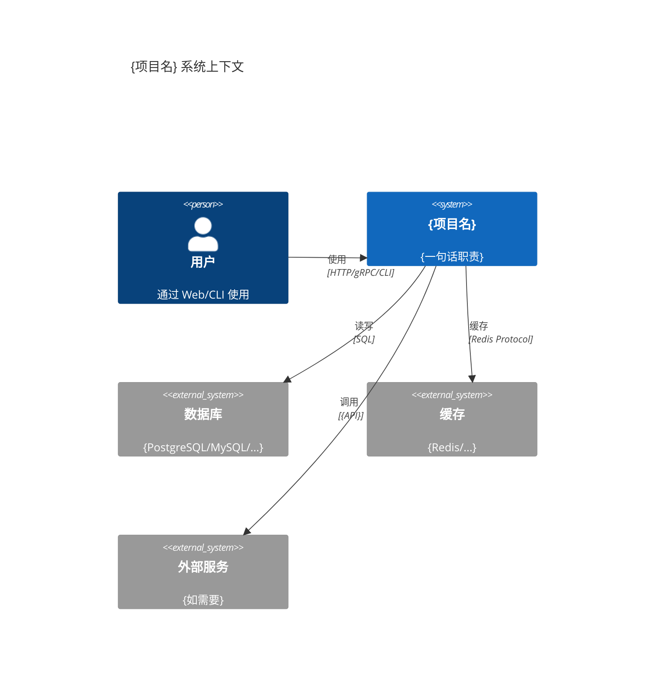
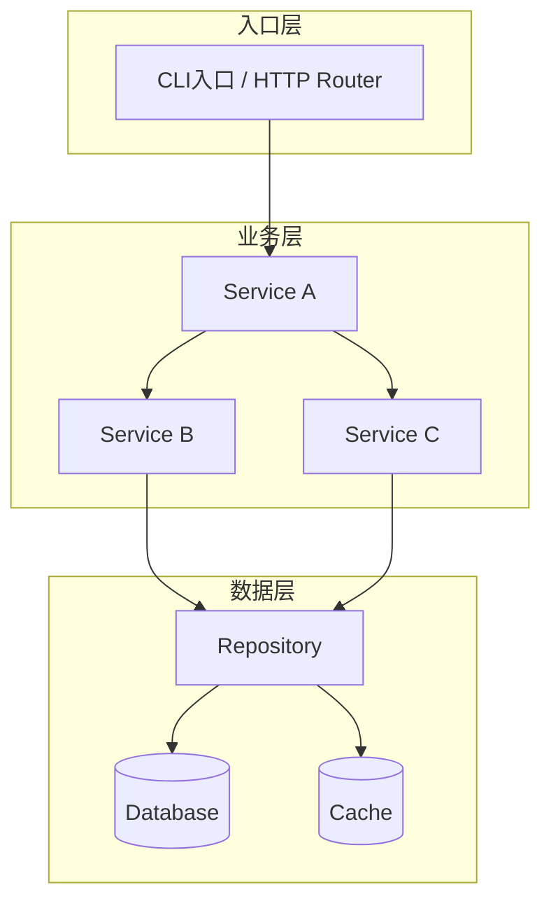
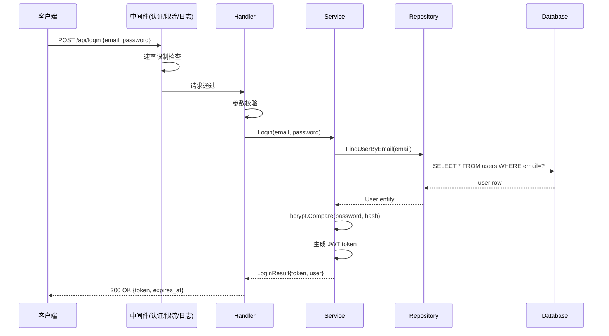
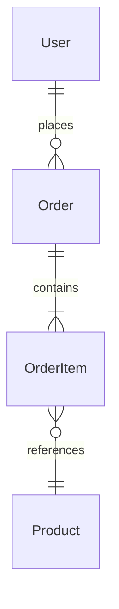

# Read Project（项目阅读助手）

## 定位

**面向接手的项目理解助手。你在别人代码基础上开发，或者自己的项目过了一段时间忘了怎么写的——这个 skill 帮你快速重建心智模型。**

跟 `read-paper`（论文→分享）的区别：

| | read-paper | read-project |
|---|-----------|-------------|
| 对象 | 线性文本（论文 PDF） | 图结构（代码库目录树+调用图） |
| 目标 | 读懂并讲给别人听 | 读懂并能上手改 |
| 核心产出 | 分享大纲 + 预判问题 | 接手指南 + 改动热力图 |
| 图 | 解析论文里的图 | **生成**架构图/时序图/数据流图 |
| 效果验证 | 实验是否证明主张 | 代码是否实现了设计意图 |

**目标不是生成项目文档——是让你能在上面接手开发。**

---

## 前置判断

### 什么时候用这个 skill

| 场景 | 触发词 |
|------|--------|
| 接手一个陌生项目/开源项目，需要快速理解 | "读项目 / 看项目 / 理解项目 / read project" |
| 回到自己以前写的项目，忘了架构 | "帮我回忆一下这个项目 / 重新理解这个项目" |
| 需要在现有项目基础上开发新功能 | "这个项目怎么改才能加 XX 功能 / 改哪里" |
| PR Review 前需要理解项目上下文 | "先帮我理解一下这个项目的架构" |

### 什么时候不用

- 你只需要找一个函数/类的定义 → 直接用 Grep/Glob，不需要走完整 skill
- 项目只有 1-2 个文件 → 直接 Read，不需要分析流程
- 你需要的是重构 → 说"用 EasyWork 重构 XX"，走完整工作流
- 你已经有完善的项目文档（CLAUDE.md + ARCHITECTURE.md）→ 先读文档，不够再走 skill

### 分析深度选择

Agent 根据项目规模和用户需求自动选择深度：

| 深度 | 适用场景 | 核心产出 | 预估时间 |
|------|---------|---------|---------|
| **快速扫读**（quick） | <50 文件，只想知道项目干嘛的 | §0-§3（速览+背景+架构） | 1-3 min |
| **标准理解**（standard，默认） | 50-500 文件，准备接手开发 | 完整 10 段报告 | 5-15 min |
| **深度分析**（deep） | >500 文件，核心模块需要深潜 | 完整 10 段 + 每模块单独深潜附录 | 15-40 min |

用户可指定深度："快速看一下这个项目" / "深入分析一下"。

**注意**：如果项目已有 `CLAUDE.md` / `ARCHITECTURE.md` / `CONTRIBUTING.md`，Agent 必须先读这些文件作为起点，再补充它们没覆盖的内容。不要重新发明已有的文档。

---

## 执行流程

### 阶段 1：Map — 扫描项目全貌

```
项目根目录 →
  1. 读包管理文件（package.json / pom.xml / go.mod / Cargo.toml / requirements.txt）
     → 提取：语言/框架/主要依赖/脚本命令
  2. 读已有文档（CLAUDE.md / README.md / ARCHITECTURE.md / CONTRIBUTING.md）
     → 提取：项目目的/架构描述/约定/已知坑点
  3. 扫描目录树（Glob 关键路径模式）
     → 识别：源码目录/测试目录/配置目录/文档目录/脚本目录
  4. 统计规模（文件数/代码行数/模块数/测试覆盖率线索）
     → 判断分析深度
```

**产出**：annotated directory tree（每个目录一句话职责）

```
project-root/
├── src/                    # 主源码
│   ├── api/                # HTTP API 层（路由+handler）
│   ├── service/            # 业务逻辑层
│   ├── model/              # 数据模型/ORM 实体
│   ├── repository/         # 数据库访问层
│   └── util/               # 通用工具函数
├── tests/                  # 测试（pytest，按模块组织）
├── config/                 # 配置文件（多环境）
├── scripts/                # 部署/迁移脚本
└── docs/                   # 项目文档
```

### 阶段 2：Trace — 追踪核心流程

从入口点出发，追踪 1-3 条关键业务流程（端到端）：

```
入口文件（main / app / index） →
  中间件/拦截器链 →
    路由/命令分发 →
      业务逻辑处理 →
        数据访问 →
          数据库/外部服务
```

**对每条流程**：
1. 找到入口代码行
2. 追踪到核心处理逻辑
3. 追踪到数据/外部调用
4. 记录整个链路上的关键函数/文件

**产出**：核心流程调用链 + Mermaid 时序图

### 阶段 3：Deep-dive — 模块深潜

对每个核心模块（按目录/包边界划分，通常 3-8 个）：

```
模块：{模块名}（{目录路径}）
├── 公开接口：（导出哪些函数/类/API）
├── 内部实现：（关键逻辑在哪些文件）
├── 依赖：（import 了哪些内部模块和外部库）
├── 被依赖：（被哪些模块调用）
├── 测试覆盖：（有没有测试，测试质量如何）
└── 复杂度判断：（简单/中等/复杂，一句话理由）
```

**重点标注**：
- 🔴 复杂度集中区：大文件（>500行）、深嵌套、大量条件分支
- 🟡 关键接口区：被 ≥3 个模块依赖的文件
- 🟢 稳定区：很少变更的工具代码

### 阶段 4：Synthesize — 综合输出

按 §5 输出格式模板生成完整报告。

**关键规则**：
- 架构图必须是 Mermaid（可在任何 Markdown 渲染器中显示）
- 目录树必须带职责注释（不是文件列表）
- 每个模块深潜必须回答"如果要改 X，从这里入手"
- §6 接手指南是整个报告的**价值核心**——如果这部分写不好，报告就失败了

---

## 输出格式模板

```
# 《{项目名}》项目阅读报告

## 0. 项目速览

| 项目 | 内容 |
|------|------|
| 项目名 | {名称} |
| 语言/框架 | {主要语言 + 版本 + 核心框架} |
| 代码规模 | {文件数} 文件 / ~{行数} 行 / {模块数} 核心模块 |
| 许可证 | {MIT/Apache/GPL/...} |
| 维护状态 | 🟢 活跃 / 🟡 维护中 / 🔴 停滞 / ⚫ 归档 |
| 项目类型 | 库(Library) / 框架(Framework) / 应用(Application) / 工具(CLI Tool) / 服务(Service) / 模板(Template) |
| 一句话概括 | {做什么的 + 为谁做的 + 核心价值/差异点} |

> 规模数据来源：{如 `cloc src/` 输出 / `git ls-files | wc -l` 等}

## 1. 背景与定位

### 1.1 解决什么问题
- 用户视角（非开发者视角）：谁在用这个项目？用它来解决什么痛点？
- 为什么会有这个项目？（是自己造轮子，还是现有方案不够用？）

### 1.2 目标用户/使用场景
- 典型用户画像
- 典型使用场景（1-3 个）

### 1.3 与同类项目的关键差异
| 对比维度 | 本项目 | {同类项目A} | {同类项目B} |
|---------|--------|-----------|-----------|
| {维度1} | {本项目} | {A} | {B} |
| {维度2} | ... | ... | ... |

如果没有明显的同类项目，写"未发现直接竞品/同类项目"。

## 2. 架构总览

### 2.1 顶层架构图（Mermaid）



### 2.2 内部架构（分层/分模块）



### 2.3 目录结构（带职责注释）

```
project/
├── cmd/                    # 入口（每个子目录一个可执行文件）
│   └── server/main.go      # HTTP 服务入口，注册路由+启动监听
├── internal/               # 私有代码（不可被外部 import）
│   ├── handler/            # HTTP handler（参数校验→调用service→返回响应）
│   ├── service/            # 业务逻辑（核心领域逻辑所在）
│   ├── repository/         # 数据访问（DB 查询封装）
│   └── model/              # 数据模型/实体定义
├── pkg/                    # 可公开引用的库代码
├── config/                 # 配置定义+多环境配置文件
├── migrations/             # 数据库迁移脚本
├── tests/                  # 集成测试
├── docs/                   # 文档
├── Makefile                # 构建/测试/部署命令入口
└── README.md
```

**规则**：
- 每个目录一行，格式：`├── dirname/  # 职责（非文件列表）`
- 只展开到有意义的层级（通常 2-3 层），不展开 vendor/node_modules/.git
- 对特别重要的文件可以单独标注

### 2.4 技术栈全景

| 层级 | 选型 | 理由（如果代码/文档中能看出来） |
|------|------|--------------------------|
| 语言 | {Go 1.22 / Python 3.12 / ...} | {原因} |
| Web 框架 | {Gin / FastAPI / Express / ...} | {原因} |
| 数据库 | {PostgreSQL + GORM / ...} | {原因} |
| 缓存 | {Redis / ...} | {原因} |
| 消息队列 | {RabbitMQ / Kafka / N/A} | {原因} |
| 部署 | {Docker + K8s / 裸机 / N/A} | {原因} |
| CI/CD | {GitHub Actions / GitLab CI / N/A} | {原因} |

## 3. 信息流 / 数据流

### 3.1 核心业务流程（端到端）

选择 1-3 条最重要的业务流程，画出请求从进入到返回的完整路径：

**流程 1：{流程名——如"用户登录"}**



**流程 2：{第二条核心流程}**
（同上格式）

**流程 3：{第三条核心流程}**（如有）

### 3.2 数据模型

**核心实体关系**：



**核心实体**：

| 实体 | 对应表/集合 | 关键字段 | 定义位置 |
|------|-----------|---------|---------|
| User | users | id, email, password_hash, role | model/user.go:15 |
| Order | orders | id, user_id, status, total | model/order.go:10 |
| ... | ... | ... | ... |

### 3.3 关键 API / 接口（如有）

| 方法 | 路径 | Handler | 功能 | 认证 |
|------|------|---------|------|------|
| POST | /api/login | auth.LoginHandler | 用户登录 | 无 |
| GET | /api/users/me | user.GetProfile | 获取当前用户 | JWT |
| ... | ... | ... | ... | ... |

## 4. 模块深潜

对每个核心模块进行深潜分析：

### {模块名}（`{目录路径}`，复杂度：🟢简单/🟡中等/🔴复杂）

**职责**：{用一句话说清楚这个模块负责什么}

**对外接口**：
| 接口 | 签名/路由 | 说明 |
|------|---------|------|
| {函数/API名} | `{签名}` | {一句话说明} |

**内部关键实现**：
| 文件 | 核心逻辑 | 行数 |
|------|---------|------|
| {file1} | {这个文件做什么} | {N} |
| {file2} | {这个文件做什么} | {N} |

**依赖关系**：
- 依赖：{模块A（做什么用）、模块B（做什么用）}
- 被依赖：{模块C、模块D}
- 外部依赖：{关键第三方库}

**复杂度集中区**：
- {文件名:行号范围}：{为什么复杂——如"状态机 12 种状态×8 种事件，嵌套 switch-case"}

**"改 X 从这里入手"**：
- 如果要改 `{功能A}` → 看 `{file1:line}` 的 `{function}`
- 如果要改 `{功能B}` → 看 `{file2:line}` 的 `{function}`
- 如果要新增 `{功能C}` → 参考 `{file3}` 的模式，在 `{dir}` 下新增文件

---

（对每个核心模块重复上述结构。通常 3-8 个模块。）

## 5. 关键设计决策与复杂度

### 5.1 设计亮点
| 设计决策 | 解决了什么问题 | 怎么实现的 | 评价 |
|---------|-------------|-----------|------|
| {如：插件化架构} | {问题} | {实现概述+文件位置} | {好在哪} |
| {如：多层缓存策略} | {问题} | {实现概述+文件位置} | {好在哪} |

### 5.2 复杂度集中区
| 位置 | 复杂度来源 | 建议 |
|------|----------|------|
| {文件:行号} | {为什么这一块最难懂} | {怎么理解它} |
| {文件:行号} | {为什么这一块最难懂} | {怎么理解它} |

**复杂度来源分类**：
- 业务复杂（领域规则多）
- 性能优化（空间换时间、缓存失效、并发控制）
- 兼容性（多版本/多平台/多协议适配）
- 历史遗留（多次迭代打补丁）
- 算法复杂（非平凡算法实现）

### 5.3 技术债务 / 已知坑点
| 问题 | 位置 | 影响 | 修复难度 |
|------|------|------|---------|
| {如：硬编码配置} | {文件:行号} | {影响} | 低/中/高 |
| {如：缺少错误处理} | {文件:行号} | {影响} | 低/中/高 |

> ⚠️ 如果项目维护良好无明显技术债，标注"未发现显著技术债务"，不要强行找茬。

## 6. 接手指南（🆕 核心差异化）

### 6.1 改动热力图

**这张表回答：如果我接到一个 XX 类型的需求，应该改哪些文件？**

| 需求类型 | 必改文件 | 可能需要改 | 参考先例 | 注意 |
|---------|---------|-----------|---------|------|
| 新增 API 端点 | `handler/{module}.go` + 注册路由 | `service/{module}.go` + `model/` | 参考 `handler/user.go` 的 `CreateUser` | 检查是否需要认证中间件 |
| 修改数据库模型 | `model/{entity}.go` + `migrations/` 新文件 | `repository/{entity}.go` + `service/` | 参考 `migrations/003_add_xxx.up.sql` | 修改后必须写 migration |
| 新增中间件 | `middleware/{name}.go` + 在 `cmd/server/main.go` 注册 | 无 | 参考 `middleware/auth.go` | 注意中间件执行顺序 |
| 修改业务逻辑 | `service/{module}.go` | `handler/` + `repository/` | — | 先找到现有测试理解预期行为 |
| 修改配置项 | `config/config.go` + 各环境配置文件 | 使用该配置的模块 | — | 不同环境可能有不同默认值 |
| 加一个 CLI 子命令 | `cmd/{command}/main.go` 或 `cmd/root.go` 注册 | `internal/` 对应逻辑 | 参考现有子命令结构 | — |
| 依赖升级 | `go.mod` / `package.json` / ... | 受影响的调用方 | — | 先跑全量测试确认兼容性 |

**如何生成此表**：Agent 根据项目的实际结构填充，需求类型从项目的代码组织模式中推断。

### 6.2 常见开发场景走查

**场景 1：新增一个增删改查（CRUD）**

```
步骤 1：定义模型 → {model/ 或 entities/ 下的文件}
步骤 2：写 migration → {migrations/ 目录，命名规则}
步骤 3：定义 repository/DAO → {repository/ 目录}
步骤 4：写 service 层逻辑 → {service/ 目录}
步骤 5：写 handler/controller → {handler/ 目录}
步骤 6：注册路由 → {router 文件路径:行号}
步骤 7：写测试 → {tests/ 目录对应位置}
步骤 8：运行测试命令 → {npm test / go test / pytest / ...}
```

**场景 2：修复一个 Bug**

```
步骤 1：复现 Bug → {如何启动项目 + 触发 Bug 的操作}
步骤 2：定位代码 → {可能出问题的文件/函数}
步骤 3：写回归测试 → {测试文件位置，先写 FAIL 的测试}
步骤 4：修代码 → {修改的目标文件}
步骤 5：跑测试确认 → {测试命令 + 老测试也要全过}
```

**场景 3：加一个中间件/拦截器**（如果项目有中间件模式）
**场景 4：加一个定时任务/后台 Job**（如果项目有后台任务模式）

（Agent 根据项目的实际架构模式填充场景，不套用不存在的模式。）

### 6.3 测试策略

| 项目 | 说明 |
|------|------|
| 测试框架 | {Jest / pytest / Go testing / ...} |
| 运行命令 | {`npm test` / `go test ./...` / `pytest`} |
| 只跑相关测试 | {`npm test -- --testPathPattern=auth` / `pytest tests/auth/`} |
| 测试组织结构 | {与源码同目录 / 独立 tests/ 目录 / __tests__/} |
| 最重要的测试 | {哪些测试覆盖了核心流程，改代码后必跑} |
| 覆盖率要求 | {如果项目有配置，标注最低覆盖率} |

## 7. 约定与规范

### 7.1 命名约定

| 类型 | 约定 | 示例 | 置信度 |
|------|------|------|--------|
| 文件名 | {kebab-case / snake_case / PascalCase} | {例} | 🟢确定/🟡推测 |
| 函数/方法 | {camelCase / snake_case} | {例} | 🟢确定/🟡推测 |
| 类/接口 | {PascalCase / ...} | {例} | 🟢确定/🟡推测 |
| 常量 | {UPPER_SNAKE / ...} | {例} | 🟢确定/🟡推测 |
| 数据库表 | {plural / snake_case} | {例} | 🟢确定/🟡推测 |

**置信度说明**：
- 🟢 确定：有 lint 配置 / 代码风格指南 / 全项目高度一致
- 🟡 推测：基于主流文件判断，但存在部分不一致

### 7.2 代码组织约定
- 模块拆分粒度：{微服务/模块化单体/...}
- 依赖方向：{单向依赖/分层架构/...，如"handler → service → repository，不可反向"}
- 文件组织：{一个文件一个类/按功能聚合/...}
- 是否使用 DI/IoC：{是（用什么框架）/ 否}

### 7.3 错误处理 / 日志 / 注释风格
- 错误处理：{返回 error / throw exception / Result<T> 模式}
- 日志风格：{结构化日志（zap/logrus/winston）/ fmt.Println / ...}
- 注释语言：{中文/英文}
- 注释密度：{稀疏（只有复杂逻辑有）/ 适中 / Docstring 强制}

### 7.4 未明文但被遵守的规则
- {从代码中发现的隐含约定——如"配置总是通过环境变量注入，不写在代码里"}
- {如"测试文件总是放在 __tests__ 目录下，但没有任何文档说过"}
- （如果没有发现隐含约定，标注"未发现明显隐含约定"）

## 8. 上手实操

### 8.1 环境搭建

```bash
# 1. 克隆项目
git clone {url}
cd {project}

# 2. 安装依赖
{实际的安装命令，从 Makefile / README / package.json 中提取}

# 3. 配置环境
{配置文件位置 + 需要修改的关键配置项}

# 4. 初始化（数据库迁移/种子数据等）
{命令}

# 5. 启动
{命令}

# 6. 验证启动成功
{curl 命令 / 访问 URL / 预期输出}
```

### 8.2 关键断点 / 调试入口

| 调试目标 | 断点位置 | 文件:行号 |
|---------|---------|---------|
| 请求入口 | {函数名} | {file:line} |
| 核心业务逻辑 | {函数名} | {file:line} |
| 数据库查询 | {函数名} | {file:line} |
| 错误处理 | {函数名} | {file:line} |

### 8.3 最小改动验证路径

**验证你的开发环境正常工作**：
```
1. 找到 {一个简单的工具函数}（{file:line}）
2. 加一行注释或 log（不改逻辑）
3. 运行相关测试：{命令}
4. 确认测试通过 → 环境正常
```

## 9. 局限与改进空间

### 9.1 项目当前局限
| 局限 | 影响 | 是否有计划改进 |
|------|------|-------------|
| {如：没有 API 版本管理} | {影响} | Issues/ROADMAP 中有提及/未提及 |
| {如：单点部署无高可用} | {影响} | — |

### 9.2 可改进方向（如果能贡献的话）
- {具体可行的改进建议 1}
- {具体可行的改进建议 2}
- （不要写"优化性能"这种空话——要写"`hotpath.go:42` 的 N+1 查询可以加一个批量查询方法"）

### 9.3 这个项目适合学习什么
- {如："适合学习 Clean Architecture 在 Go 中的落地"}
- {如："插件的动态加载机制值得一看"}
- {如："不适合学习错误处理——错误处理这块实现得比较随意"}
```

---

## 输出后 Agent 行为

报告输出完成后，Agent 主动询问：

```
【项目阅读报告已完成】

这份报告覆盖了 {项目名} 的 {N} 个核心模块、{M} 条关键业务流程。
标注了 {K} 个复杂度集中区和 {J} 个改动热力图条目。

现在你可以：
A) 让我展开某一节（如"详细分析 §4 的 {模块名}"）
B) 让我追踪一条你关心的业务流程（"从用户点击支付到扣款完成，代码怎么走的？"）
C) 让我帮你定位一个具体需求（"如果要加 XX 功能，改哪些文件？"）
D) 让我检查某个模块是否有隐藏的问题（"帮我审查 {模块} 的并发安全性"）
E) 导出报告到文件（你说"保存到 XX.md"）
F) 基于这份理解，直接开始开发任务（"好，现在帮我加一个 XX 功能"）

→ 你想怎么做？
```

---

## 反模式

- ❌ 把 `ls -R` 输出当"目录结构"——每个目录必须写职责注释
- ❌ 架构图是可选的——Mermaid C4 + 时序图是强制产出，不是锦上添花
- ❌ 模块深潜变成文件列表——每模块要回答"改 X 从这里入手"
- ❌ 改动热力图是泛泛的"改功能→改 service 层"——要精确到具体目录/文件
- ❌ 从头到尾读每个文件——先扫结构，再选核心模块深潜，不是全文通读
- ❌ 对庞大的 node_modules/vendor 目录展开分析——标注 `[第三方依赖，跳过]`
- ❌ 忽略已有文档——项目有 CLAUDE.md/README 时必须先读，不重新发明
- ❌ 数据流描述用文字段落——Mermaid 时序图强制，文字只做补充
- ❌ 技术栈只列名字不分析理由——每个选型要写"为什么选它"（如果能从代码/文档中看出来）
- ❌ 对复杂度的判断只有结论没有位置——"这个模块很复杂"不够，要精确到文件:行号+原因
- ❌ 约定与规范是猜的——要用置信度标注（🟢确定/🟡推测）
- ❌ 输出完报告就走——必须提供后续交互选项
- ❌ 对项目规模的判断纯凭感觉——用 `cloc` / `git ls-files` / `find` 等命令获取真实数字
- ❌ 遇到无法确认的设计决策假装知道——标注"从代码推断，未找到设计文档证实"

---

## 已有文档补充模式

如果项目已有以下文件，Agent 的处理策略：

| 已有文件 | 处理方式 |
|---------|---------|
| `CLAUDE.md` | **必须**先读。如果它已经覆盖了 §0-§2、§7-§8，则报告中引用"详见 CLAUDE.md"，不再重复写，重点补 §3-§6 |
| `README.md` | **必须**先读。提取项目目的、安装步骤，如有更新鲜的信息则覆盖 |
| `ARCHITECTURE.md` | **必须**先读。如果已有架构图，评估是否需要更新而非替换。补充它没覆盖的模块深潜 |
| `CONTRIBUTING.md` | **必须**先读。提取代码约定和 PR 流程，补充到 §7 |
| `.github/` / CI 配置 | 扫描但不全读。提取测试命令和部署流程 |

**原则**：已有文档是起点，不是替代品。read-project 的价值在于**补充它们没写的**（数据流追踪、复杂度标注、改动热力图、模块"改 X 从这里入手"）。

---

## 版本历史

- v1.0 (2026-06-25)：初始版本。固定 10 段输出结构，4 阶段执行流程（Map→Trace→Deep-dive→Synthesize）。强制 Mermaid C4+时序图。改动热力图（常见需求→文件路径映射）。目录树带职责注释。约定分级+置信度标注。已有文档补充模式。
