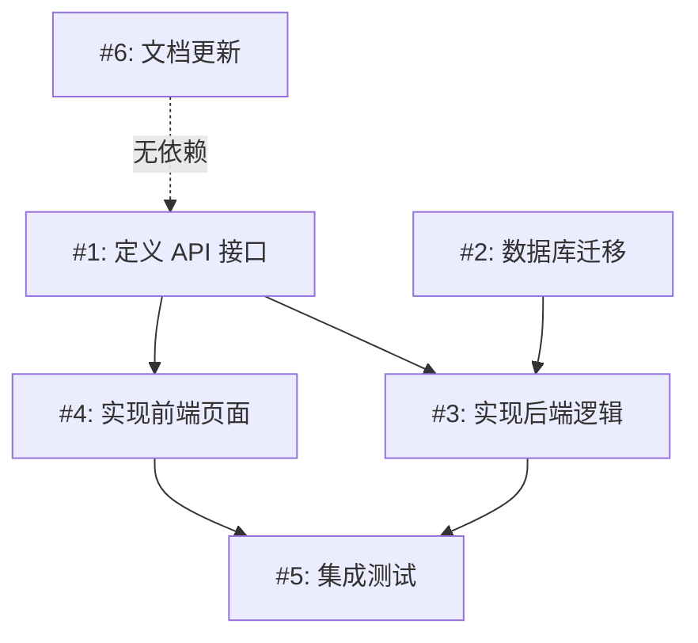
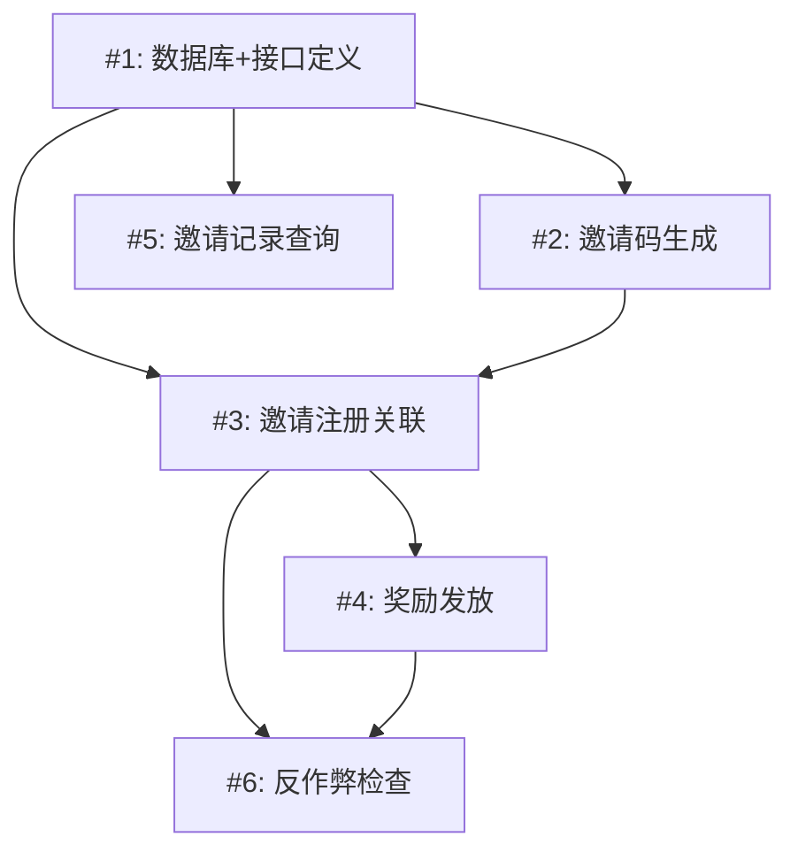

# 需求拆解（Requirement Decompose）

## 0. 定位：不是 checklist，是 blueprint

普通 Agent 拿到需求后要么直接写代码（没想清楚就动手），要么给出一个笼统的"步骤清单"（太粗，执行时还是不知道该干什么）。

**本技能要解决的问题**：

| 痛点 | 拆解后 |
|------|--------|
| "需求太大，不知道怎么开始" | 每个子任务有明确的第一步——打开哪个文件、改哪个函数 |
| "做完不知道 Check 什么" | 每个子任务有可验证的验收标准——运行什么命令、看到什么输出算完成 |
| "Agent 写了很多代码但不知道完成了没有" | 完成检查清单——开发完逐项勾对，每项都有可验证证据 |
| "改 A 发现要先改 B，改 B 发现还要改 C" | 依赖拓扑图——执行前就知道顺序，不撞墙 |

### 与 checklist skill 的关系（CRITICAL）

| 维度 | checklist | requirement-decompose（本技能） |
|------|-----------|-------------------------------|
| **时间** | 开发后（DO-CONFIRM） | 开发前（READ-DO） |
| **输入** | 已完成的代码 + 闸门结果 | 原始需求/技术方案 |
| **输出** | 逐项通过/失败/跳过的核对清单 | 可独立执行的子任务列表 + 完成检查清单 |
| **用户动作** | "这 58 项哪些还没做？" | "这 12 个子任务先做哪个？怎么做？" |
| **核心价值** | 防止遗漏关键检查 | 防止想不清楚就动手 |
| **粒度** | 检查点（是否做了单元测试？） | 执行单元（写 payment 模块的单元测试） |

**协作模式**：`read-requirements`（理解需求）→ `requirement-decompose`（拆解为子任务，**本技能**）→ `code-implement`（逐个执行）→ `checklist`（开发后核对，checklist skill）

### 参考实现

| 来源 | 核心思路 | 我们借鉴了什么 |
|------|---------|--------------|
| [CMU Task Decomposition](https://ra.adm.cs.cmu.edu/anon/2025/CMU-CS-25-132.pdf) (2025) | 结构化拆解让 SWE-agent 在 SWE-bench 提升 24% | 拆解不是"把需求写短"，是"把需求结构化"——每个子任务有独立AC+依赖+边界 |
| [task-decomposer](https://skillsmp.com/ko/skills/mathews-tom-armory-skills-task-decomposer-skill-md) (v1.1.1) | 6 阶段流水线（理解→拆解→边界→测试→依赖→风险） | 完整流水线结构；HITL/AFK 标签——标记哪些必须人工确认、哪些Agent可独立做 |
| [breakdown-plan](https://github.com/awesome-copilot/awesome-copilot-skills) (2026) | Epic→Feature→Story 三层递进 + INVEST 检验 + GitHub Issue 模板 | 层级粒度控制 + 验收标准格式 + 优先级矩阵 |
| [task-decomposition](https://lobehub.com/skills/mgd34msu-goodvibes-gemini-task-decomposition) | 5 种拆解方法 + 原子任务测试（Single/Verifiable/Independent/Bounded/Testable） | 多方法选择树 + 原子任务质量检验 |
| **SPIDR** (Mike Cohn) | Spikes/Paths/Interfaces/Data/Rules 五种纵向切分模式 | 纵向切片优先——不拆成"UI层→逻辑层→数据库层"这种无价值切片 |
| **INVEST** (Bill Wake) | Independent/Negotiable/Valuable/Estimable/Small/Testable | 每个子任务必须通过 INVEST 检验（除 Small 外都满足；Small 在 fine 粒度时强制执行） |

---

## 1. 核心理念：六阶段拆解流水线

```
阶段 1: 需求理解（Understand）
  → 用自己的话重述需求 → 提取核心目标 → 划定范围边界

阶段 2: 纵向拆解（Decompose）
  → 选拆解方法 → 切分任务 → 原子任务检验

阶段 3: 边界扫描（Edge Cases）
  → 每个子任务的边界条件 → 全局遗漏的边界情况

阶段 4: 依赖映射（Dependencies）
  → 硬依赖/软依赖/可并行 → Mermaid 依赖拓扑图

阶段 5: 验收设计（Acceptance Criteria）
  → 每个子任务的可验证AC → 完成检查清单

阶段 6: 输出 + 交互（Output）
  → 任务地图 + 子任务卡片 + 完成检查清单
```

**执行原则**：
- 阶段不可跳过——即使"快速拆解"也要走完 6 阶段（quick 模式每阶段简化但不可跳过）
- **纵向切片优先**——不按技术层拆分（UI层/逻辑层/DB层），按用户价值纵向切到底
- 原子任务检验——每个子任务必须通过"原子任务测试"5 条标准
- 每轮拆解后问"你打算先做哪个？"——不假设用户会按你排的顺序做

---

## 2. 阶段 1：需求理解（Understand）

### 2.1 目标

不直接拆。先确保你对需求的理解是正确的、完整的、有边界的。

### 2.2 重述模板

```
📋 需求重述（请确认理解是否正确）

我的理解：{用自己的话，一句说清核心目标}

这个需求要解决什么问题：
  {没有这个功能之前，用户/系统遇到的具体痛点}

范围边界：
  做什么：{明确列出 3-5 项}
  不做什么：{明确排除——这部分很重要，防止拆解时范围蔓延}

关键约束：
  | 约束 | 刚性程度 | 来源 |
  |------|---------|------|
  | {技术栈限制} | 硬/软 | {谁定的/为什么} |
  | {时间节点} | 硬/软 | {...} |
  | {兼容性要求} | 硬/软 | {...} |

→ 确认：上述理解正确吗？有没有需要补充或修正的？
```

### 2.3 需求复杂度判定

在拆解前，判断需求的复杂度，以此决定拆解粒度：

| 复杂度 | 信号 | 拆解粒度 | 预估子任务数 |
|--------|------|---------|------------|
| 🟢 简单 | 1 个模块、≤3 个文件、无外部依赖 | coarse（半天>1天） | 2-4 个 |
| 🟡 中等 | 2-3 个模块、涉及数据库+接口、有 1-2 个外部依赖 | medium（1-2天，默认） | 5-10 个 |
| 🔴 复杂 | 跨系统、涉及安全/支付/数据迁移、≥5 个模块 | fine（半天级） | 8-20 个 |

**自动判定**：如果用户未指定 `granularity`，根据以上信号自动判定。

---

## 3. 阶段 2：纵向拆解（Decompose）

### 3.1 选择拆解方法

根据需求特征，自动选择最合适的拆解方法（可组合使用）：

| # | 方法 | 适用场景 | 怎么切 | 示例 |
|---|------|---------|--------|------|
| 1 | **纵向切片** 🥇 | 用户可见的功能——有 UI/API 交互 | 按用户价值线程，端到端贯穿所有层 | 支付：微信支付→支付宝→银行卡 |
| 2 | **路径拆解** | 有多个业务流程/操作路径 | 按用户执行的不同路径 | 登录：密码登录→扫码登录→短信验证码 |
| 3 | **数据拆解** | 需要处理多种数据类型/格式 | 按数据子集/格式逐步支持 | 导入：Excel→CSV→XML→PDF |
| 4 | **规则拆解** | 业务规则复杂且逐层叠加 | 先做最简版本→逐层叠规则 | 购票：基础购票→加优惠券→加会员折扣→加限购 |
| 5 | **风险优先** | 技术方案不确定性高/有未知因素 | 先做探针（Spike）消除不确定性 | 新技术：调研→PoC→生产实现 |

**选择逻辑**（按优先级）：
```
1. 如果有技术不确定性 → 先做一次 Spike（探针任务），再用其他方法
2. 如果需求有多个端到端用户场景 → 纵向切片（最常用）
3. 如果业务规则是逐层叠加的 → 规则拆解
4. 如果需要支持多种数据格式/类型 → 数据拆解
5. 如果有多个不同操作路径 → 路径拆解
6. 以上都不适用 → 纵向切片（默认方法）
```

### 3.2 拆解方法详解

详细的 5 种拆解方法 + 完整示例见 `references/decomposition-methods.md`。

### 3.3 原子任务检验（Atomic Task Test）

每个拆分出的子任务必须通过以下 5 条检验（参考 task-decomposition skill）：

```
1. 单一产出（Single Outcome）
   问："这个任务完成后，产出一个什么东西？"
   反例 ❌："修改用户模块"——改什么？改几个文件？产出不明确
   正例 ✅："在 auth/service.go 中新增 RefreshToken 函数，接受过期 token 返回新 token"

2. 可验证（Verifiable）
   问："怎么证明这个任务做完了？能跑什么命令看到什么输出？"
   反例 ❌："优化查询性能"——什么叫"优化"？快了 1ms 算吗？
   正例 ✅："把 UserList 查询从 800ms 降到 200ms 以内，用 go test -bench 验证"

3. 可独立（Independent）
   问："这个任务能不能在别人做其他任务的同时独立推进？"
   反例 ❌：任务 A 和 B 必须交替进行——说明应该合并为一个任务
   正例 ✅：任务 A 和 B 可以并行——只需要 A 的接口定义（非实现）

4. 有边界（Bounded）
   问："一个开发者能在 1 天内完成吗？"（medium 粒度）
   反例 ❌："实现整个支付模块"——显然不止 1 天
   正例 ✅："实现微信支付回调的签名验证逻辑"——范围明确，1 天内可完成

5. 可测试（Testable）
   问："验收标准是具体的、可测量的吗？"
   反例 ❌："确保系统稳定"——无法测量
   正例 ✅："模拟 1000 QPS 30 分钟，错误率 < 0.1%，P99 < 500ms"
```

**硬性规则**：
- 如果子任务未通过检验 1（单一产出）→ **必须**再拆
- 如果子任务未通过检验 2（可验证）→ **必须**补充验收标准
- 如果子任务未通过检验 4（有边界）→ **必须**再拆（除非用户明确要求 coarse 粒度）

### 3.4 拆解禁止清单

- ❌ **横向拆分**：拆成"写 Model → 写 Service → 写 Controller → 写前端页面"——每个任务没有独立用户价值，且互相阻塞
- ❌ **伪拆分**：把一个大任务用"第一步/第二步/第三步"重写一遍——这不是拆解，是列步骤
- ❌ **技术栈拆解**："先搭 Spring Boot → 再配 MyBatis → 再写业务"——这是环境搭建，不是需求拆解
- ❌ **过细拆解**：拆成 50 个 10 分钟的小任务——过细会丢失上下文，执行者需要来回翻看
- ❌ **过粗拆解**：只有 2 个"实现前端"、"实现后端"任务——和没拆一样

---

## 4. 阶段 3：边界扫描（Edge Cases）

### 4.1 目标

需求文本通常只写"正常情况"。边界扫描找出"正常情况之外会发生什么"——这些是开发时最容易漏的。

### 4.2 扫描框架

对每个子任务，过以下 5 类边界：

```
输入边界：
  - 空输入 / null / undefined 会发生什么？
  - 超过最大长度/大小的输入？
  - 特殊字符 / SQL注入 / XSS？

状态边界：
  - 这个功能在"用户已登录"和"未登录"下行为一致吗？
  - 这个操作在"数据为空"和"数据已满"下怎么处理？
  - 并发操作：两个人同时做这件事会冲突吗？

错误边界：
  - 依赖的外部服务挂了怎么办？（网络超时/数据库宕机/第三方API挂了）
  - 中间步骤失败了——是回滚全部还是部分已完成的？
  - 用户中途取消——数据是干净的还是脏的？

时序边界：
  - "先做A再做B"——如果 A 没完成，B 被触发了怎么办？
  - 定时任务如果上一次没跑完，下一次又触发了？
  - 重试：同一个操作被执行了两次——幂等吗？

兼容边界：
  - 旧版本客户端能正常使用新功能吗？
  - 旧数据在新逻辑下如何处理？
  - 如果 AB 测试——一半用户看到新功能、一半看到旧的——都能正常工作吗？
```

### 4.3 输出格式

```
⚠️ 容易漏的边界情况（按子任务标注）

子任务 #3: {子任务名}
  - {边界情况描述} → {建议处理方式或标注"超出范围"}
  - {边界情况描述} → {建议处理方式}

全局边界（影响多个子任务）：
  - {边界情况描述} → {为什么它跨多个子任务 / 建议在哪个阶段处理}
```

**规则**：
- 每个子任务至少扫描 2 个边界情况（如果子任务很简单，至少 1 个）
- 边界情况如果"超出当前需求范围"，明确标注——防止范围蔓延
- 边界情况如果"技术上无法完美解决"，标注已知局限和可接受的妥协方案

---

## 5. 阶段 4：依赖映射（Dependencies）

### 5.1 三种依赖类型

| 类型 | 符号 | 含义 | 规则 |
|------|------|------|------|
| 🔴 **硬依赖** | `#A → #B` | 必须先做 A，A 完成后才能开始 B | 不可并行，阻塞关系 |
| 🟡 **软依赖** | `#A ~→ #B` | 建议先做 A 再做 B，但并非绝对 | 可以并行但可能返工 |
| 🟢 **无依赖** | `#A ∥ #B` | 可以完全并行 | 并行执行无任何冲突 |

### 5.2 依赖拓扑图

用 Mermaid flowchart 展示任务依赖关系，标注可并行区域：



**图规则**：
- 实线箭头 = 硬依赖，虚线 = 软依赖，无连线 = 可并行
- 高亮关键路径（最长依赖链）
- 节点 ≤ 15 个（超过则拆分）

### 5.3 并行化建议

标注哪些任务可以并行执行（多人协作或 Agent 并行），以及并行条件：

```
🚀 可以并行做的（如果有团队或 Agent 并行）：
  - #1, #2 可以并行（无依赖，不同开发者/Agent 可同时开始）
  - #4, #6 可以并行（但都在等 #1 完成 API 定义）
  - 并行机会：最多可 3 路并行（#1→#2 + #6），但 #3 开始后严格串行
```

### 5.4 HITL/AFK 标注

对每个子任务标注是"人做"还是"Agent 做"（参考 task-decomposer 的 HITL/AFK 标签）：

| 标签 | 含义 | 示例 |
|------|------|------|
| 🤖 **AFK** (Away From Keyboard) | Agent 可独立完成 | 写单元测试、格式转换、CRUD 接口 |
| 🧑 **HITL** (Human In The Loop) | 需要人工判断 | 确认需求理解、UI 设计决策、安全策略确认 |
| 🤖🧑 **混合** | Agent 先做初稿，人复审 | 代码审查、架构设计、文档编写 |

---

## 6. 阶段 5：验收设计（Acceptance Criteria）

### 6.1 每个子任务的 AC 格式

```
子任务 #N: {子任务名}
  验收标准：
    ✅ {可验证的条件 1} → 验证方式：{运行什么命令/看到什么输出/检查什么文件}
    ✅ {可验证的条件 2} → 验证方式：{...}
  怎么算"完成"（Definition of Done）：
    {不止是"代码写完了"——包括测试通过了吗？文档更新了吗？CR 通过了吗？}
```

### 6.2 自动生成完成检查清单

拆解完成后，自动生成一份"开发完成检查清单"——它是汇总了所有子任务 AC 的一张表：

```
✅ 开发完成检查清单（全部子任务做完后逐项核对）

| ID | 检查项 | 来源子任务 | 验证方式 | 状态 |
|----|--------|----------|---------|------|
| C1 | API 接口定义已与前端确认 | #1 | FE 确认邮件/消息 | ☐ |
| C2 | 数据库迁移脚本在 staging 已验证 | #2 | 执行结果截图 | ☐ |
| C3 | RefreshToken 函数通过单元测试 | #3 | go test ./auth/ -run TestRefresh | ☐ |
| C4 | 支付回调签名验证可处理篡改攻击 | #3 | 修改签名的测试用例 PASS | ☐ |
| ... | ... | ... | ... | ☐ |

整体状态：☐ {N} 项待核对
```

**设计原则**（参考《清单革命》的清单设计规则）：
- 每条 ≤ 5-9 项（工作记忆上限）
- 只列"常被遗忘+遗漏代价高"的检查点
- 不列 CI 自动能检查的（格式、lint、编译）——列 CI 覆盖不到的逻辑正确性和边界
- 每条有"验证方式"——不是"检查性能"而是"运行 benchmark，P99 < 200ms"

**与 checklist skill 的协作**：
- 这份清单专注于**这个拆解需求特有的检查点**（"微信支付回调签名验证过了吗？"）
- checklist skill 的 10 大类 58 项是**通用开发质量检查**（"单元测试覆盖率够吗？所有依赖有 CVE 扫描吗？"）
- 用户开发完成后：先过本技能的完成检查清单 → 再走 checklist skill 的通用 Audit

---

## 7. 阶段 6：输出 + 交互

### 7.1 完整输出结构

```
🧩 需求拆解：{简洁标题}

📋 需求重述
{阶段 1 产出}

🎯 拆解策略
方法：{选用的拆解方法 + 为什么选它}
粒度：{fine/medium/coarse}
拆解原则：{纵向切片优先 / 规则逐层叠加 / 风险优先 + 数据拆解}

---

📊 任务地图（依赖拓扑）

```mermaid
flowchart TD
  {任务依赖图}
```

---

📦 {N} 个子任务

| # | 子任务 | 依赖 | 预估 | AC 数 | 风险 | 谁做 |
|---|--------|------|------|-------|------|------|
| 1 | {名称} | 无 | {N}h | 3 | 🟢 | 🤖 |
| 2 | {名称} | #1 | {N}h | 2 | 🟡 | 🧑 |
| ... | ... | ... | ... | ... | ... | ... |

---

📝 子任务详情

### 子任务 #1: {名称} 🤖 AFK

**目标**：{一句话说清这个子任务做什么}

**涉及的代码位置**：{预估涉及的文件/模块}

**前置条件**：{开始这个任务前需要什么？——依赖的接口已定义、数据库表已建好、...}

**执行步骤**（3-5 步）：
  1. {第一步做什么——打开哪个文件，改/加哪个函数}
  2. {第二步做什么}
  3. ...

**验收标准**：
  ✅ {AC 1} → 验证：{命令/输出}
  ✅ {AC 2} → 验证：{命令/输出}

**边界情况**：
  ⚠️ {边界 1} → {处理方式}
  ⚠️ {边界 2} → {处理方式}

**完成定义**：{不止代码——测试✅ / 文档✅ / CR✅}

---

{子任务 #2, #3, ... 同格式}

---

⚠️ 全局边界情况（跨子任务，容易漏）
  - {跨子任务的边界情况} → {建议}
  - {跨子任务的边界情况} → {建议}

---

✅ 开发完成检查清单（全部做完后逐项核对）

| ID | 检查项 | 来源 | 验证方式 | 状态 |
|----|--------|------|---------|------|
| ... | ... | ... | ... | ☐ |

---

🚀 建议执行顺序

  第一步（今天可以开始）：子任务 #1、#2 —— 无依赖，可并行
  第二步（#1 完成后）：子任务 #3、#4 —— 依赖 #1 的接口定义
  第三步（全部完成后）：子任务 #N —— 集成测试 + 文档

  关键路径（最慢要多久）：{从第一步到最后一步的最长依赖链，{N} 天}

---

→ 选一个子任务开始？说 "开始 #1"
→ 觉得拆得不对？说 "重新拆 / 太细了 / 太粗了 / 用规则拆解试试"
→ 某个子任务还是太大？说 "继续拆 #N"
→ 确认无误准备开发？说 "开始开发" 进入 code-implement
```

### 7.2 后续交互支持

拆解完成后，用户可以：
- "开始 #3" → 加载 code-implement，以子任务 #3 为目标开始写代码
- "继续拆 #2" → 对子任务 #2 进行更深一层的拆解（递归拆解）
- "太细了" → 合并相邻子任务，升到 coarse 粒度
- "太粗了" → 每个子任务再拆一层，降到 fine 粒度
- "用规则拆解重新拆" → 换一种拆解方法重新执行阶段 2-6
- "只做前端部分" → 过滤子任务，只保留前端相关的，重组依赖

---

## 8. 特殊场景处理

### 8.1 需求本身就是一句话（太模糊）

如果用户给的需求太简单（一句话）：

```
⚠️ 需求太模糊，无法拆解。先澄清：

1. 这个功能解决谁的什么问题？
2. 最终用户会看到/用到什么？（具体场景）
3. 目前最不确定的是什么？（技术？业务规则？性能？）
4. 有没有参考系统/竞品可以看？

→ 补充后我重新拆解。
```

**不要**：强行拆解模糊需求——拆出来的子任务全是猜测，执行时必然返工。

### 8.2 需求涉及新技术/新手团队

如果需求涉及团队不熟悉的技术栈：
- 第一个子任务自动设为"探针任务"（Spike）——不计入正式开发时间
- 探针任务目标：搞清楚这项技术能不能用 + 写一个最小 PoC
- 探针任务的 AC 不是"完成功能"，而是"能回答以下问题：{列表}"

### 8.3 被其他技能调用

当被 read-requirements 或 tech-compare 调用时：
- 输入已有 `requirement_doc`（read-requirements 产出）→ 跳过阶段 1，直接从阶段 2 开始
- 输入是技术方案对比结果 → 先提取"推荐的方案"，再拆解该方案的实施任务
- 输出额外包含 `caller_context` 标记：`> 📎 被 {caller} 调用 —— 拆解 {requirement_title}`

---

## 9. 示例对比

### 示例：用户说"我要做一个用户邀请功能"

**普通 Agent 回复**（~150 字，笼统的步骤列表）：
> 好的，用户邀请功能需要以下步骤：
> 1. 设计数据库表结构
> 2. 实现邀请码生成逻辑
> 3. 实现邀请链接和注册流程
> 4. 添加邀请奖励机制
> 5. 写测试
>
> 你打算从哪一步开始？

**requirement-decompose 回复**（结构化，每个子任务有 AC + 依赖 + 边界）：

```
🧩 需求拆解：用户邀请功能

📋 需求重述
我的理解：让现有用户生成专属邀请链接，分享给新用户。新用户通过链接注册后，
         双方获得奖励（邀请人得优惠券，被邀请人得新用户礼包）。

范围边界：
  做什么：邀请码生成+链接分享+注册关联+奖励发放+邀请记录查询
  不做什么：不含"拼团"逻辑、不含邀请排行榜（那是下一个迭代）

🎯 拆解策略
方法：纵向切片（按奖励类型）+ 规则拆解（先最简邀请→再加反作弊）
粒度：medium（1-2天/子任务）

---

📊 任务地图



---

📦 6 个子任务

| # | 子任务 | 依赖 | 预估 | 风险 | 谁做 |
|---|--------|------|------|------|------|
| 1 | DB 表设计 + API 接口定义 | 无 | 3h | 🟢 | 🧑 |
| 2 | 邀请码生成逻辑 | #1 | 4h | 🟢 | 🤖 |
| 3 | 邀请注册关联（被邀请人注册时绑定邀请关系） | #1, #2 | 5h | 🟡 | 🤖 |
| 4 | 奖励发放（双方给奖励） | #1, #3 | 4h | 🟡 | 🤖🧑 |
| 5 | 邀请记录查询（我的邀请列表） | #1 | 3h | 🟢 | 🤖 |
| 6 | 反作弊检查（防刷邀请） | #3, #4 | 3h | 🔴 | 🧑 |

---

📝 子任务详情

### 子任务 #1: DB 表设计 + API 接口定义 🧑 HITL

目标：设计邀请功能的数据库表结构，定义前后端 API 接口文档。

涉及的代码位置：新建 migration 文件、新建 API 路由文件

执行步骤：
  1. 设计 invites 表：inviter_id, invite_code, invite_link, invitee_id, status, reward_status, created_at
  2. 设计 invite_rewards 表：user_id, reward_type, reward_amount, invite_id, status, created_at
  3. 定义 4 个 API 端点：POST /invites（生成邀请）、GET /invites（查询记录）、POST /register-with-invite（邀请注册）、POST /invites/reward（触发奖励）
  4. 输出 API 文档（请求/响应格式 + 错误码）→ 发给前端确认

验收标准：
  ✅ API 文档已与前端工程师确认 → 验证：FE 回复确认消息
  ✅ 迁移脚本在 staging 环境成功执行 → 验证：psql staging -c "\d invites"
  ✅ 所有字段的命名和类型与团队规范一致 → 验证：code review 通过

边界情况：
  ⚠️ 用户可能多次生成邀请码 → 每人最多 5 个有效邀请码，旧的标记为 expired

完成定义：表结构 CR 通过 ✅ | API 文档 FE 确认 ✅ | 迁移脚本 staging 验证 ✅

---

### 子任务 #2: 邀请码生成逻辑 🤖 AFK

目标：实现邀请码生成和邀请链接构建。

涉及的代码位置：`services/invite.go` — GenerateInviteCode(), BuildInviteLink()

执行步骤：
  1. 实现 GenerateInviteCode(userID) → 生成 8 位不重复短码（base62, 去掉了易混淆的 0OIl）
  2. 实现 BuildInviteLink(inviteCode) → 拼接完整链接 "https://app.com/r/{code}"
  3. 保存到 invites 表，状态为 pending
  4. 查重逻辑：如果短码已存在（极低概率），重新生成

验收标准：
  ✅ 生成的邀请码 8 位、不含 0/O/I/l → 验证：go test -run TestInviteCodeFormat
  ✅ 同一用户生成 10 次，只有前 5 个是 active 状态 → 验证：go test -run TestInviteCodeLimit
  ✅ 短码查重 logic 在碰撞时可正确处理 → 验证：mock collision scenario

边界情况：
  ⚠️ 用户被封禁后再生成邀请码 → API 返回 403，前端给出提示
  ⚠️ base62 短码空间用尽（极低概率，8位=218万亿组合） → 降级到 10 位

完成定义：代码+测试 ✅ | CR 通过 ✅ | 手动生成一个邀请链接验证 ✅

---

（子任务 #3-#6 同理展开...）

---

✅ 开发完成检查清单

| ID | 检查项 | 来源 | 验证方式 | 状态 |
|----|--------|------|---------|------|
| C1 | 迁移脚本 staging 验证通过 | #1 | psql staging -c "\d invites" | ☐ |
| C2 | API 文档 FE 确认 | #1 | FE 回复确认 | ☐ |
| C3 | 邀请码格式正确（8位/无易混淆字符） | #2 | go test -run TestInviteCodeFormat | ☐ |
| C4 | 邀请码数量限制（最多5个生效） | #2 | go test -run TestInviteCodeLimit | ☐ |
| C5 | 邀请注册绑定在事务中完成 | #3 | 模拟注册中途失败→DB回滚 | ☐ |
| C6 | 奖励发放幂等（不会重复发） | #4 | 同一个邀请触发两次→只发一次 | ☐ |
| C7 | 反作弊规则触发后正确拦截 | #6 | 模拟同IP 10次注册→第11次被拦 | ☐ |

---

🚀 建议执行顺序

第一步（今天可开始）：子任务 #1 —— DB + API 定义（需人工确认）
第二步（#1 完成后）：子任务 #2、#5 —— 可并行，一个做生成一个做查询
第三步（#2 完成后）：子任务 #3 —— 邀请注册关联
第四步（#3 完成后）：子任务 #4、#6 —— 奖励发放 + 反作弊可并行

关键路径：#1 → #2 → #3 → #4/#6，约 3-4 天

→ 选一个子任务开始？说 "开始 #1"
→ 觉得拆得不对？说 "太粗了 / 太细了 / 用风险优先重新拆"
```

---

## 10. 反模式

### 拆解类反模式
- ❌ **横切**：把需求拆成"写 Model → 写 Service → 写 Controller"——每一层都没有独立用户价值
- ❌ **伪拆**：把"实现用户邀请功能"写成"第一步：理解需求；第二步：开始写代码；第三步：写完测试"——这是废话
- ❌ **过细**：每个子任务只有 10 分钟的工作量——执行者花在任务切换上的时间比执行还多
- ❌ **过粗**：一个子任务预估 5 天——和没拆一样
- ❌ **不标依赖**：用户以为可以并行，结果 #4 做到一半发现需要 #2 的输出——返工
- ❌ **跳过边界扫描**：只按正常路径拆，忽略了"用户取消操作"后的状态——上线第一天就出 bug

### 验收类反模式
- ❌ **AC 不可验证**："确保系统稳定"、"优化性能"——无法测量，无从验证
- ❌ **AC 只写了 Happy Path**：没有错误路径的验收标准——开发者也只会测正常情况
- ❌ **完成定义 = "代码写完了"**：没有测试、没有文档、没有 CR——这不是完成
- ❌ **完成检查清单每类超过 10 条**：太多人会跳过——拆成子清单

### 交互类反模式
- ❌ **不确认需求理解就开始拆**：理解错了，拆出来的全是错的——先问"我的理解对吗"
- ❌ **强制一种拆解方法**：用户可能有自己的偏好——展示推荐方法 + 可选替代方法
- ❌ **拆完不提供下一步**：用户看了 20 个任务还是不知道"现在该做什么"——标注第一步
- ❌ **对模糊需求强行拆解**："优化系统" → 拆出 10 个任务 → 全是猜的。先澄清再拆

---

## 11. 参考实现

| 来源 | 类型 | 我们借鉴了什么 |
|------|------|--------------|
| [CMU Task Decomposition](https://ra.adm.cs.cmu.edu/anon/2025/CMU-CS-25-132.pdf) | 学术论文 | 结构化拆解在 SWE-bench 上提升 24%；拆解质量 = 子任务独立 AC + 明确依赖 + 可验证 |
| [task-decomposer](https://skillsmp.com/ko/skills/mathews-tom-armory-skills-task-decomposer-skill-md) | Claude Code Skill | 6 阶段流水线（理解→拆解→边界→测试→依赖→风险）；HITL/AFK 标签 |
| [breakdown-plan](https://github.com/awesome-copilot/awesome-copilot-skills) | Claude Code Skill | Epic→Feature→Story 层级粒度控制；INVEST 检验；Fibonacci 估算；GitHub Issue 集成 |
| [task-decomposition](https://lobehub.com/skills/mgd34msu-goodvibes-gemini-task-decomposition) | AI Skill | 5 种拆解方法（纵向切片/路径/数据/规则/风险优先）；原子任务 5 条检验 |
| **SPIDR** (Mike Cohn) | 敏捷方法论 | Spikes/Paths/Interfaces/Data/Rules 五种纵向拆分模式 —— 纵向优先，杜绝横切 |
| **INVEST** (Bill Wake) | 敏捷标准 | Independent/Negotiable/Valuable/Estimable/Small/Testable —— 子任务质量检验标准 |
| **《清单革命》** (Atul Gawande) | 方法论 | READ-DO vs DO-CONFIRM 清单格式 —— 验收清单聚焦"常被遗忘+代价高"，每条有验证方式 |
