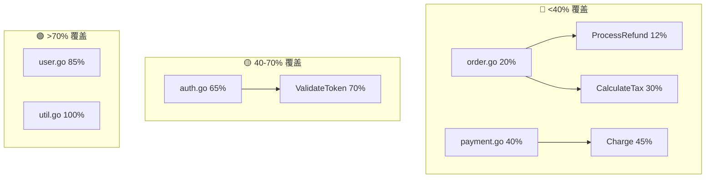
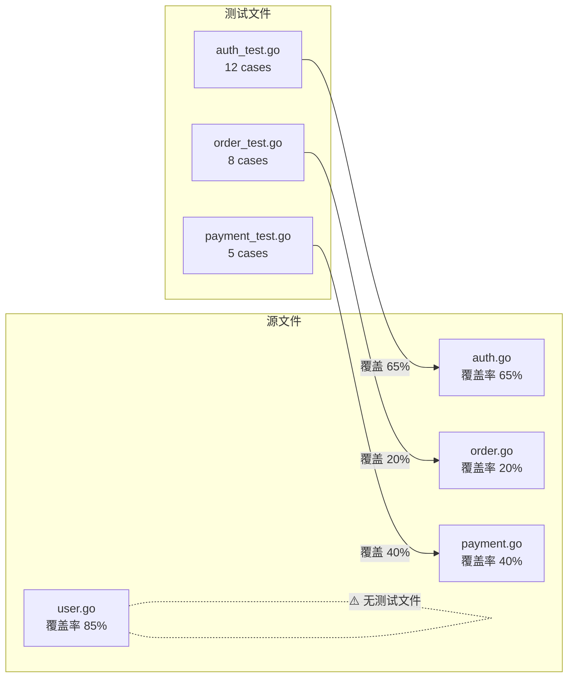

# Test Coverage（测试覆盖率可视化）

## 定位

**测试覆盖率不只是个数字。AI 生成了一堆测试，你不知道哪些有用、哪些多余、哪些地方还裸奔——这个 skill 帮你搞清楚。**

核心四问：

| 问题 | 这个 skill 怎么回答 |
|------|-------------------|
| 🤔 覆盖了什么？ | 行/分支/函数三级覆盖率 + 文件级明细表 |
| 🚫 没覆盖什么？ | 覆盖盲区清单——具体到文件:行号 + 盲区类型 |
| ✅ 测试有用吗？ | 每个测试文件的有用/冗余/充数评估 |
| 📈 增量够不够？ | AI 生成的测试 vs 已有测试的增量贡献 |
| ⚠️ 哪里最危险？ | 复杂度 × 覆盖率交叉分析 → 风险热点排序 |
| 🎯 下一个补什么？ | 按风险优先级排列的补测建议清单 |

---

## 前置判断

### 什么时候用这个 skill

| 场景 | 触发词 |
|------|--------|
| AI 生成测试代码后，想看覆盖效果 | "帮我看看测试覆盖了什么 / 分析一下覆盖率" |
| 不确定哪些测试有用，哪些是充数的 | "这些测试哪些真的有用 / 评估测试质量" |
| 想知道还有哪些代码路径没被测到 | "还有哪些地方没覆盖 / 测试盲区在哪里" |
| PR Review 前检查测试是否充分 | "这个 PR 的测试覆盖够不够 / 增量覆盖率达标吗" |
| 重构前了解现有测试保护网有多密 | "重构前帮我看看测试覆盖情况" |

### 什么时候不用

- 项目根本没有测试框架 → 先配置测试框架，再谈覆盖率
- 你想跑测试看有没有失败 → 这是 `examine-quality` 的职责
- 你想生成新测试 → 这是 CODE 阶段的职责，本 skill 只分析现有覆盖

### 支持的语言

| 语言 | 覆盖率工具 | 输出格式 | 自动检测方式 |
|------|----------|---------|------------|
| **Go** | `go test -coverprofile` | `.out` (Go cover) | 检测 `go.mod` |
| **Python** | `coverage.py` / `pytest-cov` | `.coverage` / JSON / XML | 检测 `pyproject.toml` / `setup.cfg` |
| **Java** | JaCoCo / Maven Surefire | `jacoco.xml` / `jacoco.csv` | 检测 `pom.xml` / `build.gradle` |
| **JavaScript/TypeScript** | Istanbul / NYC / Vitest | `lcov.info` / `coverage-final.json` | 检测 `package.json` |
| **Rust** | `cargo-llvm-cov` / `tarpaulin` | `lcov.info` | 检测 `Cargo.toml` |

Agent 启动时自动检测项目语言和可用工具链。如果检测不到覆盖率工具，提示用户安装。

---

## 执行流程

### 阶段 1：检测 + 运行覆盖率

```
1. 扫描项目文件 → 识别语言和测试框架
2. 检查覆盖率工具是否可用 → 不可用则提示安装命令
3. 检查是否已有覆盖率数据（如 CI 产物 lcov.info / coverage/）
   - 有 → 直接解析，标注数据来源和时间
   - 无 → 运行覆盖率命令
4. 运行覆盖率命令（只跑测试子集，不全量跑——太慢）
5. 确认覆盖率数据文件生成成功
```

**各语言运行命令**：

| 语言 | 命令 |
|------|------|
| Go | `go test -coverprofile=coverage.out ./...` |
| Python | `python -m pytest --cov=. --cov-report=json --cov-report=term` |
| Java | `mvn test jacoco:report` 或 `./gradlew test jacocoTestReport` |
| JS/TS | `npx vitest run --coverage` 或 `npx jest --coverage` |

### 阶段 2：解析覆盖率数据

从覆盖率数据中提取：

```
每文件：
├── 文件名 + 路径
├── 总行数 / 已覆盖行数 / 覆盖率%
├── 未覆盖行列表：[行号, 行号, ...]
├── 分支覆盖率% + 未覆盖分支：[行号:分支描述]
├── 函数覆盖率% + 未覆盖函数：[函数名]
└── 复杂度（圈复杂度 / 认知复杂度，如果工具支持）

全局：
├── 行覆盖率
├── 分支覆盖率
├── 函数覆盖率
├── 总文件数 / 已覆盖文件数
└── 覆盖率趋势（如果有历史数据对比）
```

**支持格式**：LCOV / Go cover `.out` / Cobertura XML / JaCoCo XML / Istanbul JSON / coverage.py JSON

### 阶段 3：测试 ↔ 源码映射

```
对每个测试文件：
├── 这个测试文件测试的是哪个源文件？
├── 这个测试文件中每个 test case 覆盖了源文件的哪些函数/行？
├── 同一个源文件被哪些测试文件覆盖？（多对多映射）
└── 哪些源文件完全没有任何测试文件对应？
```

**映射策略**：
- 按文件名匹配（`auth_test.go` → `auth.go`）
- 按 import 匹配（测试 import 了哪个包）
- 按函数名匹配（`TestLogin` → `func Login(...)`）

### 阶段 4：增量覆盖分析

如果用户的测试是 AI 新生成的（或通过 Git diff 可区分）：

```
1. git diff main/master → 列出本次新增/修改的测试文件
2. git diff main/master → 列出本次新增/修改的源文件
3. 计算：
   - 新增测试文件覆盖了哪些源文件行？
   - 这些行在新增测试之前是否已经有人覆盖了？
   - 增量覆盖 = 只有新测试才覆盖到的行数
   - 重复覆盖 = 新测试和已有测试都覆盖的行数
   - 未贡献覆盖 = 新测试没有接触到任何未被覆盖的行
4. 判断增量覆盖是否达标
```

**增量覆盖达标线**（参考业界标准）：
| 改动类型 | 增量行覆盖率最低要求 |
|---------|-------------------|
| Bug 修复 | ≥90%（必须覆盖到 Bug 所在行） |
| 新功能 | ≥80% |
| 重构 | 不低于重构前（覆盖率不能下降） |
| 配置/文案 | 无要求 |

### 阶段 5：测试价值评估

对每个测试文件/测试用例进行分类：

| 类别 | 判定标准 | 标签 |
|------|---------|------|
| ✅ **有效测试** | 覆盖了逻辑代码的关键路径，有断言 | `[有效]` |
| 🔄 **冗余测试** | 多个测试覆盖了完全相同的代码路径 | `[冗余]` |
| 🗑️ **充数测试** | `expect(true).toBe(true)` / 无断言 / 只测了框架行为 | `[充数]` |
| ⚠️ **脆弱测试** | 依赖外部状态/时间/随机数，可能不稳定 | `[脆弱]` |
| 🎯 **高价值测试** | 覆盖了边界条件/异常路径/并发场景 | `[高价值]` |

### 阶段 6：风险热点计算

```
风险分 = 圈复杂度 × (1 - 行覆盖率) × 影响系数

影响系数：
  - 被 ≥5 个其他模块引用 = 2.0
  - 涉及数据库/外部调用 = 1.5
  - 涉及认证/授权/资金 = 2.0
  - 普通业务逻辑 = 1.0
  - 工具函数 = 0.5
```

### 阶段 7：输出报告 + 可视化

---

## 输出格式模板

```
# 🧪 测试覆盖率分析报告

> 项目：{项目名} | 语言：{Go/Python/...} | 覆盖率工具：{工具名}
> 数据时间：{YYYY-MM-DD HH:MM} | 分析模式：{全量/增量(diff main)}

## 0. 覆盖率概览

| 指标 | 当前值 | 阈值 | 状态 |
|------|--------|------|------|
| 行覆盖率 | {X}% ({covered}/{total} lines) | ≥80% | ✅/⚠️/❌ |
| 分支覆盖率 | {X}% ({covered}/{total} branches) | ≥70% | ✅/⚠️/❌ |
| 函数覆盖率 | {X}% ({covered}/{total} functions) | ≥80% | ✅/⚠️/❌ |
| 文件覆盖率 | {X}% ({covered}/{total} files) | — | — |
| 🆕 增量行覆盖率 | {X}% ({N} 行新增覆盖) | ≥80% | ✅/⚠️/❌ |

**覆盖率分布图**（Mermaid）：


---

## 1. 覆盖盲区清单

> 以下代码完全没有测试或覆盖率严重不足。

### 🔴 0% 覆盖（完全裸奔）

| 文件 | 函数/方法 | 行号范围 | 圈复杂度 | 风险等级 |
|------|---------|---------|---------|---------|
| `{file}` | `{func}` | :{start}-{end} | {N} | 🔴高/🟡中/🟢低 |

### 🟡 低覆盖（<40%）

| 文件 | 函数 | 当前覆盖 | 未覆盖行 | 盲区类型 |
|------|------|---------|---------|---------|
| `{file}` | `{func}` | {X}% | {line list} | 分支未覆盖/异常路径未覆盖/... |

### 盲区类型统计

| 盲区类型 | 数量 | 说明 |
|---------|------|------|
| 条件分支（if/else 另一边） | {N1} | 代码中有 if-else，只测了一边 |
| 异常/错误处理路径 | {N2} | `if err != nil` / `catch` 块未触发 |
| 边界条件 | {N3} | 空值/零值/极值/越界 |
| 循环体 | {N4} | 循环只执行了 0 次或 1 次 |
| 并发路径 | {N5} | goroutine/线程/async 代码 |
| 默认分支（switch default） | {N6} | switch 的 default 分支 |
| defer/cleanup | {N7} | defer 块中的逻辑 |

---

## 2. 测试价值评估

> 不是所有测试都有用。以下是对现有测试的分类评估。

### 测试文件清单

| 测试文件 | 测试用例数 | 覆盖源文件 | 覆盖行数 | 价值评级 | 问题 |
|---------|----------|----------|---------|---------|------|
| `{test_file1}` | {N} | `{src_file}` | {L} | ✅ 有效 | — |
| `{test_file2}` | {N} | `{src_file}` | {L} | 🔄 冗余 | 与 `{test_file1}` 覆盖 100% 重叠 |
| `{test_file3}` | {N} | `{src_file}` | {L} | 🗑️ 充数 | 3 个 case 无断言 / 仅测 mock 返回 |
| `{test_file4}` | {N} | `{src_file}` | {L} | 🎯 高价值 | 覆盖了并发竞态 + 超时边界 |

### 🔄 冗余测试详情

| 冗余测试 | 覆盖代码行 | 已被以下测试覆盖 | 建议 |
|---------|----------|---------------|------|
| `{test_func1}` | :42-55 | `{test_func2}` (100% 重叠) | 删除或合并 |

### 🗑️ 充数测试详情

| 充数测试 | 问题 | AI 生成的？ |
|---------|------|-----------|
| `TestAlwaysPass` | `assert.True(true)` ——无意义 | ✅ 是 |
| `TestMockOnly` | 只测了 mock 对象的行为，没测真实逻辑 | ✅ 是 |

### 测试价值总览


---

## 3. 🆕 增量覆盖分析（AI 生成测试贡献）

> 以下分析基于 `git diff main` 对比得出。

### 增量摘要

| 指标 | 数值 |
|------|------|
| 新增/修改测试文件 | {N} 个 |
| 新增测试用例 | {M} 个 |
| 新增覆盖行数 | {X} 行（其中 **纯增量覆盖** {Y} 行） |
| 重复覆盖行数 | {Z} 行（已有测试已经覆盖，新测试未增加价值） |
| 未覆盖行数 | {W} 行（新增的测试仍未能覆盖） |
| 增量覆盖率 | {X/N}% |

### 每个新增测试的贡献

| 测试文件 | 覆盖源文件:行 | 纯增量覆盖 | 重复覆盖 | 价值判断 |
|---------|------------|----------|---------|---------|
| `{new_test1}` | `auth.go:42-55,62-70` | 8 行 | 5 行 | ⚠️ 一半是重复覆盖 |
| `{new_test2}` | `order.go:88-120` | 32 行 | 0 行 | ✅ 全部是增量 |
| `{new_test3}` | `user.go:10-12` | 0 行 | 3 行 | ❌ 无新的增量覆盖 |

### 增量达标判定

| 检查项 | 阈值 | 实际 | 判定 |
|--------|------|------|------|
| 增量行覆盖率 | ≥80% | {X}% | ✅/❌ |
| 充数测试比例 | ≤10% | {X}% | ✅/❌ |
| 关键路径覆盖（有 DB/外部调用的） | 100% | {X}% | ✅/❌ |
| Bug 修复行覆盖（如适用） | 100% | {X}% | ✅/❌ |

```
【增量覆盖判定】
{如果全部通过} → ✅ 增量覆盖达标，可以合并
{如果部分未过} → ⚠️ 以下项目不达标：{列表}。建议补充测试后再合并。
```

---

## 4. ⚠️ 风险热点

> 高复杂度 × 低覆盖率 = 出 Bug 概率最高。以下按风险分排序，越靠前越应该优先补测试。

| 排名 | 文件:行号 | 函数 | 圈复杂度 | 覆盖率 | 风险分 | 风险来源 |
|------|---------|------|---------|--------|--------|---------|
| 1 | `order.go:88` | `ProcessRefund` | 18 | 12% | **86** 🔴 | 涉及资金+高复杂度+多分支 |
| 2 | `auth.go:120` | `ValidateToken` | 12 | 30% | **50** 🔴 | 认证核心+被 23 处调用 |
| 3 | `payment.go:55` | `Charge` | 10 | 45% | **33** 🟡 | 外部调用+超时重试 |
| 4 | `user.go:200` | `DeleteAccount` | 8 | 25% | **30** 🟡 | 数据删除+级联操作 |
| ... | ... | ... | ... | ... | ... | ... |

### 风险热点分布图

```
文件级风险热力图（ASCII）:

auth.go     [████████░░] 80% 覆盖 — 🟢 安全
order.go    [██░░░░░░░░] 20% 覆盖 — 🔴 高危 ← 资金相关！
payment.go  [████░░░░░░] 40% 覆盖 — 🟡 中危
user.go     [██████░░░░] 60% 覆盖 — 🟢 安全
util.go     [██████████] 100% 覆盖 — 🟢 安全
```

---

## 5. 📋 用例缺失清单

> 以下测试用例是应该写但还没有写的——按优先级排列。

### P0 — 必须补（缺这些 = 不可上线）

| # | 应测什么 | 目标文件:行号 | 为什么重要 | 建议测试方式 |
|---|---------|------------|----------|------------|
| 1 | `ProcessRefund` 退款金额超过原订单金额 | `order.go:88-95` | 资金安全——可能被利用退款套利 | 构造 `refundAmount > order.Total` 的输入 |
| 2 | `ValidateToken` expired token 处理 | `auth.go:120-130` | 过期 token 被接受 = 安全漏洞 | 传入 `exp < now()` 的 token |

### P1 — 应该补（上线前尽量补）

| # | 应测什么 | 目标文件:行号 | 为什么重要 |
|---|---------|------------|----------|
| {同上格式} | | | |

### P2 — 可以补（质量提升）

| # | 应测什么 | 目标文件:行号 | 为什么 |
|---|---------|------------|--------|
| {同上格式} | | | |

---

## 6. 🎯 补测建议（优先级排序）

> 综合风险分 + 业务影响 + 实现成本，以下是接下来最应该写的 5 个测试。

| 优先级 | 测试目标 | 风险分 | 预估代码行 | 预估时间 | 写完后覆盖率提升 |
|--------|---------|--------|----------|---------|---------------|
| 🥇 P0 | `ProcessRefund` 异常金额处理 | 86 | ~30 行 | 15 min | 行+8% / 分支+15% |
| 🥈 P0 | `ValidateToken` 过期/篡改 | 50 | ~25 行 | 10 min | 行+5% / 分支+10% |
| 🥉 P1 | `Charge` 超时重试 | 33 | ~20 行 | 10 min | 行+3% / 分支+8% |
| 4 | P1 | `DeleteAccount` 级联删除 | 30 | ~35 行 | 15 min | 行+4% / 分支+6% |
| 5 | P2 | `UserImport` CSV 格式边界 | 15 | ~15 行 | 5 min | 行+2% / 分支+3% |

**补测后预期覆盖率**：

| 指标 | 当前 | 补 P0 后 | 补全部后 |
|------|------|---------|---------|
| 行覆盖率 | {X}% | {X+8}% | {X+15}% |
| 分支覆盖率 | {Y}% | {Y+15}% | {Y+25}% |
| 风险热点数 (🔴) | {N} | {N-2} | 0 |

---

## 7. 📊 可视化

### 7.1 源码覆盖注解（关键文件）

对覆盖率最低的 3 个文件进行逐行标注：

```
{文件名}: {覆盖率}%

 42  func ProcessRefund(order Order, amount Money) error {    ← ✅ 已覆盖
 43      if order.Status != "paid" {                          ← ✅ 已覆盖
 44          return ErrOrderNotPaid                            ← ❌ 未覆盖（paid→其他状态的边界未测）
 45      }
 46      if amount.Currency != order.Currency {               ← ❌ 未覆盖（币种不匹配未测）
 47          return ErrCurrencyMismatch
 48      }
 49      if amount > order.Total {                            ← ❌ 未覆盖（超额退款未测）⚠️ 资金风险
 50          return ErrRefundExceedsOrder
 51      }
 52      if amount <= 0 {                                     ← ✅ 已覆盖
 53          return ErrInvalidAmount
 54      }
 55      result, err := paymentGateway.Refund(order.ID, amount) ← ⚠️ 部分覆盖（happy path 测了，err 分支未测）
 56      if err != nil {
 57          return fmt.Errorf("refund failed: %w", err)       ← ❌ 未覆盖
 58      }
 59      order.Status = "refunded"                             ← ✅ 已覆盖
 60      return db.Save(order)                                 ← ⚠️ 部分覆盖（Save 成功测了，失败未测）
 61  }

图例：✅ 已覆盖 | ❌ 未覆盖 | ⚠️ 部分覆盖（同行的其他分支未覆盖）
```

### 7.2 文件级覆盖率树图（Mermaid）



### 7.3 测试 ↔ 源码映射图



---

## 输出后 Agent 行为

```
【测试覆盖率分析完成】

行覆盖率 {X}% / 分支覆盖率 {Y}% / 函数覆盖率 {Z}%。
发现 {N1} 个覆盖盲区、{N2} 个冗余测试、{N3} 个充数测试、{N4} 个风险热点。

增量覆盖：新增 {M} 个测试，纯增量覆盖 {Y} 行（{P}%）。{达标/不达标}

现在你可以：
A) 展开某个盲区："看看 {文件名} 的盲区详情" → 输出源码逐行标注
B) 生成补测试代码："帮我补 #{优先级1} 的测试" → 切换到 CODE 模式
C) 只看 AI 生成的测试："只看增量覆盖" → 过滤到增量分析视图
D) 对比两次覆盖："对比上一次分析" → 展示覆盖率变化趋势
E) 设置覆盖率门禁："PR 低于 80% 自动阻断" → 配置 CI 质量门禁
F) 导出报告："保存到 coverage-report.md"

→ 你想怎么做？
```

---

## 反模式

- ❌ 只报覆盖率数字不分析——80% 只是一个数，哪 20% 没覆盖才是关键
- ❌ 不区分"有效覆盖"和"充数覆盖"——AI 生成的 `expect(true).toBe(true)` 算覆盖但不是有效覆盖
- ❌ 不标注盲区类型——"未覆盖第 42 行"不够，要说"第 42 行的 else 分支未覆盖"
- ❌ 增量分析只看新增行数不看增量贡献——新测试覆盖了老测试已经覆盖的行 = 零增量价值
- ❌ 风险评级只看覆盖率不看复杂度——1000 行 util.go 覆盖率 0% 和 50 行鉴权代码覆盖率 0% 不是一个级别的风险
- ❌ 补测建议只列函数名不给理由——要说"为什么这个函数最优先补测"
- ❌ 把 mock 对象的覆盖当成真实覆盖——`mock.ExpectCall()` 不算被测代码被覆盖
- ❌ 忽略测试文件的代码质量——测试文件本身有 flaky test / 慢测试 / 环境依赖也要标注
- ❌ 覆盖率数据过时——如果代码有未提交的改动，先标注"覆盖率数据可能过期"
- ❌ 不支持 CI 产物解析——用户说"分析覆盖率"时，首先检查是否有 CI 上传的 `lcov.info`，避免重复跑测试
- ❌ 分析完不提供后续交互——用户可能要补测试/看详情/设门禁

---

## 覆盖率工具链检测

Agent 根据项目文件自动检测并选择覆盖率工具：

```
检测逻辑：
  go.mod 存在?    → Go: 使用 go test -coverprofile
  pom.xml 存在?   → Java: 使用 Maven + JaCoCo
  build.gradle?   → Java: 使用 Gradle + JaCoCo
  pyproject.toml? → Python: 使用 pytest-cov
  setup.cfg?      → Python: 使用 pytest-cov
  package.json?   → JS/TS: 检查 vitest/jest → 使用相应 coverage 命令
  Cargo.toml?     → Rust: 使用 cargo-llvm-cov

如果检测到多个语言 → 按主要语言（文件数最多的）选择工具链
如果检测失败 → 让用户指定："请指定覆盖率工具"
```

---

## 版本历史

- v1.0 (2026-06-25)：初始版本。支持 Go/Python/Java/JS/TS/Rust 六种语言。8 段输出结构。覆盖盲区按类型分类。测试价值五级评估（有效/冗余/充数/脆弱/高价值）。增量覆盖分析（AI 生成测试贡献）。风险分 = 复杂度×(1-覆盖率)×影响系数。Mermaid 可视化。补测建议按 P0/P1/P2 优先级排序。源码逐行覆盖标注。
